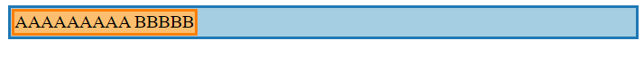

# Box sizing in CSS

在这篇文章中，我会讲清楚在特定的定位方案下(positioning scheme)，盒子是如何被 HTML 生成的。CSS 盒模型定义了盒子组件的基本结构。

盒子的大小是跟盒模型有关的，但是很大程度上也受使用的定位方案影响。一些 CSS 教程在介绍定位方案之前就讲 CSS 盒模型，但我会调换下顺序，因为你无法真正的理解盒子模型的 margins 和 content 的大小是如何计算出来的除非你能在定位方案背景下看待盒子。

## Content dimensions and margins

padding 和 border 属性作用几乎是一致的：在 content box 外生成 padding 和 border。有一个边缘情况，如果内容被分成多行，inline-level 元素(不包括 inline-block)左右的 border 仅绘制一次，而不是为每个 line box 都绘制，上下边框不会影响竖直方向的布局。

例如：

```jsx
<p class="blue">Lorem ipsum dolor sit amet, sed nulla, dignissim suspendisse libero massa erat tempor.</p>
<p><span class="green">Lorem ipsum dolor sit amet, sed nulla, dignissim suspendisse libero massa erat tempor.</span></p>
```


让我们先快速总结一下计算内容尺寸（width 和 height）和自动边距（margin：auto）的机制：根据一个盒子是 inline，block，floated 或者绝对定位而不同，另外，display：in-block 有特殊的行为，下面表格总结了当这些值设定为 auto 时的情况。


## Box model calculations for inline elements

inline,不可替换元素是最容易理解的。

width 和 height 被 inline-level 元素忽略，取决于内容大小(text)。

行内元素通过将它们放置在 line 内来定位，line box 取决于 font-size 和 line-height。

margin-top 和 margin-bottom 被 in-line level 元素忽略。

margin-right 和 margin-left 对 inline box 起作用，在同一 line box 中相对于其他内容水平偏移，设置为 auto 会简单的当成 0 处理，没有特殊的处理。

## "Content-based" height for blocks, floats and inline-blocks

content-based：即定位元素的子元素后，取最后一个子元素的底边，并设置元素的高度匹配。

实际上有两种计算：

- 在 normal flow 中的 floats，inline-block，和 block-level 元素，overflow 属性设置不是 visible。
- 在 normal flow 中的 block-level 元素，overflow 为 visible。

第二种忽略了后代元素中的浮动元素，这也就是为什么默认情况下，只有浮动元素后代的块级框的高度为 0，因为 visible 是 overflow 的默认值。

第一种情况，overflow 属性设置不是 visible，后代浮动元素的高度也会算入。

> In addition, if the element has any floating descendants whose bottom margin edge is below the element's bottom content edge, then the height is increased to include those edges. Only floats that participate in this block formatting context are taken into account, e.g., floats inside absolutely positioned descendants or other floats are not.

换句话说，默认 width，height 都是 auto，除非指定明确的高度，否则这些块将始终扩展以适应其所有内容。

## Width calculations

Block-level：constraint-based,width 或者 margin 设为 auto，会占据未使用的空间填充，减去任何已明确设置的值并将这个值设置为结果。

Floating blocks and inline-block：shrink-to-fit，1) 首选宽度（例如，使用尽可能少的换行），2） 可用的首选最小宽度（例如，使用尽可能多的换行）和 3) 可用宽度。

如果水平空间可用，则宽度值设置为首选宽度，否则设置为首选最小宽度，在最坏的情况下，可用宽度有一些潜在的溢出。

## Width calculations: block-level elements (constraint-based)

margin-left+border-left+padding-left+width+padding-right+border-right+margin-right =width of containing block

border 和 padding 不能设置为 auto，简化为 margin-left+width+margin-right = width of containing block

三种情况：

- margin 和 width 都设为 auto
- width 设定为具体的值，margin 为 auto
- 三个中的两个设定为具体的值，另一个设置为 auto

第一种情况宽度优先，margin 会自动为 0，宽度会占据一行中所有未使用的空间

第二种情况，会居中此元素，即左右 margin 平分可用的空间

第三种情况会满足设定的具体值，剩下的就是 auto 的值，满足上面公式即可。

## Width calculations: floating blocks and inline-block elements (shrink-to-fit)

> If 'width' is computed as 'auto', the used value is the "shrink-to-fit" width.
> Calculation of the shrink-to-fit width is similar to calculating the width of a table cell using the automatic table layout algorithm. Roughly: calculate the preferred width by formatting the content without breaking lines other than where explicit line breaks occur, and also calculate the preferred minimum width, e.g., by trying all possible line breaks. CSS 2.1 does not define the exact algorithm. Thirdly, find the available width: in this case, this is the width of the containing block minus the used values of 'margin-left', 'border-left-width', 'padding-left', 'padding-right', 'border-right-width', 'margin-right', and the widths of any relevant scroll bars.
> Then the shrink-to-fit width is: min(max(preferred minimum width, available width), preferred width).

1.当有很多空间可用，width 为首选宽度(preferred width)(尽可能少的分为多行)

```jsx
.inline-block {
  display: inline-block;
}
<div class="big blue">
  <div class="inline-block orange">AAAAAAAAA BBBBB</div>
</div>
```



2.当可用空间小于首选宽度，大于首选最小宽度(尽可能多的分行),用此可用空间

```jsx
.big {
  width: 130px;
}
.inline-block {
  display: inline-block;
}
<div class="big blue">
  <div class="inline-block orange">AAAAAAAAA BBBBB</div>
</div>
```


3.当可用空间小于首选最小宽度，可能会发生溢出

```jsx
.big {
  width: 80px;
}
.inline-block {
  display: inline-block;
}
<div class="big blue">
  <div class="inline-block orange">AAAAAAAAA BBBBB</div>
</div>
```


## Margins for floating blocks and inline-block elements

很简单，设为 0。

## Absolutely positioned, non-replaced elements

混合了 constraint-based 和 shrink-to-fit or content-based 算法。

constraint-based：

```
'top' + 'margin-top' + 'border-top-width' + 'padding-top' +
'height' + 'padding-bottom' + 'border-bottom-width' +
'margin-bottom' + 'bottom'
= heightof containing block
```

and

```
'left' + 'margin-left' + 'border-left-width' + 'padding-left' +
'width' + 'padding-right' + 'border-right-width' + 'margin-right' +
'right'
= widthof containing block
```

因为 border 和 padding 的值不能设为 auto，所以可以简化为

```
'top' + 'margin-top' + 'height' + 'margin-bottom' + 'bottom'
= height of containing block
```

```
'left' + 'margin-left' + 'width' + 'margin-right' + 'right'
= width of containing block
```

内容+偏移量+margin = 包含块的大小

(width + the left & right margins + left & right offsets, or height + the top & bottom margins + top & bottom offsets)

有以下几种情况

- 如果所有的属性都设置了具体的值，就使用这些值。
- 如果 width/height 和 offsets 设置了具体的值,margin 为 auto 时，两边 margin 平分剩余的空间，当两边 offsets 值相等，可以居中元素。
- 如果 width/height 和 offsets 设置了具体的值,一个 margin 设置了值一个为 auto，则根据上面的公式计算出值作为 auto 的值。
- 否则，margin 为 auto 当作 0 看待，看剩下三个属性(width + offsets or height + offsets)

  - 如果这些属性都没有设置为 auto，上面已经处理过这种情况，因为这些值都是显式设置的。
  - 如果三个中只有一个设置为 auto，通过 constraint-based 算法计算缺失的值。
  - 如果两个属性设置为 auto 并且其中一个属性是 width/height，则使用的 shrink-to-fit or content-based 方法来计算 width/height，然后使用基于 constraint-based 的方法来计算另一个缺失值。
  - 如果这三个属性都是 auto 的，定位元素，就像它静态定位在顶部或左侧一样，然后使用 shrink-to-fit（for width）/content-based（for height）来计算内容大小，然后使用 constraint-based 来计算 bottom/right 的尺寸。
  - 当 width/height 设置了具体值，offsets 为 auto 时，并不会居中，位置同上，不会改变元素位置。

  

正如你所看到的，经验法则是，如果内容尺寸没有被指定，那么在试图通过盒子模型指定 constraint-based 的算法来填充其余的值之前，会使用 shrink-to-fit（for width）/content-based（for height）的算法来计算它们。

使用绝对定位可以水平或者竖直定位元素，但有两点警告：

- 绝对定位的元素不与后面的同级元素交互，并且可以绘制在正常流中的任何内容之上。
- 为了去触发 margin 为 auto 居中的效果，内容大小(width / height)和 偏移量(left / right / top / bottom) 必须设置。这个很重要，可以通过设置内容大小百分比或者 max-width 或者 min-width 优化。
