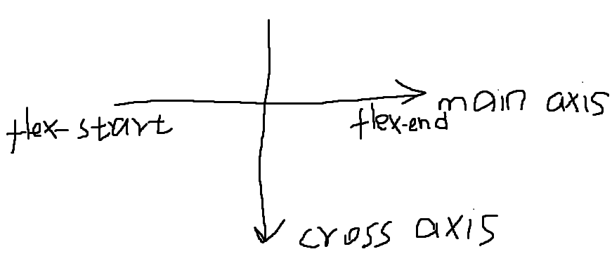
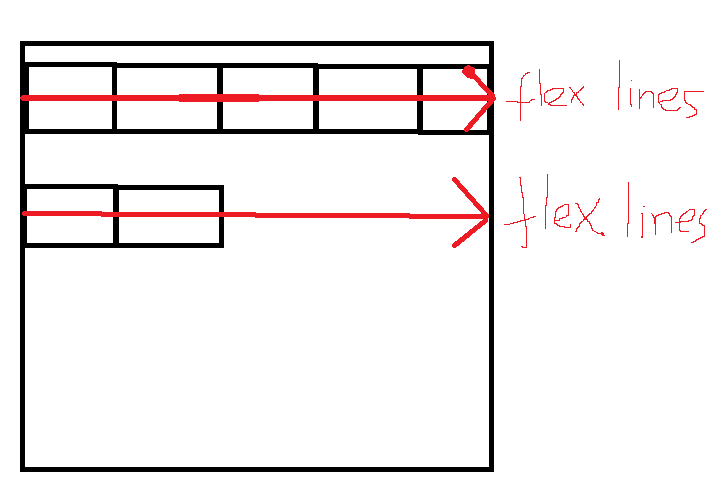
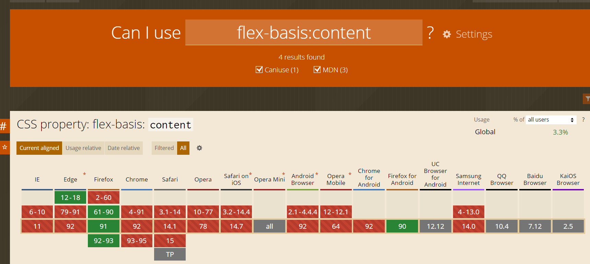
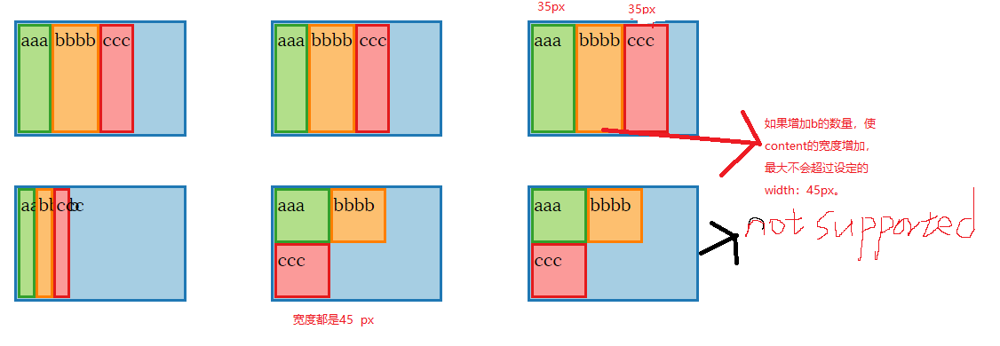
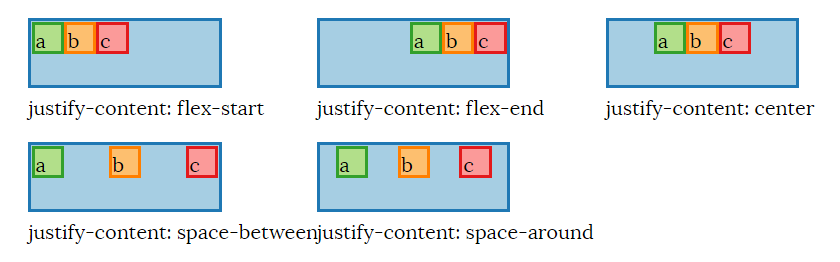
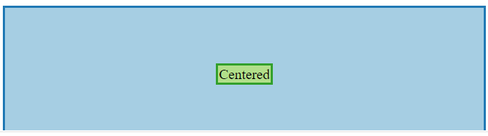

## Why Flexbox?

出现目的是解决管理负空间的问题，它对 flexbox 父项中的子项应该如何（重新）调整大小、包装和对齐提供了很多控制。

Flexbox 内置的基本假设是，作为作者，你要确保 Flexbox 的内容能适当地调整

- flexbox 父级的可用宽度和高度的变化
- flexbox 容器中子项数量的变化

Flexbox 中的 "flex "是指当可用的宽度或高度大于或小于子框所需的 "理想 "大小时，能够指定子项的尺寸。

## 属性

### flex container 属性

`display：flex` 和 `display:inline-flex`
`flex-flow`(属性缩写)

- ``flex-direction`:flex 子项堆叠的方向。
- `flex-wrap`：指定 flex 元素单行显示还是多行显示 。
- `justify-content`:控制 flex 元素在 main axis 上的定位。
- `align-items`:控制 flex 元素相对于 flex lines 在 cross axis 上的定位。可以认为是 cross axis 上的`justify-content`。
- `align-content`:控制 flex lines 如何相对于父元素在 cross axis 上定位。

### flex item 属性

- `order`：items 的相对顺序
- `flex`(属性缩写)
  - `flex-grow`:当 main axis 上有剩余的空间时，分配给 item 的空间比例。
  - `flex-shrink`:当 main axis 上没有足够空间时分配给 item,收缩的比例。-
  - `flex-basis`: item 的内容维度(content dimensions)如何影响 flex-grow 和 flex-shrink 计算。
- `align-self`: 对于特定 item，覆盖其`align-items`。

### main axis and cross axis

flex-direction 的方向就是 main axis 垂直于他的是 cross axis。也可以理解为盒子堆叠的方向就是主轴的方向。reverse 之后，主轴箭头方向指向反方向。


### flex lines

个人理解：


### flex items sizing

三个步骤：

- 先 items 分到 flex lines 上：计算 flex items 假设性大小(跟 flex-basis 相关，后面讲)，根据这个大小先分到 flex lines 上。
- 调整每个 flex lines 上的 flex items 大小：根据 flex-grow 和 flex-shrink，调整这个 flex items 的最终大小。
- 对齐 flex lines 和 items：根据应用到 flex lines(align-content 和 align-items)上的属性调整然后是 flex items。

### flex-basis

这个属性至关重要，他是 flex items 决定和调整大小的基础。

flex-basis 根据四种不同的 flex sizing 操作模式（我想出的术语，而不是规范术语）更容易理解：（比例指的是 flex-grow 和 flex-shrink 计算）例如前者设为 1 后者设为 2 这中就叫做比例的模式。

1. 纯比例模式：设置 flex-basis: 0 相当于说子元素的默认宽度（或高度，取决于 flex-direction）是 0px. 换句话说：

- flex items 内容的实际宽度对最终计算元素的大小没有任何影响。(也就是上面说的第一步)
- flex items 永远不会换行，因为关于何时换行的决定是根据子项的 flex basis 大小完成的，并且在 flexbox 算法中明确设置的确定值优先。

2. flex-basis 为固定值+比例模式：设置 flex-basis: Npx，其中 N 是某个值会导致大小计算考虑这些元素具有 N 像素的 flex basis 大小。

- 只要这些 flex 的基值的总和大于 flex container 的可用主轴空间大小，就会发生换行。
- 之后根据 flex-grow 和 flex-shrink 来计算最终的空间时，是以这个为基础算的。

3. flex-basis 设为 auto+比例的模式：
   这种情况真正的 flex-basis 的值回落到 items 的宽或者高的大小， 如果这些没有被设置，则为通常用于计算元素的宽度或高度的算法。
   - 当换行的行为发生时，flex items 要么就是有明确的高或宽的值，或者没有的话就是根据 content 来算的。
   - 之后根据 flex-grow 和 flex-shrink 来计算最终的空间时，是以这个为基础算的。
4. flex-basis 为 content+比例模式：
   basis 的值为元素 width：auto 或者 height：auto 的值。这个属性比较新，浏览器支持极差，不建议使用。
   

**上面这些模式只是用于计算 flex items 放置在 flex lines 上的大小用于判断是否换行，跟元素实际大小没有关系！！！**

例子：

- flex-basis: 0 with width: 45px on each flex item results in the items having at least a 0px width, or their content size if it is greater.
- flex-basis: 10px with width: 45px on each flex item results in the items having at least a 10px width, or their content size if it is greater.
- flex-basis: 35px with width: 45px on each flex item results in the items having at least a 35px width, or their content size if it is greater.
- flex-basis: 35px with width: 45px and max-width: 10px on each flex item results in the items having a 10px width.
- flex-basis: auto with width: 45px on each flex item results in the items having a 45px width, and the items wrap because the sum of flex basis sizes exceeds the flex container's width.
- flex-basis: content with width: 45px on each flex item should result in the flex items being sized exactly to their content, but this value is not supported as of the time I'm writing this.

```
<div class="flex-parent blue">
<div class="green">aaa</div><div class="orange">bbbb</div><div class="red">ccc</div>
</div>
.flex-parent {
display: flex;
flex-direction: row;
flex-wrap: wrap;
flex-grow: 0;
justify-content: flex-start;
width: 130px;
height: 100px;
}
```



flex-basis 只是提供一个最低值，如果你 content 的宽度比这个大，实际元素的宽度就是 content 宽度，如果 flex-basis 的值大于 content 的宽度，实际元素就是 flex-basis 的值，跟 width 大小无关，width 的大小只是当 flex-basis 比 width 小的时候，content 内容的大小最大不能超过 width 的大小，否则发生溢出。

### flex-grow 和 flex-shrink

不管 width 多少和实际元素的宽度多少，都是按照 flex-basis 的值来算的！！父元素宽度或者高度 - 子元素 flex-basis 的和 = 可分配空间，然后乘以比例加给或减给每个元素就是分配后元素的宽度或高度！

### main axis alignment：justify-content

注意 margin：auto 优先于 justify-content


### Cross axis alignment for flex lines: align-content

`align-content`,`align-items`,`align-self`：属性确定在 cross axis 上的对齐。

但是`align-content`不会影响单行的 flex container 的对齐方式，可以这样理解有两个高度一个使 cross axis container 的高度，一个使每个 flex lines 的高度，这个属性决定了他们之间距离。

`align-items`并`align-self`具有相同的效果：它们控制每个 flex lines 内各个 item 的对齐方式。

## order

order 值是相对的，大的在后面，小的在前面。

## 使用 flexbox 居中

```
<div class="parent blue">
  <div class="child green">Centered</div>
</div>

.parent {
  display: flex;
  flex-direction: row;
  justify-content:center;
  align-items:center;
  height:100%
}
```



## margin:auto 与 flexbox 一起使用

在 main axis 上设置 margin：auto 会覆盖 justify-content 属性。
在 cross axis 上设置 margin：auto 会覆盖 align-items 属性。
