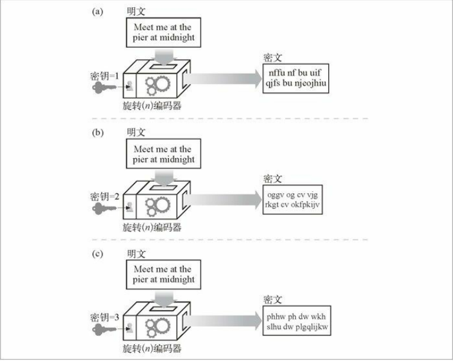
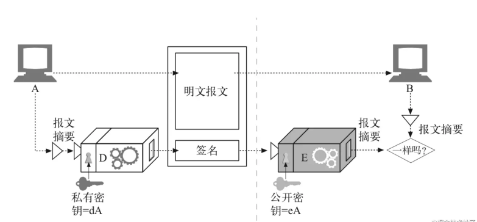
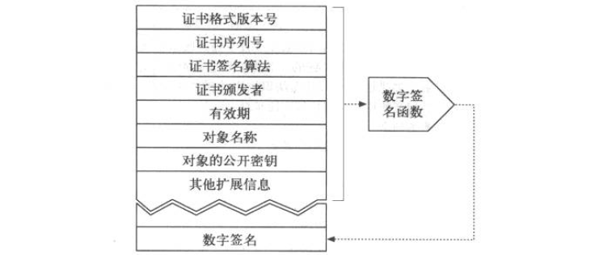
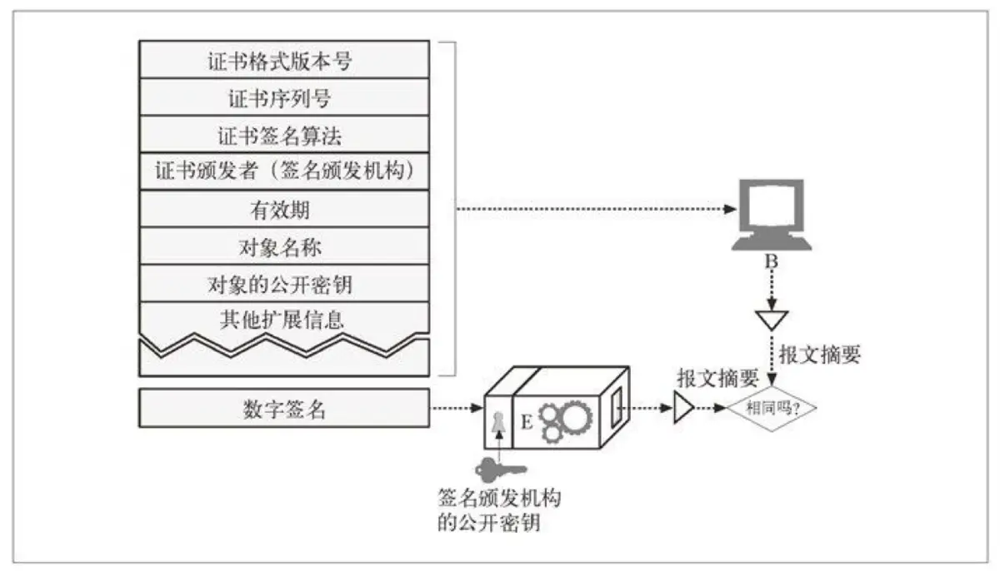
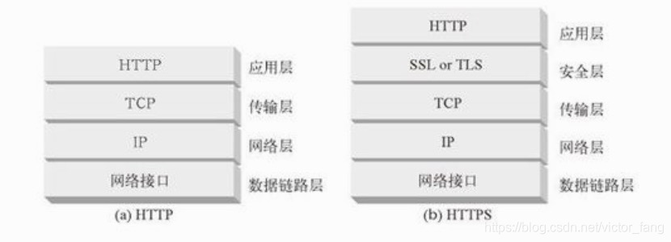
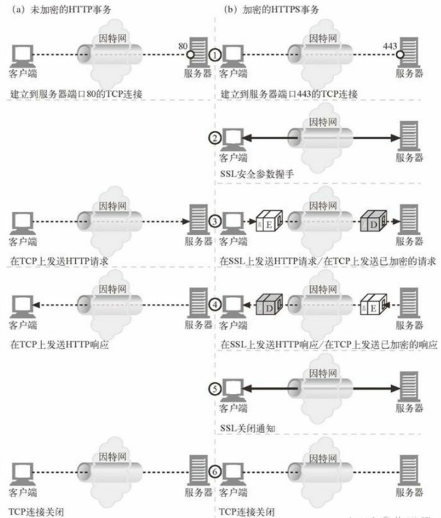

在了解 HTTPS 如何确保安全性之前，我们需要先了解一些密码学相关的知识。

我们先理清一个重要的概念：**密钥**和**密码**。

**密码是什么？**

> 密码是一套编码方案-一种特殊的报文编码方式和一种稍后使用的相应的解码方式集合体。 --《HTTP 权威指南》

最初，在人们还没有发明出复杂加密算法之前，使用的简单算法就是**密码**，因为算法太简单，很容易被人猜出来而将密文还原为明文。

**密钥是什么？**

密钥可以看成是密码的一个参数，我们使用相同的算法来加密相同的明文，他会因为密钥的不同而产生不同的密文。例如下面这个旋转 N 字符密码,此时密钥就相当于参数 N。

**知道了密码和密钥，那么加密过程是什么？**

我们可以把加密算法想象成一些函数，这些函数会读取一块数据，并根据算法和密钥值对其进行编/解码。

## 对称加密

正如他的名字一样，这种技术加密和解密都是使用相同的密钥。使用这种技术，发送端和接受端要共享相同的密钥才能进行通信，发送端用此密钥加密数据并将密文发送给接收端，接收端收到密文使用此密钥进行解密，得到原始数据。

常见的对称加密算法：`DES`、`Triple-DES`、`AES`、`RC2`和`RC4`。

#### 优缺点

效率高，由于不适合在网上传输，秘钥的维护较为麻烦。

## 非对称加密

非对称加密算法需要两个密钥：公开密钥（publickey，简称公钥）和私有密钥（privatekey，简称私钥）。

例如：

- A 要向 B 发送信息，A 和 B 都要产生一对用于加密和解密的**公钥和私钥**。
- A 的私钥保密，A 的公钥告诉 B；B 的私钥保密，B 的公钥告诉 A。
- A 要给 B 发送信息时，A 用 B 的公钥加密信息，因为 A 知道 B 的公钥。
- A 将这个消息发给 B（已经用 B 的公钥加密消息）
- B 收到这个消息后，B 用自己的私钥解密 A 的消息。其他所有收到这个报文的人都无法解密，因为只有 B 才有 B 的私钥。

常见的非对称算法：`RSA`。

##### 优缺点

有较高的安全性，但效率低。

比较常见的优化方案是**结合对称加密算法**，例如如果数据比较大，使用对方的公钥来加密效率会很低，但是我们可以使用随机函数生成对称秘钥，使用对方的公钥来加密这个对称秘钥，数据通过更快的对称加密技术进行加密，从而提高效率(对称算法加解密数据，非对称算法加解密对称算法的密钥)。这些描述可以概括为“**给锁上锁**”。

## 数字签名

我们可以使用数字签名来保证数据没有被篡改过并说明是谁发送的数据。

例子：A 向 B 发送报文，并对其签名

- 首先，节点 A 将变长报文提取为定长的摘要。
- 节点 A 对摘要应用签名函数并把私钥作为参数进行加密。
- B 节点收到报文，对签名进行检查，使用 A 的公钥进行解密出摘要，并用此摘要对发送过来的摘要比对，如果不匹配，要么就是报文在传输的过程中被篡改了，要么就是发送端根本没有 A 的私有密钥(也就是说他不是节点 A)。

## 数字证书

对于请求方来说，它怎么能确定它所得到的公钥一定是从目标主机那里发布的，而且没有被篡改过呢？亦或者请求的目标主机本本身就从事窃取用户信息的不正当行为呢？这时候，我们需要有一个权威的值得信赖的第三方机构(一般是由政府审核并授权的机构)来统一对外发放主机机构的公钥，只要请求方这种机构获取公钥，就避免了上述问题的发生。

客服端与服务器建立 HTTPS 链接后，会获取服务器的证书，浏览器对其进行验证(浏览器会预先安装很多签名颁发机构的证书)，如前面所讲的，利用证书上的数字签名来验证证书的完整性。因为任何人都可以创建一个证书，所以浏览器对于不是权威机构颁发的证书会弹窗来告知用户。

证书上大概的内容：

验证证书：

## HTTPS

下面我们正式进入主题：HTTPS 如何保证 HTTP 连接的安全性。

HTTPS 在 HTTP 下面提供了一个传输级的密码安全层(SSL/TLS),安全层在传输层 TCP 之上，在应用层 HTTP 之下。

HTTPS 在 HTTP 报文发送给 TCP 之前，先将其发送给 SSL/TLS 对其进行加密。

上面说到，SSL 在传输层与应用层之间对网络连接进行加密。

在发送方，SSL 接收应用层的数据，对数据进行加密，然后把加密的数据送往 TCP 套接字。

在接收方，SSL 从 TCP 套接字读取数据，解密后把数据交给应用层。

## HTTPS 发送报文流程

1. 客服端首先打开一条到服务器的 443 端口的连接(TCP 连接)

2. 进行 SSL/TLS 初始化，SSL 握手。握手过程中完成的工作：

- 交换协议版本号，密钥
- 选择一个两端都了解的密码
- 对两端的身份进行认证(证书)
- 生成临时的会话密钥(对称密钥)，以便加密信道

3. 初始化完成，客户端发送的报文在 SSL/TLS 中用生成的会话密钥加密，加密完成后将密文交给 TCP 传输，服务端从 TCP 中取出密文，在 SSL/TLS 中解密，解密后把数据交给应用层。

### 参考资料

---

《HTTP 权威指南》

[详解 HTTPS 是如何确保安全性的？](https://blog.csdn.net/wx_962464/article/details/51043069)

[Akara 的 blog](https://messiahhh.github.io/blog/frontend/%E8%AE%A1%E7%AE%97%E6%9C%BA%E7%BD%91%E7%BB%9C.html#https)
