## 总述

React 为设计高性能的 React 应用程序提供了很多优化，可以通过遵循一些最佳实践来实现。性能优化的关键在于是否能够减少不必要的 Render，触发 Render 主要有下面的情况：

- 发生 **setState**
- **props** 的改变
- 使用`forceUpdate`

下面给出了一些常见的优化方案，我们将解读、实践它们，对于部分内容我们会深入源码分析其原理。

## React.PureComponent

### 组件嵌套造成的额外渲染

来看看下面这个例子：

#### 案例

来看下面这个组件嵌套的代码：

```jsx
import React from "react"
class Banner extends React.Component {
  render() {
    console.log("banner render!")
    return <div>banner -- div</div>
  }
}
const List = () => {
  console.log("list render!")
  return (
    <ul>
      <li>11</li>
      <li>22</li>
      <li>33</li>
      <li>44</li>
    </ul>
  )
}
class Main extends React.Component {
  constructor(props) {
    super(props)
    this.state = {
      counter: 0,
    }
  }
  add() {
    this.setState({
      counter: this.state.counter + 1,
    })
  }
  render() {
    console.log("Main render!")
    return (
      <div>
        <div>current:{this.state.counter}</div>
        <button onClick={() => this.add()}>add!</button>
        <Banner />
        <List />
      </div>
    )
  }
}
export default Main
```

运行之后，页面如图所示：

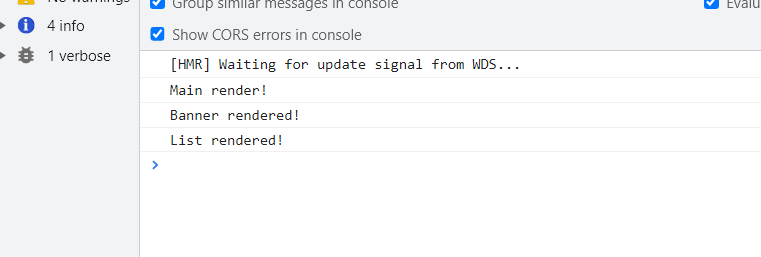

页面初次渲染，打印了如上图的内容，这很正常 -- 每个组件都得被 render 一次。

但当我们点击 Main 组件中的**add 按钮**时（如下图），三个组件被重新 render 了！但是**Banner 组件**、**List 组件**的 render 是毫无必要的。


### 使用 PureComponent

设想一下，假如我们能够在 List 和 Banner 组件被渲染之前对比一下前后的`props`是否改变 、`state`是否改变，再决定是否渲染不就可以了吗？我们可以使用`shouldComponentUpdate`
这个生命周期函数来实现，它返回一个布尔值，来定义是否 render，下面是官方文档的截图：

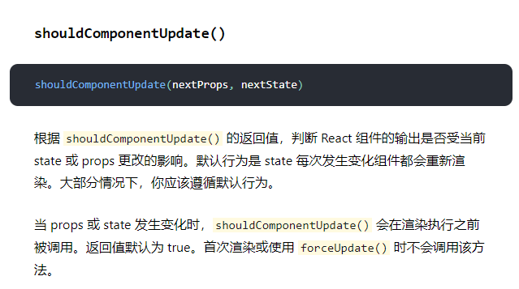

但是如果我们每个文件都写一遍，那么实在太麻烦了，所以我们可以使用**PureComponent**，下面我们尝试修改上面的 Footer 组件。

```jsx
class Banner extends PureComponent {
  render() {
    console.log("Banner rendered!")
    return <div>Banner</div>
  }
}
```

从下图中可以看出，Banner 组件没有被重新渲染，美中不足的是，List 组件（它是一个函数式组件）仍然发生了渲染，我们下面会解决它。

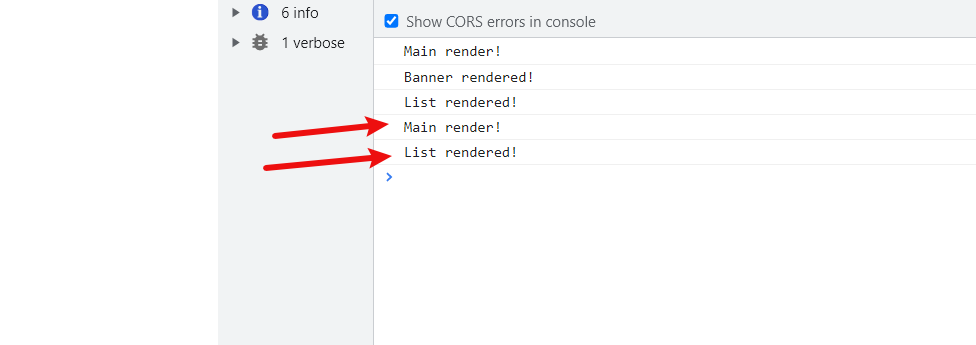

### PureComponent 原理

根据上面的描述，我们可以猜出`PureComponent`的原理无非就是比较前后 props、state 是否改变，我们先看看`PureComponent`：

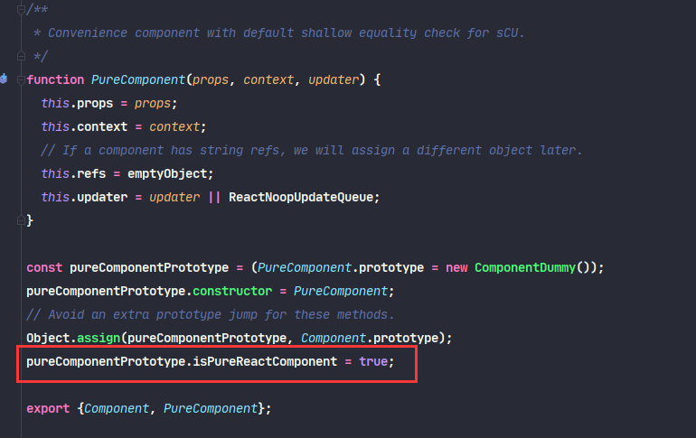

注意最后设置`isPureReactComponent`为**true**，React 通过调用`checkShouldComponentUpdate`
来判断，这个函数位于`packages/react-reconciler/src/ReactFiberClassComponent.js`下，注意下面的两个红框：

- 第一部分：判断开发者是否使用了`shouldComponentUpdate`，如果是，执行并返回结果。（ps.出现的`startPhaseTimer`貌似是一个计时功能，我们这里不做探讨）
- 第二部分：如果这个组件是 PureComponent，执行第二个红框的代码，也是核心部分了 -- 它通过调用`shallowEqual`比较**state**和**props**来决定是否需要更新。

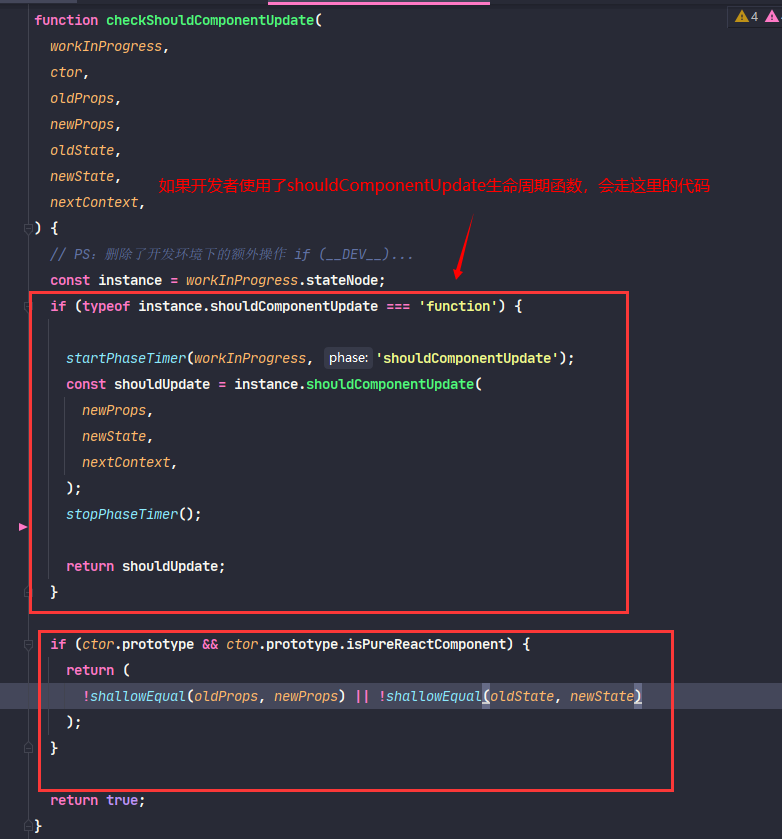

来看看`shallowEqual`，它位于`packages/shared/shallowEqual.js`，下面以注释的形式给出解析：

```typescript
function shallowEqual(objA: mixed, objB: mixed): boolean {
  // 面向基本数据类型的比较，下面会单独提
  if (is(objA, objB)) {
    return true
  }

  // object 和 null 的情况，也返回false
  if (
    typeof objA !== "object" ||
    objA === null ||
    typeof objB !== "object" ||
    objB === null
  ) {
    return false
  }

  // 拿出所有的keys
  const keysA = Object.keys(objA)
  const keysB = Object.keys(objB)

  // 先比较长度，长度不等直接返回false
  if (keysA.length !== keysB.length) {
    return false
  }

  // 循环遍历比较
  for (let i = 0; i < keysA.length; i++) {
    if (
      // 判断为true的条件：
      // 1.hasOwnProperty方法判断B中是否有A的key
      // 2.对value的基本数据类型进行比较
      !hasOwnProperty.call(objB, keysA[i]) ||
      !is(objA[keysA[i]], objB[keysA[i]])
    ) {
      return false
    }
  }
  return true
}
```

其中，`is`函数来自下面的代码，可以看出`is`间接地调用了`Object.is`，如果出现浏览器不支持的情况，那么调用自己写的`is`，这个函数可以被称为`Object.is()`的**polyfill**：

```typescript
function is(x: any, y: any) {
  return (x === y && (x !== 0 || 1 / x === 1 / y)) || (x !== x && y !== y)
}

const objectIs: (x: any, y: any) => boolean =
  typeof Object.is === "function" ? Object.is : is

export default objectIs
```

可以看出，Object.is 可以对基本数据类型做出非常精确的比较，但是对引用类型无能为力：

```javascript
Object.is([1, 2], [1, 2])
//false
Object.is({ a: 231 }, { a: 231 })
//false
```

至此，我们搞懂了**PureComponent**的原理，但是它只支持**类组件**，下面我们来介绍一下如何优化**函数式组件**。

## Memo

### 使用 Memo

同样是上面的例子，针对函数式组件，我们可以使用`memo`来避免多余的渲染，例如针对我们的 List 组件：

```jsx
const List = memo(() => {
  console.log("List render!")
  return (
    <ul>
      <li>11</li>
      <li>22</li>
      <li>33</li>
      <li>44</li>
    </ul>
  )
})
```

来看看效果：当点击 add 按钮时


可以看出，在`PureComponent`、`Memo`的配合下，计数器的更新值引起 Main 组件渲染，其他的组件没有出现无意义的渲染。

### Memo 原理

下面是 Memo 的代码：


在`packages/react-reconciler/src/ReactFiberBeginWork.js`下有如下代码,：


注意红框的部分，`compare`在这里被执行 ，如果用户传入`compare`，则执行用户的逻辑，否则执行我们上面刚刚提到的`shallowEqual`。

### 避免内联样式、对象的使用

大量使用内联样式和内联对象不仅让代码变得难以维护，而且会带来性能问题。

#### 避免内联样式

使用内联样式，浏览器将花费更多时间执行脚本、渲染。例如下面的内联样式`backgroundColor`会被 Babel 解析成 css 中的`background-color`：

```jsx
import React from "react"

export default class InlineStyledComponents extends React.Component {
  render() {
    return (
      <>
        <b style={{ backgroundColor: "blue" }}>Welcome to Sample Page</b>
      </>
    )
  }
}
```

我们可以使用**cssModule**等方法来实现组件私有样式，具体实现这里不再赘述。

#### 避免内联对象

来看下面的代码：

```jsx
class User extends React.PureComponent {
  render() {
    return (
      <div>
        <div>{this.props.user.name}</div>
        <div>{this.props.user.age}</div>
      </div>
    )
  }
}

class DoNotUseInlineObject extends React.PureComponent {
  constructor(props) {
    super(props)
    this.state = {
      cnt: 0,
    }
  }

  add() {
    console.log("add按钮被单击!")
    this.setState({
      cnt: this.state.cnt + 1,
    })
  }

  render() {
    return (
      <div>
        <div>{this.state.cnt}</div>
        <button onClick={() => this.add()}>add!</button>
        <User
          user={{
            name: "sam",
            age: 20,
          }}
        />
      </div>
    )
  }
}

export default DoNotUseInlineObject
```

`DoNotUseInlineObject`这个组件的重点在于父组件传给 User 的**Props**是个行内元素，当调用`render`时，React 会重新创建对此对象的引用，这会导致两者判断不相同，就类似于下面的代码：

```javascript
const oldInfo = {
  name: "sam",
  age: 20,
}
const newInfo = {
  name: "sam",
  age: 20,
}
oldInfo === newInfo // false
one === one // true
```

这个比较在哪里呢？我们上面刚刚说过，其实就是`shallowEqual`，接下来，我们使用浏览器的开发者工具来 Debug，以感受两者的区别。

我们在`shallowEqual`函数的入口打上断点，它在`react-dom.development.js`的第 12537 行（不同版本可能会有差异，建议通过函数关键字来搜索）

**使用内联对象**

触发 User 组件的 props 比较，本质上是调用`shallowEqual`:


一直单步执行，直到这个地方，结果返回了一个 false：

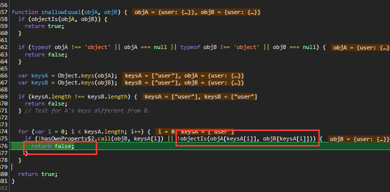

究其原因，其实是`objA`和`ObjB`**引用**的对象不同。

**不使用内联对象**

接下来我们不使用内联对象，进行同样的调试操作：

先对代码作出一些修改（省略了没有发生改变的代码）：

```jsx
import React from "react"

const userInfo = {
  name: "sam",
  age: 20,
}

class DoNotUseInlineObject extends React.PureComponent {
  render() {
    return (
      <div>
        <div>{this.state.cnt}</div>
        <button onClick={() => this.add()}>add!</button>
        <User user={userInfo} />
      </div>
    )
  }
}

export default DoNotUseInlineObject
```

这里就判断为`true`了，这是因为`objA`和`ObjB`**引用**了同一个对象`userInfo`。

### React 优化条件渲染

条件渲染指的是根据某个值的不同来渲染不同的组件，例如，下面的代码会根据`flag`的不同来渲染不同的组件树：

```jsx
import React from "react"
import { useState } from "react"

const ConditionalRenderingCmp = () => {
  const [flag, setFlag] = useState(false)
  if (flag) {
    return (
      <>
        <Flag></Flag>
        <Header></Header>
        <Content></Content>
      </>
    )
  } else {
    return (
      <>
        <Header></Header>
        <Content></Content>
      </>
    )
  }
}

export default ConditionalRenderingCmp
```

这里会发生什么性能问题呢？要回答此问题，我们必须知道 React 中 Diff 算法针对同层节点是采用**同时遍历**来进行对比的，也就是说，当上面代码的 flag 改变，两个组件树进行 diff，过程如下：


- flag vs Header，不同，生成 mutation。
- Header vs Content，不同，生成 mutation。
- Content，生成 mutation。

但如果我们使用后者的方法，那么，diff 将变成这样：


本质上是 diff 时，**header**和一个**null 节点**进行比较，从而让下面得兄弟元素进行比较时是相等的，从而带来了性能优化。

> 提示：我们也可以使用设置 key 来达到类似的效果，关于 key 的内容后面也会讲到。

我们可以这样优化代码：

```jsx
const ConditionalRenderingCmp = () => {
  const [flag, setFlag] = useState(false)
  useEffect(() => {
    setTimeout(() => {
      setFlag(true)
    }, 1000)
  }, [])

  return (
    <>
      {flag && <Header />}
      <Content />
      <Footer />
    </>
  )
}
```

怎么来验证上面的结论呢，我们可以查看浏览器的调试工具，尤其注意 DOM 元素的变化：

优化之前的版本，我们可以看到**三个 div 都重新执行了 DOM 操作**（观察深色区域）：

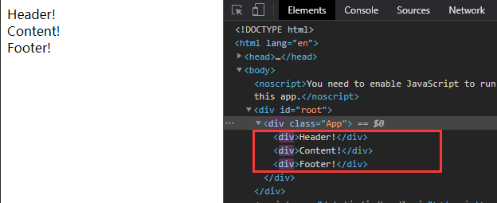

优化之后的版本，注意**只有 header 进行了 DOM 操作**：

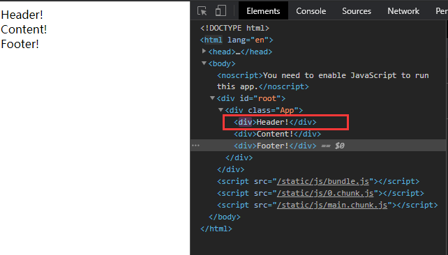

### 正确地使用 key

#### key 的原理

key 是服务于 react 的 diff 算法的，正确的使用 key 可以发挥出 diff 算法的效果。我们上面提到过类似的情况，我们再来温习一下：

对于下面的 DOM 结构，React 会同时遍历两个子节点的列表，有差异时会生成一个**mutation**。

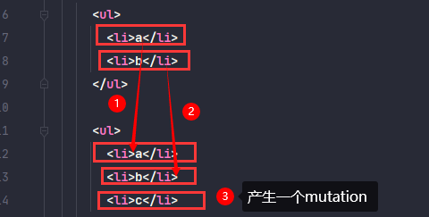

但是这种情况太理想了！如果是下面这种情况，那么就会带来不必要的 DOM 操作了（创建了较多的 mutation）！

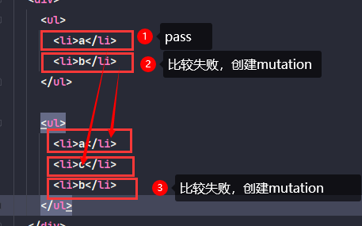

这种情况下，**Key**的作用就体现了，我们可以使用 key 来匹配。


比较时，key 为 a 的元素不变，添加了 key 为 c 的元素 mutation，同时 key 为 b 的元素只进行**位移**
，无需额外修改，最终。我们只创建了一个 mutation。当然，我们的 key 必须唯一！除了这个注意的地方，下面还有几个关于 key 的注意点。

#### key 的注意点

##### 不要使用随机数

随机数在下一次 render 时，每个元素会重新生成 key，前后就无法匹配到了。

##### 不要使用 index 作为 key

一般情况下，我们不要使用 index 作为 key。类似于上面的例子，当我们将一个`<li>`插入`ul`的最前面，由于`key`的存在（是一个固定的唯一数），其它的元素只是进行了**位移**。

但是如果我们使用 index 作为 key，那么在插入之后，最初具有键值 1 的元素具有键值 2，React 会认为所有的组件都被修改，于是进行了额外的渲染。

## 使用 Hooks

### useCallback

`useCallback`的功能在于让一个函数"可记忆化"(**memoized**)，当依赖（第二个参数）被改变时它才会执行更新，利用它我们可以让某些组件避免 render。

来看下面的代码：

```jsx
import React, { memo, useCallback, useState } from "react"

const Child = () => {
  console.log("child render!")
  return <div>child!</div>
}

const MyButton = memo(props => {
  console.log("button render! ==> " + props.flag)
  return (
    <div>
      <button onClick={() => props.add()}>set!</button>
    </div>
  )
})

const TryUseCallBack = () => {
  const [flag, setFlag] = useState(false)
  const [cnt, setCnt] = useState(0)

  const setMyFlag = () => {
    setFlag(!flag)
  }

  const addOne = () => {
    setCnt(cnt + 1)
  }

  const addTwo = useCallback(() => {
    setCnt(cnt + 2)
  }, [cnt])

  console.log("main render!")
  return (
    <div>
      <div>{cnt}</div>
      <div>{flag ? "yes" : "no"}</div>
      <Child />
      <MyButton add={addOne} flag={"button1"} />
      <MyButton add={addTwo} flag={"button2"} />
      <button onClick={() => setMyFlag()}>add</button>
    </div>
  )
}

export default TryUseCallBack
```

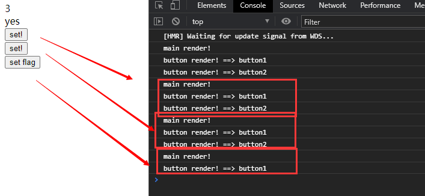

- 点击第一个 set 按钮时，`addOne`被调用，cnt 修改，导致**Main**组件重新 render，addOne、addTwo 被重新更新。
- 点击第二个 set 按钮，道理一样。
- 点击第三个 set 按钮，`setFlag`被调用，flag 改变，但是 addTwo 由于**memoized**了，不会进行更新，从而第二个 button 不会触发 render。

### useMemo

`useMemo`比`useCallback`适用性更加广：

```jsx
import React, { useMemo } from "react"
import { useState } from "react"

const getTenBigger = cnt => {
  console.log("函数被重新定义")
  return cnt + 10
}

const TryUseMemo = () => {
  const [cnt, setCnt] = useState(0)
  const [flag, setFlag] = useState(false)

  let tenBigger = useMemo(() => getTenBigger(cnt), [cnt])
  return (
    <div>
      <div>{tenBigger}</div>
      <div>{flag ? "yes" : "no"}</div>
      <button onClick={() => setCnt(cnt + 1)}>add!</button>
      <button onClick={() => setFlag(!flag)}>set flag</button>
    </div>
  )
}

export default TryUseMemo
```

按下**setFlag**按钮之后，函数`getTenBigger`并没有重新定义，第五行的打印也就不会执行。它只在`cnt`改变之后才会重新定义：


相对于`useCallback`，`useMemo`的返回值可以是多样的，更加灵活，前者只能是函数。

## 使用懒加载

### 介绍

想象一下我们直接将项目打包，体积可能会非常大。上线必然会遇到一些令人不适的问题 -- 极慢的首屏加载、CDN 流量的浪费……懒加载可以让我们做到**按需加载**，来看下面这个案例：

```jsx
import React, { useState } from "react"
import OtherComponent from "./OtherComponent"

const LazyLoad = () => {
  const [show, setShow] = useState(false)
  return (
    <div>
      <button onClick={() => setShow(!show)}>show!</button>
      {show && <OtherComponent />}
    </div>
  )
}

export default LazyLoad
```

**LazyLoad**组件有一个按钮，按下按钮显示**OtherComponent**组件，在现实中这可能是个登录业务 --
用户登录则展示管理面板。在页面一打开时就把所有组件加载意义不大，且会导致加载缓慢，我们可以使用 react 提供的懒加载组件`React.lazy`。

### 尝试 React.lazy

我们将上面的代码稍作修改：

React 的懒加载通过，`import()`、`lazy()`、`Suspense`组件实现。

```jsx
import React, { lazy, Suspense, useState } from "react"

const Other = lazy(() => import("./OtherComponent"))

const LazyLoad = () => {
  const [show, setShow] = useState(false)
  return (
    <div>
      <button onClick={() => setShow(!show)}>show!</button>
      <Suspense fallback={null}>{show && <Other />}</Suspense>
    </div>
  )
}

export default LazyLoad
```

使用懒加载前：

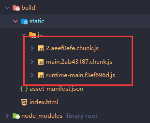

使用懒加载后：

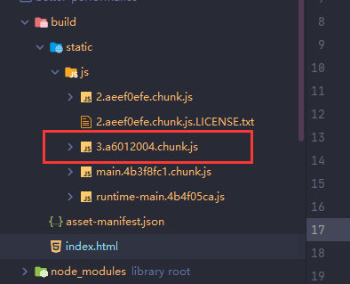

红色方框的 js 文件只有在**按钮被单击**时才会加载。

### React.lazy 原理

#### 从 import()说起

`import()`被称为**动态 import**，来看这样一个例子：

```javascript
// index.js
const Component = () => {
  let element = document.createElement("div")
  let button = document.createElement("button")
  let br = document.createElement("br")

  button.innerHTML = "单击我加载 print.js"
  element.innerHTML = "hello world~"
  element.appendChild(br)
  element.appendChild(button)
  button.onclick = () =>
    import("./print").then(m => {
      console.log(m)
      m.default()
    })
  return element
}

document.body.appendChild(Component())
```

```javascript
// 被懒加载的模块 -- print.js
console.log("print.js懒加载....")

export default () => {
  console.log("按钮被按下啦~")
}
```

当 Webpack 解析到该`import()`语法时，会自动进行代码分割。

#### React-lazy 实现

`lazy`的代码如下，删除了开发环境下额外处理的部分，它返回一个`LazyComponent`对象，请务必留意这些代码，下面会提到：

```typescript
import type { LazyComponent, Thenable } from "shared/ReactLazyComponent"

import { REACT_LAZY_TYPE } from "shared/ReactSymbols"

export function lazy<T, R>(ctor: () => Thenable<T, R>): LazyComponent<T> {
  let lazyType = {
    $$typeof: REACT_LAZY_TYPE,
    _ctor: ctor,
    // React uses these fields to store the result.
    _status: -1,
    _result: null,
  }
  return lazyType
}
```

在`packages/react-reconciler/src/ReactFiberBeginWork.js`下有一个`mountLazyComponent`函数，我们一眼可以看出红框部分是加载 lazy 组件的关键代码：

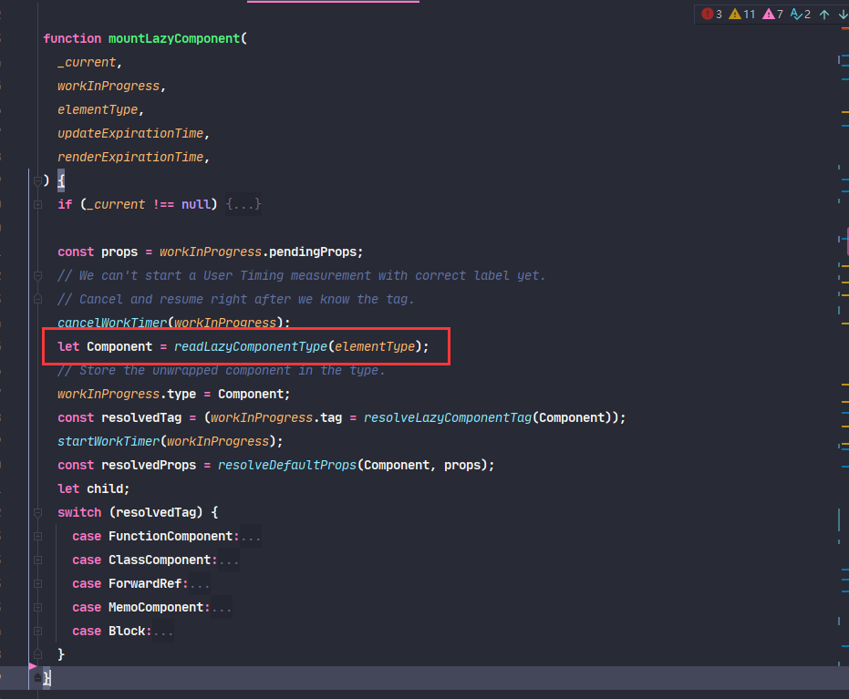

它的代码如下：

```typescript
export function readLazyComponentType<T>(lazyComponent: LazyComponent<T>): T {
  initializeLazyComponentType(lazyComponent)
  if (lazyComponent._status !== Resolved) {
    throw lazyComponent._result
  }
  return lazyComponent._result
}
```

来看`initializeLazyComponentType`，这里是核心部分:

```typescript
export const Uninitialized = -1
export const Pending = 0
export const Resolved = 1
export const Rejected = 2

export function initializeLazyComponentType(
  lazyComponent: LazyComponent<any>
): void {
  if (lazyComponent._status === Uninitialized) {
    lazyComponent._status = Pending
    const ctor = lazyComponent._ctor
    const thenable = ctor()
    lazyComponent._result = thenable
    thenable.then(
      moduleObject => {
        if (lazyComponent._status === Pending) {
          const defaultExport = moduleObject.default
          lazyComponent._status = Resolved
          lazyComponent._result = defaultExport
        }
      },
      error => {
        if (lazyComponent._status === Pending) {
          lazyComponent._status = Rejected
          lazyComponent._result = error
        }
      }
    )
  }
}
```

这个函数主要干了这些事情：

- 判断**lazyComponent 对象**的`_status`变量是否为`Uninitialized`(未初始化，值为 -1) 。如果您对前面的内容还有记忆的话，开发者调用`lazy`函数时会初始化`_result`为 **-1**。
- 准备加载组件，将状态设置为`Pending`(加载中，值为 0 )。
- 调用`ctor()`函数，这个`ctor`的类型为`Thenable`(即带有`then`方法) ：

```typescript
export type Thenable<T, R> = {
  then(resolve: (T) => mixed, reject: (mixed) => mixed): R,
  ...
};
```

其实，他就是我们上面提到的`import("./xxxxxx")`这个动态导入语法。

- 执行`thenable.then()`，拿到对应的模块，如果此时状态为`Pending`，让`_result`指向`moduleObject.default`，至此，我们的**lazyComponent**初始化完毕。
- 如果加载失败了，在`error`处捕获它，将状态置为`Reject`，结果置为`error`。

我们回到上面的`readLazyComponentType`函数，如果结果不为`resolved`，则抛出“异常”，这个异常会交给`Suspence`组件处理，Suspence 组件会渲染**fallback**中的内容。

## 参考资料

Mayank Gupta, [22 React Performance Optimization Techniques](https://medium.com/technofunnel/https-medium-com-mayank-gupta-6-88-21-performance-optimizations-techniques-for-react-d15fa52c2349#67cc)

MDN, [Polyfill](https://developer.mozilla.org/zh-CN/docs/Glossary/Polyfill)

React docs, [reconciliation](https://zh-hans.reactjs.org/docs/reconciliation.html)

React，[React 代码仓库](https://github.com/facebook/react)
