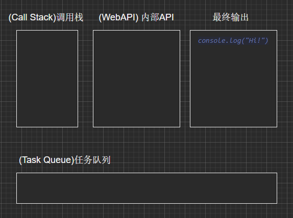
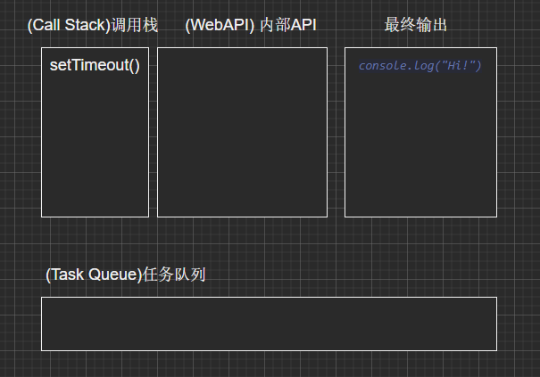
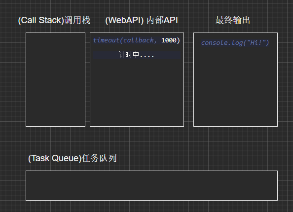
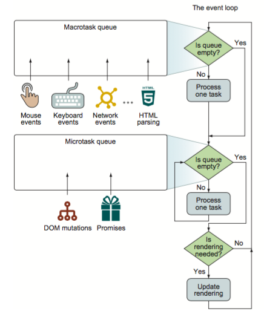
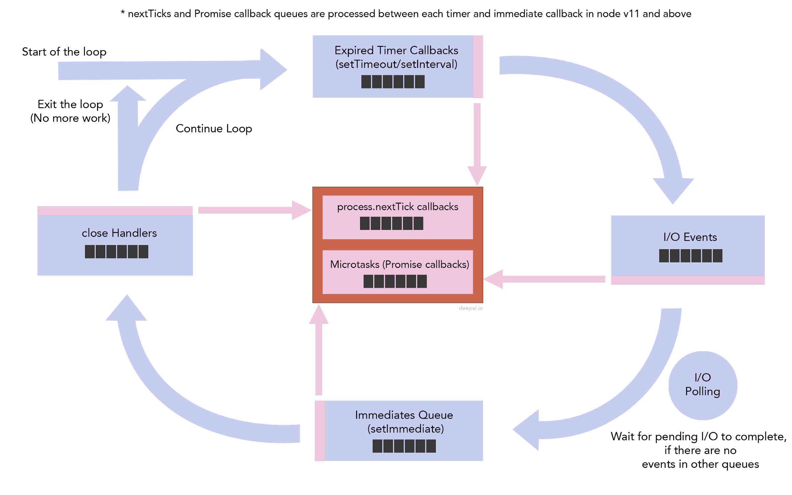

## 总述

本文将深入分析浏览器和 NodeJS 的事件循环。

## 事件循环

如何理解事件循环？

[HTML Standard](https://html.spec.whatwg.org/multipage/webappapis.html#event-loops) 如此介绍道：

To coordinate events, user interaction, scripts, rendering, networking, and so forth, user agents must use event loops
as described in this section. Each agent has an associated event loop, which is unique to that agent.

> 为了协调事件、用户交互、脚本、渲染、网络等，用户代理（如浏览器）必须使用事件循环。 每个代理有一个关联的事件循环，它是唯一的。

[NodeJS 官网](https://nodejs.org/en/docs/guides/event-loop-timers-and-nexttick) 如此介绍道：

The event loop is what allows NodeJS to perform non-blocking I/O operations — despite the fact that JavaScript is
single-threaded。

> 事件循环是 NodeJS 处理非阻塞 I/O 操作的机制——尽管 JavaScript 是单线程处理的。

这里顺便提一下 **IO**：维基百科这样描述：I/O 通常指数据在存储器（内部和外部）或其他周边设备之间的输入和输出，是信息处理系统（例如计算机）与外部世界（可能是人类或另一信息处理系统）之间的通信。 我们 node 开发环境中最常见的有**文件读写**、**网络请求**操作。

对于浏览器，用户交互（如浏览器鼠标事件）、网络（ajax 请求）是浏览器内部提供的 API （当然再往底层走也是面向操作系统）。

综上所述，事件循环是 JavaScript 引擎和浏览器接口/操作系统沟通的一座桥梁，是浏览器、NodeJS 实现异步的方法。

## 浏览器的事件循环

### 概念

介绍浏览器的事件循环之前，我们必须理解一些概念：

**Task（任务）**：一个任务就是由执行诸如从头执行一段程序、执行一个事件回调或一个 **interval/timeout** 被触发之类的标准机制而被调度的任意 JavaScript 代码。这些都在任务队列（task
queue）上被调度。

**Task queues（任务队列）**：一个事件循环具有一个或多个任务队列。任务队列是任务的**集合**。

**Web API（浏览器接口）**：浏览器提供给用户的 API。

**Call Stack（调用栈）**：主函数的调用栈。

### 基本流程

来看下面代码：

```javascript
console.log("Hi!")
const foo = name => {
  return "hello " + name
}
setTimeout(() => {
  console.log("setTimeout Finish")
}, 1000)
console.log(foo("sam"))
```

如果没有事件循环，那么执行 `setTimeout()` 会被阻塞，到 1s 之后才执行，这会大大降低程序运行的效率。事件循环机制就是解决这个问题的关键。

实际运行时，是这样实现的：

首先，我们执行 `console.log("Hi!")`:



然后是函数 `foo()` 的定义，啥也不执行。

接着执行 `setTimeout()` 函数：

首先，让 `setTimeout()` 函数入栈：



`setTimeout()` 立即执行，他会调用浏览器的 **WebAPI**，然后立刻出栈（执行完成），此时浏览器底层会**单独地**进行相应的系统调用（如计时器）：



我们接着执行 `console.log(foo("sam"))` ，注意此时 Web API 的计时器也在**同步地执行**，具体的入栈出栈操作这里不再赘述。

此时主函数的代码执行完毕，主线程会一直去查看任务队列有没有任务，如果有，将它压如调用栈，执行之。

一旦计时器执行完成，**Web API** 会将回调函数放入回调队列中。主线程发现回调队列有内容，会从队列中取出它，放到调用栈中执行：

您可以进入[这个网站](http://latentflip.com/loupe/?code=Y29uc29sZS5sb2coIkhpISIpOw0KDQpzZXRUaW1lb3V0KGZ1bmN0aW9uIHRpbWVvdXQoKSB7DQogIGNvbnNvbGUubG9nKCJoZWxsbyB3b3JsZCEiKTsNCn0sIDIwMDApOw0KDQpjb25zb2xlLmxvZygibWFpbiBlbmQiKTs%3D!!!PGJ1dHRvbj5DbGljayBtZSE8L2J1dHRvbj4%3D)
来可视化体验浏览器的事件循环过程。

### 宏任务和微任务

值得注意的是，上面提到的回调队列是有优先级的顺序的，这里需要了解一下两个名词：

- **宏任务队列**（macrotask queue）：**ajax**、**setTimeout**、**setInterval**、**DOM 监听**等。
- **微任务队列**（microtask queue）：Promise 的 then 回调、`queueMicrotask()` 等。

其步骤总结如下图：



我们可以发现，事件循环期望微任务**尽可能快地被执行完成**，在上图中体现为每次执行完成一个宏任务，都会去查看微任务队列中有没有内容，如果有，则执行它们直至队列为空。

### 实践

来看下面的代码：

```javascript
console.log("start")
setTimeout(function () {
  console.log("setTimeout!")
}, 0)
Promise.resolve()
  .then(function () {
    console.log("promise1")
  })
  .then(function () {
    console.log("promise2")
  })
console.log("end")
```

分析一下过程：

- 打印 **start** 字符串。
- `setTimeout()` 进入 **macrotask queue**。
- `Promise.then()` 后的回调进入 **microtask queue**。
- 执行最后一行，打印 end 字符串。
- 全局代码执行完毕，接下来执行 **microtask** 的任务，打印 promise1、promise2。
- 这时 microtask 队列已经为空，从上面的流程图可知，接下来主线程可能会去做一些 UI 渲染工作，然后开始下一轮 event loop， 执行 `setTimeout()` 的回调，打印出 **setTimeout!**字符串。

接下来，我们介绍 NodeJS 的事件循环，其机制比浏览器复杂得多。

## NodeJS 的事件循环

NodeJS 的事件循环的核心是 **[libuv](https://zh.wikipedia.org/wiki/Libuv)** 库，它提供对基于事件循环的异步 I/O 的支持。

- 我们的 JavaScript 会被送到 **v8** 引擎进行处理。
- 代码中会调用 Node API，会交给 libuv 库处理。
- libuv 通过一个事件循环（可以理解为轮询）来查询结果，并将结果放到事件队列中，然后交给 v8 引擎。

### 流程

下图是事件循环的流程，一次事件循环又被称为一次 **Tick**，**每个阶段都有一个队列来执行回调**。不同类型的事件在它们自己的队列中排队。

- **定时器（timers）**：本阶段执行已经被 `setTimeout()` 和 `setInterval()` 的调度回调函数。
- **待定回调（pending callbacks）**：执行延迟到下一个循环迭代的 I/O 回调。
- **idle, prepare**：仅系统内部使用。
- **轮询（poll）**：检索新的 I/O 事件、执行与 I/O 相关的回调（几乎所有情况下，除了关闭的回调函数，那些由计时器和 `setImmediate()` 调度的之外），其余情况 node 将在适当的时候在此阻塞。
- **检测（check）**：`setImmediate()` 回调函数在这里执行。
- **关闭的回调函数（close callbacks）**：一些关闭的回调函数，如：`socket.on('close', ...)`。

下图展示了这个流程：



可以看出，**Expired timers** 即上面的定时器阶段、**IO Events** 即上面的 `poll` 阶段、`close Handlers` 即上面的 `close callbacks` 阶段。

我们还注意到两个中间队列，（这两个队列不属于 libuv，属于 nodeJS 运行环境）：

- **Next Ticks Queue**：使用 `process.nextTick()` 函数添加的回调，它比 **Other Microtasks Queue** 优先级高。
- **Other Microtasks Queue**：其他微任务队列，例如 promise 的 `then()` 回调、`queueMicroTask()`。

事件循环的启动从定时器（timers）阶段开始，**一旦一个阶段完成**，事件循环就会检查上面说到的两个中间队列中是否有可用的回调。如果有，事件循环将立即开始处理它们，直到清空这两个队列为止。

### Timer 阶段

这是事件循环的第一个阶段，Node 会去检查有无已过期的**timer**，如果有则把它的回调压入**timer**的任务队列中等待执行，事实上，Node 并不能保证**timer**在预设时间到了就会立即执行，因为 Node 对**timer**的过期检查不一定靠谱，它会受机器上其它运行程序影响，或者那个时间点主线程不空闲。比如下面的代码，`setTimeout()` 和 `setImmediate()` 的执行顺序是不确定的。

setTimeout(() => {
console.log("setTimeout");
}, 0);
setImmediate(() => {
console.log("setImmediate");
});

````

可以得到输出：

```shell
$ node timeout_vs_immediate.js
setTimeout
immediate
$ node timeout_vs_immediate.js
immediate
setTimeout
````

这是因为 setTimeout 最少为 1 毫秒，所以关键就在这个 1 毫秒，如果同步代码执行时间较长，进入 Event Loop 的时候 1 毫秒已经过了，setTimeout 执行，如果 1 毫秒还没到，就先执行了 setImmediate。

但如果把它们放到一个 I/O 回调里面，就一定是 `setImmediate()` 先执行。

```js
// timeout_vs_immediate.js
const fs = require("fs")
fs.readFile(__filename, () => {
  setTimeout(() => {
    console.log("timeout")
  }, 0)
  setImmediate(() => {
    console.log("immediate")
  })
})
```

可以得到输出：

```shell
$ node timeout_vs_immediate.js
immediate
timeout
$ node timeout_vs_immediate.js
immediate
timeout
```

上面代码会先进入 I/O callbacks 阶段，然后是 check 阶段，最后才是 timers 阶段。因此，setImmediate 才会早于 setTimeout 执行。

```js
console.log("outer")

setTimeout(() => {
  setTimeout(() => {
    console.log("setTimeout")
  }, 0)
  setImmediate(() => {
    console.log("setImmediate")
  })
}, 0)
```

上面代码类似，从最外层看，已经到 timer 阶段，且之后并没有回调函数了,进入 check queue 执行`setImmediate`，然后是新一轮 timer，执行`setTimeout`。

### 原生 Promise

上图已经指出，promise 的 `then()` 回调属于**其他微任务队列（Other Microtasks Queue）**，来看下面代码：

```javascript
Promise.resolve().then(() => console.log("promise1 resolved"))
Promise.resolve().then(() => console.log("promise2 resolved"))
Promise.resolve().then(() => {
  console.log("promise3 resolved")
  process.nextTick(() =>
    console.log("next tick inside promise resolve handler")
  )
})
Promise.resolve().then(() => console.log("promise4 resolved"))
Promise.resolve().then(() => console.log("promise5 resolved"))
setImmediate(() => console.log("set immediate1"))
setImmediate(() => console.log("set immediate2"))
process.nextTick(() => console.log("next tick1"))
process.nextTick(() => console.log("next tick2"))
process.nextTick(() => console.log("next tick3"))
setTimeout(() => console.log("set timeout"), 0)
setImmediate(() => console.log("set immediate3"))
setImmediate(() => console.log("set immediate4"))
```

- 五个 promise 的 `then` 回调将进入 **Other Microtasks Queue**。
- 两个 `setImmediate` 将进入 **Check Queue**。
- 三个 `next tick` 回调将进入 **nextTick queue**。
- 一个 `setTimeout` 回调将在适当的时刻进入 **timers Queue**。
- 两个 `setImmediate` 回调将进入 **Check Queue**。
- 事件循环将开始检查并处理 process.nextTick 队列。
- 检查 **Other Microtasks Queue**，处理相应的 promise 回调。
- 在上一步的过程中，一个新的 `nextTick` 回调被加入**nextTick queue**。node 会去处理它。直至没有更多的微任务(注意是执行完一个阶段后才会去检查 nextTick queue 或 Other Microtasks Queue)。
- 事件循环进入计时器阶段，处理一个计时器回调。
- 进入检测（check）阶段，处理所有的 `set immediate`。

最终程序将打印如下内容：

```
next tick1
next tick2
next tick3
promise1 resolved
promise2 resolved
promise3 resolved
promise4 resolved
promise5 resolved
next tick inside promise resolve handler
set timeout
set immediate1
set immediate2
set immediate3
set immediate4
```
