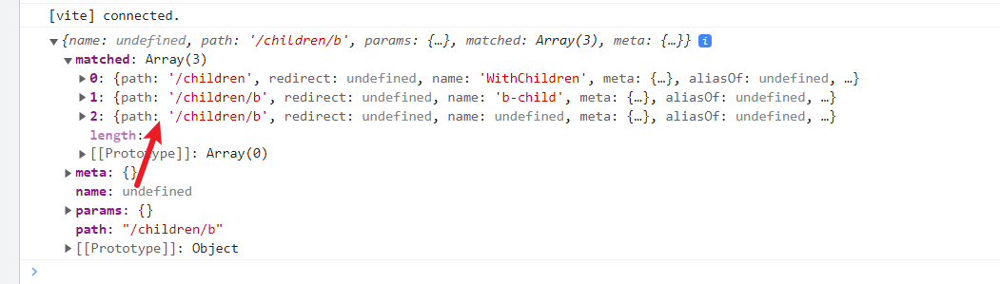

## 总述

什么是路由？早期，路由其实是个**后端概念**，在服务端渲染（**SSR**）的 app 中，后端处理 HTML，并返回它，像这样：

```http
https://www.google.com/something.html
```

我们可以通过不同的路径，请求不同的静态资源，这种方式就是路由。

在后来我们有了**SPA**，被称为单页应用，单页应用不仅仅是在页面交互是无刷新的，连**页面跳转**都是**无刷新**的，为了实现单页应用，所以就有了前端路由。

其实说白了就是我们让`url`的地址发生变化，但是不会去真正的去发送请求到后端，而在前端监听`url`变化来执行相应的`js`代码来实现页面的“跳转”。

**SPA**有好处也有坏处，它的好处正如我们所说的，页面的交互是无刷新的，对用户更友好(感觉页面的反应更快了)。

坏处也很明显，`SEO`(Search Engine Optimization)很差，因为实际上我们只有一个页面嘛，而搜索引擎大多是使用爬虫去爬取`HTML`的关键字来决定搜索排名。

### 前置知识

#### hashRouter

##### hash 值的变化不会让浏览器发起请求

假设我们有个 HTML：

```html
<!DOCTYPE html>
<html lang="en">
  <head>
    <meta charset="UTF-8" />
    <title>Title</title>
  </head>
  <body>
    hello world
  </body>
</html>
```

使用本地服务器托管，访问页面：

可以看到页面正常显示了。

这时我们往地址栏的 url 后加入一些内容：

回车，我们发现浏览器并没有刷新。即就是说 hash 值的变化，并不会导致浏览器向服务器发出请求，浏览器不发出请求，也就不会刷新页面。

基于浏览器的这个特性，我们可以用**hash 模式**实现一个路由，首先我们来了解一下有关 hash 路由的 API。

##### hashChange 事件

HTML5 增加了 hashchange 事件，用于在 URL 散列值（ URL 最后#后面的部分）发生变化时通知开发者。这是因为开发者经常在 Ajax 应用程序中使用 URL 散列值存储状态信息或路由导航信息。

尝试在浏览器控制台运行以下代码：

```javascript
window.addEventListener("hashchange", event => {
  console.log(`Old URL: ${event.oldURL}, New URL: ${event.newURL}`)
})
```

然后修改当前 url 的散列值，你会发现回调函数被触发了。

##### 预期的流程

知道了上面的 API，我们可以构建出如下的流程：

- 旧地址为`http://localhost:63342/frontendRouter/#/page1`
- 修改 hash 值，准备跳转到新地址`http://localhost:63342/frontendRouter/#/page2`，但是要注意跳转的类型：

  - **刷新页面**，是不会触发`hashchange`的，我们可以使用`load`事件。
  - 输入链接回车跳转，会触发`hashchange`。
  - 浏览器的后退,前进按钮，会触发`hashchange`

- 根据我们的 hash 来匹配相应的页面。（这里的”页面“我们可以简单地看成一个 HTML 片段），如果匹配不到，我们执行重定向。
- 替换相应的 DOM。

##### DEMO

下面是一个简单的**hashRouterDEMO**:

```html
<!DOCTYPE html>
<html lang="en">
  <head>
    <meta charset="UTF-8" />
    <title>Title</title>
    <script>
      const myHashTable = {
        page1: "<div>我是第一页</div>",
        page2: "<div>我是第二页</div>",
        default: "hello world",
      }
      window.addEventListener("load", () => {
        const newHash = location.hash.split("#/")[1]
        document.body.innerHTML = myHashTable.hasOwnProperty(newHash)
          ? myHashTable[newHash]
          : myHashTable["default"]
      })
      window.addEventListener("hashchange", event => {
        console.log(
          `url Hash值被改变！Old URL: ${event.oldURL}, New URL: ${event.newURL}`
        )
        const newHash = event.newURL.split("/#/")[1]
        document.body.innerHTML = myHashTable.hasOwnProperty(newHash)
          ? myHashTable[newHash]
          : myHashTable["default"]
      })
    </script>
  </head>
  <body>
    hello world
  </body>
</html>
```

#### HTML5 History API

**history** 对象表示当前窗口首次使用以来用户的导航历史记录。因为 history 是 window 的属性，所以每个 window 都有自己的 history 对象。出于安全考虑，这个对象不会暴露用户访问过的 URL，但可以通过它在不知道实际 URL 的情况下前进和后退。

##### go()

`go()`方法可以在用户历史记录中沿任何方向导航，可以前进也可以后退。这个方法只接收一个参数，
这个参数可以是一个整数，表示前进或后退多少步。负值表示在历史记录中后退（类似点击浏览器的“后
退”按钮），而正值表示在历史记录中前进（类似点击浏览器的“前进”按钮）。`go(0)`或者没有参数将刷新当前页面。

```javascript
// 后退一页
history.go(-1)
// 前进一页
history.go(1)
// 前进两页
history.go(2)
```

##### back() / forward()

它们是`go()`的语法糖。

```javascript
// 后退一页
history.back()
// 前进一页
history.forward()
```

##### pushState()

`pushState()`方法执行后，状态信息就会被推到历史记录中，浏览器地址栏也会改变以反映新的相对 URL（可以想象成一个“假的”URL）。

因为 `pushState()`会创建新的历史记录，所以也会相应地启用“后退”按钮。此时单击“后退”按钮，就会触发 window 对象上的 popstate 事件。

##### 刷新白屏问题

如果你使用一些前端框架和它的路由管理插件，那么有时会出现刷新白屏现象。

这一现象的本质在于：我们使用`pushState()`创建的每一个**假的 URL(可以看成一个“状态”)**并没有在服务器上对应一个**真实物理 URL**。所谓的白屏其实就是 404 错误。

如果服务端使用了**nginx**，那么我们可以这样配置来处理这个问题（方案就是将当前的 url 重定向到 index.html 下）：

```nginx
server {
    listen       80;
    server_name  xxxx.yuzzl.top;
    root  xxxxxx;

    // 下面是重点！
    location / {
        try_files $uri $uri/  /index.html;
    }
}
```

### 从基本的路由开始

了解了前置知识,那么各种路由库无非是利用这两种模式来作进一步的封装，使其适应自身的框架罢了，来看下图（来自官方文档）：


可以发现，两种模式对应我们前面说到两种路由方案 -- **Hash**和**HTML5**，分别对应`createWebHistory`(`src/history/hash.ts`下)和`createWebHistory`(`src/history/html5.ts`下)。

接下来，我们就从这两个模式的具体实现讲起。

## createWebHistory

### 整体描述

`createWebHistory`最终返回一个`routerHistory`，它的主要流程如下：

- 利用`useHistoryStateNavigation`初始化一个导航对象`historyNavigation`。

```typescript
const historyNavigation = useHistoryStateNavigation(base)
```

- 利用`useHistoryListeners`初始化一个路由监听器`historyListeners`。

```typescript
const historyListeners = useHistoryListeners(
  base,
  historyNavigation.state,
  historyNavigation.location,
  historyNavigation.replace
)
```

- 封装我们熟悉的`history.go()`：

```typescript
function go(delta: number, triggerListeners = true) {
  if (!triggerListeners) historyListeners.pauseListeners()
  history.go(delta)
}
```

- 初始化我们要返回的对象(将几个对象合并)：

```typescript
const routerHistory: RouterHistory = assign(
  {
    // it's overridden right after
    location: "",
    base,
    go,
    createHref: createHref.bind(null, base),
  },
  historyNavigation,
  historyListeners
)
```

- 利用`Object.defineProperty`, 为`routerHistory`绑定属性`location`和`state`。
  这个操作无非是为调用者提供方便，我们访问`location`属性等价于`historyNavigation.location.value`,`state`属性等价于`historyNavigation.location.value`。

```typescript
Object.defineProperty(routerHistory, "location", {
  get: () => historyNavigation.location.value,
})
Object.defineProperty(routerHistory, "state", {
  get: () => historyNavigation.state.value,
})
```

我们对源码稍作处理, 将`routerHistory`挂载到`window`上，方便操作：

```typescript
// @ts-ignore
window.MY_HISTORY = routerHistory
return routerHistory
```

起一个空白的 H5 页面，只执行上面的方法，可以看出，这些路由操作全部如期望的一样执行，上升到框架层面，无非也是对这个`routerHistory`进行各种操作，所以封装一套**通用的路由操作 API**至关重要。


接下来，我们来看看`routerHistory`的一些详细的实现。

### useHistoryStateNavigation -- 路由导航操作集

上面说到`createWebHistory`利用`useHistoryStateNavigation`初始化一个导航对象`historyNavigation`，我们走进`useHistoryStateNavigation`一探究竟。

首先是一个对象解构，获得 window 下的`history`和`location`，他们是路由操作的核心部分。

```ts
const { history, location } = window
```

接下来利用`createCurrentLocation`获取当前位置：

```typescript
let currentLocation: ValueContainer<HistoryLocation> = {
  value: createCurrentLocation(base, location),
}
```

`createCurrentLocation`内容如下：

```typescript
/**
 * Creates a normalized history location from a window.location object
 * 从 window.location 获取标准化的位置
 * @param base
 * @param location -
 */
function createCurrentLocation(
  base: string,
  location: Location
): HistoryLocation {
  const { pathname, search, hash } = location
  // allows hash based url
  const hashPos = base.indexOf("#")
  if (hashPos > -1) {
    // prepend the starting slash to hash so the url starts with /#
    let pathFromHash = hash.slice(1)
    if (pathFromHash[0] !== "/") pathFromHash = "/" + pathFromHash
    return stripBase(pathFromHash, "")
  }
  const path = stripBase(pathname, base)
  return path + search + hash
}
```

这个函数的功能很简单，传入一个`base`(基础路径，这个功能主要是给`HashRouter`作准备的)和全局`location`，进行一系列字符串操作，返回一个由**路径** + **search**(就是 URL 中的查询参数，即?a=1 之类的) + **hash**(url 中#后面的值)拼接而成的字符串。
最终这个字符串会被暴露给用户，其实就是上面提到的`historyNavigation.location`。

我们继续讨论主函数，在获取当前状态之后，又对`history.state`进行了一些处理：

```typescript
let historyState: ValueContainer<StateEntry> = { value: history.state }
// build current history entry as this is a fresh navigation
if (!historyState.value) {
  changeLocation(
    currentLocation.value,
    {
      back: null,
      current: currentLocation.value,
      forward: null,
      // the length is off by one, we need to decrease it
      position: history.length - 1,
      replaced: true,
      // don't add a scroll as the user may have an anchor and we want
      // scrollBehavior to be triggered without a saved position
      scroll: null,
    },
    true
  )
}
```

来看看下面的`changeLocation()`, 这个函数很重要:

```typescript
function changeLocation(
  to: HistoryLocation,
  state: StateEntry,
  replace: boolean
): void {
  // when the base has a `#`, only use that for the URL
  const hashIndex = base.indexOf("#")
  const url =
    hashIndex > -1
      ? base.slice(hashIndex) + to
      : createBaseLocation() + base + to
  try {
    // 这里对Safari浏览器的个性异常做了捕获
    // BROWSER QUIRK
    // NOTE: Safari throws a SecurityError when calling this function 100 times in 30 seconds
    history[replace ? "replaceState" : "pushState"](state, "", url)
    historyState.value = state
  } catch (err) {
    if (__DEV__) {
      warn("Error with push/replace State", err)
    } else {
      console.error(err)
    }
    // Force the navigation, this also resets the call count
    location[replace ? "replace" : "assign"](url)
  }
}
```

可以看出`changeLocation`就是对`history.replaceState`/`history.pushState`的封装。它根据传入的`to`（目标），通过字符串拼接来获取目标路径，然后执行相应的 historyAPI。同时修改了外部的`historyState`，我们可以通过查看`StateEntry`接口获取来看看它提供的更加详细的路由状态信息：

```typescript
interface StateEntry extends HistoryState {
  back: HistoryLocation | null
  current: HistoryLocation
  forward: HistoryLocation | null
  position: number
  replaced: boolean
  scroll: _ScrollPositionNormalized | null | false
}
```

可见，`useHistoryStateNavigation`首次调用`changeLocation`的目的就是初始化状态，因为默认的原生路由不会提供上面的状态信息。

回到我们的`useHistoryStateNavigation`，继续往下走，就是我们非常熟悉的 API：

```typescript
function replace(to: HistoryLocation, data?: HistoryState)
function push(to: HistoryLocation, data?: HistoryState)
```

他们本质上是对`changeLocation`又做了一次封装, 并最终暴露给调用者，这里简单地讲一下具体的实现：

**push()**

```typescript
function push(to: HistoryLocation, data?: HistoryState) {
  const currentState = assign(
    {},
    historyState.value,
    history.state as Partial<StateEntry> | null,
    {
      forward: to,
      scroll: computeScrollPosition(),
    }
  )
  if (__DEV__ && !history.state) {
    // 一些错误提示文本，略去
  }
  changeLocation(currentState.current, currentState, true)
  const state: StateEntry = assign(
    {},
    buildState(currentLocation.value, to, null),
    { position: currentState.position + 1 },
    data
  )
  changeLocation(to, state, false)
  currentLocation.value = to
}
```

- 第一步：利用`assign()`合并相关内容，获取当前状态`currentState`。
- 第二步：利用`changeLocation`改变当前状态。
- 第三步：利用`assign()`合并相关内容，获取当前状态`state`（这是最终状态）。
- 第四步：将现在的路径赋值给`currentLocation`,整个过程结束。

我们可以看到，一次`push`状态改变了两次，我们可以在控制台上打印这两个状态一探究竟：

可以看出，第一个状态可以看成一个"中间状态"，体现在`forward`字段上，第二个状态才是我们的最终状态，可以看到`current`已经变成了`hello`。

replace 的过程也差不多，在此就不赘述了。

最后，`useHistoryStateNavigation`返回一个对象, 向外提供了四个 API，外界通过调用它们即可实现对路由的一系列导航跳转操作。

```typescript
return {
  location: currentLocation,
  state: historyState,
  push,
  replace,
}
```

### useHistoryListeners -- 路由监听

`vue-router`利用监听`popstate`事件来实现路由监听，我们首先了解一下`popstate`事件何时触发？

我们查阅`MDN`文档:

> The popstate event of the Window interface is fired when the active history entry changes while the user navigates the session history.

> The popstate event will be triggered by doing a browser action such as a click on the back or forward button (or calling history.back() or history.forward() in JavaScript).

简而言之，当页面已经存在于`history`栈并再此访问`history`栈的页面时才会触发`popstate`，例如用户点击浏览器回退按钮或者使用`history.back()`或者`history.forward()`。

我们来看`useHistoryListeners`函数

```ts
function useHistoryListeners(
  base: string,
  historyState: ValueContainer<StateEntry>,
  currentLocation: ValueContainer<HistoryLocation>,
  replace: RouterHistory['replace']
) {
  let listeners: NavigationCallback[] = []
  let teardowns: Array<() => void> = []

  let pauseState: HistoryLocation | null = null
```

首先定义了监听器栈，移除栈(用于移除监听函数，后面会讲)，和`pauseState`标识。

```ts
function listen(callback: NavigationCallback) {
  // setup the listener and prepare teardown callbacks
  listeners.push(callback)

  const teardown = () => {
    const index = listeners.indexOf(callback)
    if (index > -1) listeners.splice(index, 1)
  }

  teardowns.push(teardown)
  return teardown
}
```

通过`listen`函数将回调压进监听器栈中，同时将移除回调的移除函数压进移除栈中。

我们往下走，发现了`popstate`事件的注册。

```ts
window.addEventListener("popstate", popStateHandler)
window.addEventListener("beforeunload", beforeUnloadListener)
```

进入`popStateHandle`函数

```ts
const popStateHandler: PopStateListener = ({
  state,
}: {
  state: StateEntry | null
}) => {
  const to = createCurrentLocation(base, location)
  const from: HistoryLocation = currentLocation.value
  const fromState: StateEntry = historyState.value
  let delta = 0

  if (state) {
    currentLocation.value = to
    historyState.value = state

    // ignore the popstate and reset the pauseState
    if (pauseState && pauseState === from) {
      pauseState = null
      return
    }
    delta = fromState ? state.position - fromState.position : 0
  } else {
    replace(to)
  }

  // call all listeners
  listeners.forEach(listener => {
    listener(currentLocation.value, from, {
      delta,
      type: NavigationType.pop,
      direction: delta
        ? delta > 0
          ? NavigationDirection.forward
          : NavigationDirection.back
        : NavigationDirection.unknown,
    })
  })
}
```

首先获取了当前的路径，上一跳的路径(from)和`state`(fromState)并初始化了`delta`(本页面与上一跳在`history`栈的距离)。

然后更新了`currentLocation.value`和`historyState.value`来保证下一跳时`from`和`formState`是正确的。

接着就是调用监听器栈中所有的监听器并传入相应的信息来供监听器使用。

还记得刚开始的`pauseState`吗，它是用来暂停监听器的一个标识，我们来看它是如果起作用的。

```ts
function pauseListeners() {
  pauseState = currentLocation.value
}
```

`useHistoryListeners`将`pauseListeners`导出，当调用此函数时`pauseState`被设置为`currentLocation.value`

当下一次`popstate`被触发时，`popStateHandler`被调用。

```ts
const from: HistoryLocation = currentLocation.value

if (pauseState && pauseState === from) {
  pauseState = null
  return
}
```

它会去验证`pauseState`是否与`currentLocation.value`相等，从而中止
`popStateHandler`的执行，也就暂停了监听器的执行。

将`pauseState`重新赋值为`null`意味着监听器函数只会被暂停一次，我们可以来验证一下。


可见监听器函数只被暂停了一次，`popstate`再次触发的时候监听器正常工作。

```ts
function destroy() {
  for (const teardown of teardowns) teardown()
  teardowns = []
  window.removeEventListener("popstate", popStateHandler)
  window.removeEventListener("beforeunload", beforeUnloadListener)
}

return {
  pauseListeners,
  listen,
  destroy,
}
```

`destroy`则为监听器的卸载，`useHistoryListeners`返回一个对象，向外界提供了三个 API。

## createWebHashHistory

这是`VueRouter`提供的第二种路由解决方案，在了解了上面的`createWebHistory`的基本流程之后，我们可以轻松写出`createWebHashHistory`,它只不过是在基础的 URL 之后加上了一个`#`，来看它的实现：

```typescript
export function createWebHashHistory(base?: string): RouterHistory {
  base = location.host ? base || location.pathname : ""
  if (base.indexOf("#") < 0) base += "#"
  if (__DEV__ && !base.endsWith("#/") && !base.endsWith("#")) {
    warn(
      `A hash base must end with a "#":\n"${base}" should be "${base.replace(
        /#.*$/,
        "#"
      )}".`
    )
  }
  return createWebHistory(base)
}
```

## 总结

至此，`VueRouter`的路由核心部分已经全部分析完成，这一部分的源码中没有提到任何`Vue`的知识，只是对**原生的 API 进行封装**。保证了其**高可用性**。此时，我们也可以手撕一个完美的路由库了。

### 两种路由模式有什么不同

#### hash

hash 路由利用了浏览器的特性 -- hash 值的变化，并不会导致浏览器向服务器发出请求，浏览器不发出请求，也就不会刷新页面：

```http
https://xxx.com/xxx/hello#helloworld
// 不变刷新页面
https://xxx.com/xxx/hello#helloworld2
```

通过监听`hashchange`事件来实现我们的目标。

hash 路由对于没有主机的 Web 应用程序很有用。

#### history

history 路由利用 HTML5 的`HistoryAPI`来控制状态。

history 路由适合有主机的 Web 应用程序，由于每一个**虚拟的 URL**需要对应服务端的一个地址，所以我们需要在服务端（例如 nginx）进行重定向，例如在`nginx`下可以如此处理：

```nginx
location / {
  try_files $uri $uri/ /index.html;
}
```

更多的处理方案请自行阅读官方文档。

### VueRouter 对底层路由管理实现的巧妙之处

`VueRouter`的`hashRouter`是基于`WebHistory`的，只是在基础 url 之后加了一个`#`，这一操作不仅实现了`hashRouter`的特性，同时完美利用了之前封装好的`HistoryAPI`，真可谓路由封装的最佳实践。

## 路由 vuetify

在这里之前封装好的路由将被赋予`vue`的特性, 这也是`VueRouter`源码的核心部分。主要的代码位于`src/router.ts`下，下面展示一个`Demo`代码(来自官网)，来回顾一下`vueRouter`是如何使用的。

```js
// 第一步: 定义路由组件
const Home = { template: "<div>Home</div>" }
const About = { template: "<div>About</div>" }

// 第二步: 定义路径和组件的映射关系
const routes = [
  { path: "/", component: Home },
  { path: "/about", component: About },
]

// 第三步: 创建路由实例
const router = VueRouter.createRouter({
  // 第四步： 设置路由的模式
  history: VueRouter.createWebHashHistory(),
  routes,
})

// 第五步: 初始化vue
const app = Vue.createApp({})

app.use(router)

app.mount("#app")
```

我们介绍的重点在第三步，我们从 `createRouter()` 起手来分析其原理。

### 路由初始化

`createRouter()` 用来创建供`Vue`应用程序使用的`Router`实例。它返回一个 `router` 对象，里面就是我们熟悉的一系列 `vue-router` API：


#### 整体过程

我们省略函数定义(后面会讲)和一些细节处理，突出主干部分。

我以代码和注释的形式来解释。

```ts
export function createRouter(options: RouterOptions): Router {
  // 1.初始化matcher，可以看成路由管理器
  const matcher = createRouterMatcher(options.routes, options)
  // 2.获取路由API(hashAPI 或者 HistoryAPI)
  const routerHistory = options.history

  // 3.利用useCallbacks()处理化前置守卫、解析守卫、后置守卫
  const beforeGuards = useCallbacks<NavigationGuardWithThis<undefined>>()
  const beforeResolveGuards = useCallbacks<NavigationGuardWithThis<undefined>>()
  const afterGuards = useCallbacks<NavigationHookAfter>()

  // 4.当前路由注意这里与vue3结合，使用了vue3的shallowRef，做到了响应式路由
  const currentRoute = shallowRef<RouteLocationNormalizedLoaded>(
    START_LOCATION_NORMALIZED
  )

  const router: Router = {
    // 5. 准备挂载到全局vueApp上，这是vue提供的插件功能，之后这个函数会被vue调用
    install(app: App) {
      // 省略，后面会讲到
    },
    // 6. 省略其他暴露的API，可见上图
  }

  return router
}
```

#### createRouterMatcher --初始化路由 matcher

```typescript
const matcher = createRouterMatcher(options.routes, options)
```

首先利用 `createRouterMatcher()` 初始化了 `matcher` 变量，这个函数返回值如下, 可以看出是路由处理的一套`API`，其中有部分再次向外暴露给用户（可以对比一下本节的第一张图片），如`addRoute`，很明显，我们可以利用这些 API 使用**动态路由**功能：

```typescript
return { addRoute, resolve, removeRoute, getRoutes, getRecordMatcher }
```

### addRoute()

`createRouterMatcher`传入路由表`routes`，以及全局配置`globalOptions`, 它利用`addRoute()`递归地遍历路由表, 来看`addRoute()`，其中参数`record`表示单个路由记录:

```ts
function addRoute(
  record: RouteRecordRaw,
  parent?: RouteRecordMatcher,
  originalRecord?: RouteRecordMatcher
) {
  // 判断是否为根路由
  const isRootAdd = !originalRecord
  // 对路由记录作正常化处理，返回的是处理后的路由记录
  const mainNormalizedRecord = normalizeRouteRecord(record)
  // 处理路由记录别名功能
  mainNormalizedRecord.aliasOf = originalRecord && originalRecord.record
  const options: PathParserOptions = mergeOptions(globalOptions, record)
  // generate an array of records to correctly handle aliases
  const normalizedRecords: typeof mainNormalizedRecord[] = [
    mainNormalizedRecord,
  ]
  if ("alias" in record) {
    const aliases =
      typeof record.alias === "string" ? [record.alias] : record.alias!
    for (const alias of aliases) {
      normalizedRecords.push(
        assign({}, mainNormalizedRecord, {
          // this allows us to hold a copy of the `components` option
          // so that async components cache is hold on the original record
          components: originalRecord
            ? originalRecord.record.components
            : mainNormalizedRecord.components,
          path: alias,
          // we might be the child of an alias
          aliasOf: originalRecord
            ? originalRecord.record
            : mainNormalizedRecord,
          // the aliases are always of the same kind as the original since they
          // are defined on the same record
        }) as typeof mainNormalizedRecord
      )
    }
  }

  let matcher: RouteRecordMatcher
  let originalMatcher: RouteRecordMatcher | undefined
  // 遍历所有路由记录
  for (const normalizedRecord of normalizedRecords) {
    // 格式化路径
    const { path } = normalizedRecord

    if (parent && path[0] !== "/") {
      const parentPath = parent.record.path
      const connectingSlash =
        parentPath[parentPath.length - 1] === "/" ? "" : "/"
      normalizedRecord.path =
        parent.record.path + (path && connectingSlash + path)
    }

    // 初始化父路由信息(为子路由准备的)
    matcher = createRouteRecordMatcher(normalizedRecord, parent, options)

    if (__DEV__ && parent && path[0] === "/")
      checkMissingParamsInAbsolutePath(matcher, parent)

    // if we are an alias we must tell the original record that we exist
    // so we can be removed
    if (originalRecord) {
      originalRecord.alias.push(matcher)
      if (__DEV__) {
        checkSameParams(originalRecord, matcher)
      }
    } else {
      // otherwise, the first record is the original and others are aliases
      originalMatcher = originalMatcher || matcher
      if (originalMatcher !== matcher) originalMatcher.alias.push(matcher)

      // remove the route if named and only for the top record (avoid in nested calls)
      // this works because the original record is the first one
      if (isRootAdd && record.name && !isAliasRecord(matcher))
        removeRoute(record.name)
    }
    // 判断是否有孩子，如果有，递归执行addRouter(),以matcher（代表父路由）、originalRecord（代表未经处理过的路由原始记录）
    if ("children" in mainNormalizedRecord) {
      const children = mainNormalizedRecord.children
      for (let i = 0; i < children.length; i++) {
        addRoute(
          children[i],
          matcher,
          originalRecord && originalRecord.children[i]
        )
      }
    }

    // if there was no original record, then the first one was not an alias and all
    // other alias (if any) need to reference this record when adding children
    originalRecord = originalRecord || matcher

    // TODO: add normalized records for more flexibility
    // if (parent && isAliasRecord(originalRecord)) {
    //   parent.children.push(originalRecord)
    // }
    // 插入到Matchers数组中
    insertMatcher(matcher)
  }

  return originalMatcher
    ? () => {
        // since other matchers are aliases, they should be removed by the original matcher
        removeRoute(originalMatcher!)
      }
    : noop
}
```

这里其实就是把我们传入的路径和组件的映射(`record`)作一系列的处理，例如标准化参数,处理别名等等，接着给每一个`record`创建一个`matcher`对象，并推进`Matchers`数组中。

我们进入到`createRouteRecordMatcher`中，可以看到`matcher`的形式。

```ts
const matcher: RouteRecordMatcher = assign(parser, {
  record,
  parent,
  // these needs to be populated by the parent
  children: [],
  alias: [],
})
```

我们讲`router`挂载到`window`下，调用`getRoutes`方法可以看到`matchers`数组


可以看到对应了我们创建的四个映射关系。

### 初始化路由守卫

三种路由守卫都通过`useCallbacks<T>()`来初始化，可以看出它利用了闭包，`handlers: T[]` 是存储用户注册的守卫函数的地方:

```ts
/**
 * Create a list of callbacks that can be reset. Used to create before and after navigation guards list
 */
export function useCallbacks<T>() {
  let handlers: T[] = []

  function add(handler: T): () => void {
    handlers.push(handler)
    return () => {
      const i = handlers.indexOf(handler)
      if (i > -1) handlers.splice(i, 1)
    }
  }

  function reset() {
    handlers = []
  }

  return {
    add,
    list: () => handlers,
    reset,
  }
}
```

这个函数被调用之后返回一个对象，并且，`add` 会在 `createRouter()` 主函数中作为我们熟悉的 `beforeEach` 等 API 暴露给调用者：


`add` 用来注册守卫，`reset` 清空守卫，`list` 是一个函数，返回 `handlers` 数组，在相应的时机 `vue-router` 会遍历调用之。

### 当前路由 -- currentRoute

这是响应式路由的核心，其中常量 `START_LOCATION_NORMALIZED` 为默认路由（`/`）：

```ts
export const START_LOCATION_NORMALIZED: RouteLocationNormalizedLoaded = {
  path: "/",
  name: undefined,
  params: {},
  query: {},
  hash: "",
  fullPath: "/",
  matched: [],
  meta: {},
  redirectedFrom: undefined,
}

const currentRoute = shallowRef<RouteLocationNormalizedLoaded>(
  START_LOCATION_NORMALIZED
)
```

使用`vue`的**响应式 API**`shallowRef`处理`currentRoute`使其成为响应式的元素，一旦它改变就会触发视图的更新。

可参考官方文档：[shallowRef](https://vuejs.org/api/reactivity-advanced.html#shallowref)

### install -- 向 vue 添加全局功能

这是`vue`**插件机制**的体现，其文档如此介绍道：

插件是自包含的代码，通常向 Vue 添加全局级功能。它可以是公开 `install()` 方法的 `object`，也可以是 `function`。

插件的功能范围没有严格的限制——一般有下面几种：

1. 添加全局方法或者 property。如：[vue-custom-element](https://github.com/karol-f/vue-custom-element)
2. 添加全局资源：指令/过滤器/过渡等。如：[vue-touch](https://github.com/vuejs/vue-touch)
3. 通过全局混入来添加一些组件选项。如[vue-router](https://github.com/vuejs/vue-router)
4. 添加全局实例方法，通过把它们添加到 `config.globalProperties` 上实现。
5. 一个库，提供自己的 API，同时提供上面提到的一个或多个功能。如 [vue-router](https://github.com/vuejs/vue-router)

#### 代码分析

来看`install`部分的代码：

```ts
    install(app: App) {
      // 获取路由对象
      const router = this
      // 全局注册 RouterLink、RouterView组件
      app.component('RouterLink', RouterLink)
      app.component('RouterView', RouterView)
      // 添加全局实例属性：router，使用者可以通过 $router 来获取 vueRouter 对象
      app.config.globalProperties.$router = router
      // 劫持$route属性
      // 通过unref之后的currentRoute是普通的对象而不是响应式对象
      // 便于调用者二次处理
      Object.defineProperty(app.config.globalProperties, '$route', {
        enumerable: true,
        get: () => unref(currentRoute),
      })

      // 创建初始导航，上面说过，默认的当前路由为 “/”，但是如果用户输入了 “/hello”，便不是 “/"了，所以我们要初始化一次
      if (
        isBrowser &&
        // used for the initial navigation client side to avoid pushing
        // multiple times when the router is used in multiple apps
        !started &&
        currentRoute.value === START_LOCATION_NORMALIZED
      ) {
        // see above
        started = true
        // 调用push方法，实现路由跳转，ps:由于他是初始路由，其实最终是调用了replace
        push(routerHistory.location).catch(err => {
          if (__DEV__) warn('Unexpected error when starting the router:', err)
        })
      }

      const reactiveRoute = {} as {
        [k in keyof RouteLocationNormalizedLoaded]: ComputedRef<
          RouteLocationNormalizedLoaded[k]
        >
      }
      for (const key in START_LOCATION_NORMALIZED) {
        // @ts-expect-error: the key matches
        reactiveRoute[key] = computed(() => currentRoute.value[key])
      }
    // provide 可向根组件中注入一个 property，
    // 值得注意的是这里的 routerKey、routerViewLocationKey
    // 都是 es6 的 Symbol 类型，有效防止了成员变量的命名冲突
      app.provide(routerKey, router)
      app.provide(routeLocationKey, reactive(reactiveRoute))
      app.provide(routerViewLocationKey, currentRoute)
    // 这里应该是处理有多个vue实例的情况，扩展了unmount方法。
      const unmountApp = app.unmount
      installedApps.add(app)
      app.unmount = function () {
        // 一旦某个app实例注销，那么会从app集合中移除
        installedApps.delete(app)
        // 如果app集合为空，说明全部实例都已注销，
        // 于是我们需要及时移除路由的监听，同时重置当前路由
        if (installedApps.size < 1) {
          // invalidate the current navigation
          pendingLocation = START_LOCATION_NORMALIZED
          removeHistoryListener && removeHistoryListener()
          removeHistoryListener = null
          currentRoute.value = START_LOCATION_NORMALIZED
          started = false
          ready = false
        }
        // 执行vue实例的注销方法
        unmountApp()
      }
      // devtools 相关，省略
      if ((__DEV__ || __FEATURE_PROD_DEVTOOLS__) && isBrowser) {
        addDevtools(app, router, matcher)
      }
    },
  }
```

注入的`router`和`route`被包装成 API 暴漏给用户使用。

```ts
export function useRouter(): Router {
  return inject(routerKey)!
}

/**
 * Returns the current route location. Equivalent to using `$route` inside
 * templates.
 */
export function useRoute(): RouteLocationNormalizedLoaded {
  return inject(routeLocationKey)!
}
```

### 路由跳转

上面提到了 `createRouter()` 暴露了很多 API，关于路由跳转接口有这些：

- push
- replace
- pop
- back
- forward
- go

其中 `back`，`forward` 其实就是 `go(+1 / -1)`。 对于 `push` 和 `replace` 请看下面代码：

```ts
function push(to: RouteLocationRaw | RouteLocation) {
  return pushWithRedirect(to)
}

function replace(to: RouteLocationRaw | RouteLocationNormalized) {
  return push(assign(locationAsObject(to), { replace: true }))
}
```

可以看出他们本质上都是调用了`pushWithRedirect`，只不过后者多了 `{replace: true}` 下面我们来看看 `pushWithRedirect`。

#### pushWithRedirect -- 路由跳转的核心

下面结合代码注释描述一下 `pushWithRedirect` 的过程，具体细节的方法会单独提及。

```ts
function pushWithRedirect(
    to: RouteLocationRaw | RouteLocation,
    redirectedFrom?: RouteLocation
  ): Promise<NavigationFailure | void | undefined> {
     // 使用 resolve 解析目标路由，同时更新 pendingLocation（可以视为等待路由或者过渡路由）
    const targetLocation: RouteLocation = (pendingLocation = resolve(to))
    // 记录当前路由
    const from = currentRoute.value
    // 携带的数据
    const data: HistoryState | undefined = (to as RouteLocationOptions).state
    // 是否强制跳转
    const force: boolean | undefined = (to as RouteLocationOptions).force
    // 是否为replace跳转，如果是通过replace调用的，那么传入的to路由会加入 { replace: true }
    const replace = (to as RouteLocationOptions).replace === true
    // 是否需要重定向
    const shouldRedirect = handleRedirectRecord(targetLocation)

    // 如果需要重定向，递归调用 pushWithRedirect 直至无重定向为止
    if (shouldRedirect)
      return pushWithRedirect(
        assign(locationAsObject(shouldRedirect), {
          state: data,
          force,
          replace,
        }),
        // keep original redirectedFrom if it exists
        redirectedFrom || targetLocation
      )

    // 如果是来自重定向的，执行如果到了这里就是最终的路由，未来不会再重定向
    const toLocation = targetLocation as RouteLocationNormalized
    // 记录重定向来源
    toLocation.redirectedFrom = redirectedFrom
    // 错误对象，下面的可能发生的错误都会赋值给他，最后它会被统一处理
    let failure: NavigationFailure | void | undefined
    // 如果不是强制跳转，但是是相同的路由
    // 我们就会产生一个错误并交给 failure 变量，到后面统一处理
    if (!force && isSameRouteLocation(stringifyQuery, from, targetLocation)) {
      failure = createRouterError<NavigationFailure>(
        ErrorTypes.NAVIGATION_DUPLICATED,
        { to: toLocation, from }
      )
    }
    // 最终我们返回一个Promise
    // 1. 首先判断之前的操作是否失败
    // 1.1 如果失败，我们resolve了一个promise对象，执行下面的then方法
    // 1.2 如果一切正常，我们调用 navigate() 方法，传入相应的路由参数执行跳转
    // 1.3 因为navigate()方法返回的也是一个promise，所以如果执行跳转失败，我们则走下面的catch，成功则走下面的then方法
    return (failure ? Promise.resolve(failure) : navigate(toLocation, from))
      .catch((error: NavigationFailure | NavigationRedirectError) =>
        isNavigationFailure(error)
          ? // navigation redirects still mark the router as ready
            isNavigationFailure(error, ErrorTypes.NAVIGATION_GUARD_REDIRECT)
            ? error
            : markAsReady(error) // also returns the error
          : // reject any unknown error
            triggerError(error, toLocation, from)
      )
    // 上面的navigate执行跳转成功，以及failure有值都会走到这个回调，
    // 我们只要根据failure的值进行对应的处理即可
      .then((failure: NavigationFailure | NavigationRedirectError | void) => {
        if (failure) {
            // 最后我们调用 pushWithRedirect 执行跳转失败的重定向，重定向的配置和错误的类型有关
            return pushWithRedirect(
              // kee optionsp
              assign(locationAsObject(failure.to), {
                state: data,
                force,
                replace,
              }),
              // preserve the original redirectedFrom if any
              redirectedFrom || toLocation
            )
          }
        } else {
          // 完成导航，在这里我们实现了路由的真正跳转，执行完之后，浏览器的URL会发生相应的变化
          failure = finalizeNavigation(
            toLocation as RouteLocationNormalizedLoaded,
            from,
            true,
            replace,
            data
          )
        }
        // 路由跳转结束的操作，在这里 afterEach 守卫将被遍历并执行，具体的代码略去，请自行查看
        triggerAfterEach(
          toLocation as RouteLocationNormalizedLoaded,
          from,
          failure
        )
        return failure
      })
  }
```

#### navigate -- 执行路由导航

如果 `pushWithRedirect` 的主要过程没有出现错误，也就是说 `failure` 为 `undefined` ，那么就会执行 `navigate`。

navigate 函数需要我们传入目标路由 `to` 和 起始路由 `from`：

```ts
function navigate(
  to: RouteLocationNormalized,
  from: RouteLocationNormalizedLoaded
): Promise<any> {
  // ，，，，
}
```

首先，传入 `to` 和 `from`， 通过执行 `extractChangingRecords` 提取本次路由跳转的信息：

```typescript
const [leavingRecords, updatingRecords, enteringRecords] =
  extractChangingRecords(to, from)
```

`extractChangingRecords()` 的主要功能是遍历 `to` 、`form` 匹配（`match`）的所有`matcher`对象，然后加入到相应的数组中：

```ts
function extractChangingRecords(
  to: RouteLocationNormalized,
  from: RouteLocationNormalizedLoaded
) {
  const leavingRecords: RouteRecordNormalized[] = []
  const updatingRecords: RouteRecordNormalized[] = []
  const enteringRecords: RouteRecordNormalized[] = []
  const len = Math.max(from.matched.length, to.matched.length)
  for (let i = 0; i < len; i++) {
    // from 匹配的match对象
    const recordFrom = from.matched[i]
    if (recordFrom) {
      // 如果这个对象在to中没有出现，那么将 recordFrom 放入 leavingRecords，否如果再次出现了，则放到 updatingRecords
      if (to.matched.indexOf(recordFrom) < 0) leavingRecords.push(recordFrom)
      else updatingRecords.push(recordFrom)
    }
    // 如果 to 的match对象不再 from 里面出现，那么是新出现的，我们放到 enteringRecords 里面
    const recordTo = to.matched[i]
    if (recordTo) {
      if (from.matched.indexOf(recordTo as any) < 0)
        enteringRecords.push(recordTo)
    }
  }
  return [leavingRecords, updatingRecords, enteringRecords]
}
```

接着执行 `extractComponentsGuards` ，通过传入上面的 `record` 和守卫 type，以提取相应的路由守卫赋值给 `guards`，另外，路由**异步组件**也会在这里被处理：

```typescript
guards = extractComponentsGuards(
  leavingRecords.reverse(),
  "beforeRouteLeave",
  to,
  from
)
```

这里被处理的是 `beforeRouteLeave` 守卫。

来看 `extractComponentsGuards`，略去了一些错误处理：

```typescript
export function extractComponentsGuards(
  matched: RouteRecordNormalized[],
  guardType: GuardType,
  to: RouteLocationNormalized,
  from: RouteLocationNormalizedLoaded
) {
  const guards: Array<() => Promise<void>> = []
  // 遍历传入的 matched，也就是匹配的路由
  for (const record of matched) {
    // 接着遍历 所有components
    for (const name in record.components) {
      // 拿到 rawComponent
      let rawComponent = record.components[name]
      // 如果它是一个合法的 vue 组件，
      // isRouteComponent 合法的条件是 component 为 object 类型，且拥有 displayName、props、__vccOpts 属性
      if (isRouteComponent(rawComponent)) {
        // 通过传入的 guardType 拿到 guard，并加入 guard 数组中
        const guard = options[guardType]
        guard && guards.push(guardToPromiseFn(guard, to, from, record, name))
      } else {
        // 如果他不是一个合法的组件，例如一个函数 () => import(.....)，
        // 没错，你想到了懒加载模式（异步路由），
        // 这个 import 在底层的实现就是一个 promise ，执行它
        let componentPromise: Promise<
          RouteComponent | null | undefined | void
        > = (rawComponent as Lazy<RouteComponent>)()
        // 将这个 promise 的 then 回调 加入到 guards 中
        guards.push(() =>
          componentPromise.then(resolved => {
            const resolvedComponent = isESModule(resolved)
              ? resolved.default
              : resolved
            // 如果解析成功，我们将旧的 component （上面说了，是个异步函数）替换成我们解析的组件
            record.components[name] = resolvedComponent
            // 然后拿到相应的 guard
            const guard: NavigationGuard = resolvedComponent[guardType]
            return guard && guardToPromiseFn(guard, to, from, record, name)()
          })
        )
      }
    }
  }
  return guards
}
```

然后，我们处理 `leavingRecords` 的 `leaveGuards` 守卫：

```typescript
for (const record of leavingRecords) {
  record.leaveGuards.forEach(guard => {
    guards.push(guardToPromiseFn(guard, to, from))
  })
}
```

最终返回一个 `promise` 链，结合注释来看源码：

```typescript
return (
  // 1.执行 from 匹配路由的 beforeRouteLeave 守卫
  runGuardQueue(guards)
    .then(() => {
      // 2.将全局 beforeEach 路由用 promise 封装，加入守卫队列中
      guards = []
      for (const guard of beforeGuards.list()) {
        guards.push(guardToPromiseFn(guard, to, from))
      }
      guards.push(canceledNavigationCheck)
      // 3. 调用全局的 beforeEach 守卫。
      return runGuardQueue(guards)
    })
    .then(() => {
      // 4. 获取 updatingRecords 的 beforeRouteUpdate 守卫
      guards = extractComponentsGuards(
        updatingRecords,
        "beforeRouteUpdate",
        to,
        from
      )
      // 5. 获取 updatingRecords 的 updateGuards 守卫
      for (const record of updatingRecords) {
        record.updateGuards.forEach(guard => {
          guards.push(guardToPromiseFn(guard, to, from))
        })
      }
      guards.push(canceledNavigationCheck)
      // 6. 执行守卫
      return runGuardQueue(guards)
    })
    .then(() => {
      guards = []
      for (const record of to.matched) {
        if (record.beforeEnter && from.matched.indexOf(record as any) < 0) {
          if (Array.isArray(record.beforeEnter)) {
            for (const beforeEnter of record.beforeEnter)
              guards.push(guardToPromiseFn(beforeEnter, to, from))
          } else {
            guards.push(guardToPromiseFn(record.beforeEnter, to, from))
          }
        }
      }
      guards.push(canceledNavigationCheck)
      // 执行 beforeEnter 相关的守卫
      return runGuardQueue(guards)
    })
    .then(() => {
      guards = extractComponentsGuards(
        enteringRecords,
        "beforeRouteEnter",
        to,
        from
      )
      guards.push(canceledNavigationCheck)
      // 执行 beforeEnter 相关的守卫
      return runGuardQueue(guards)
    })
    .then(() => {
      guards = []
      for (const guard of beforeResolveGuards.list()) {
        guards.push(guardToPromiseFn(guard, to, from))
      }
      guards.push(canceledNavigationCheck)
      // 调用全局的 beforeResolve 守卫
      return runGuardQueue(guards)
    })
  // 导航异常 catch 处理 ，略去
)
```

`navigate()` 的一系列过程总结如下：

- 初始化并调用 from 组件匹配到的 beforeRouteLeave 守卫、leaveGuards 守卫
- 初始化并调用全局的 beforeEach 守卫
- 初始化并调用 updatingRecords 的 beforeRouteUpdate、updateGuards 守卫
- 初始化并调用 enteringRecords 的 beforeRouteEnter 守卫
- 初始化并调用全局的 beforeResolve 守卫

如何保证守卫都按顺序执行？来看 `runGuardQueue`，它通过 `Array.prototype.reduce` 保证了 `guards` 链式执行：

原理是把后一个 `guard` 放到前一个 `guard` 的 `then` 回调中：

```typescript
function runGuardQueue(guards: Lazy<any>[]): Promise<void> {
  return guards.reduce(
    (promise, guard) => promise.then(() => guard()),
    Promise.resolve()
  )
}
```

#### finalizeNavigation -- 完成导航

在`navigate`方法中，我们执行了所有跳转前的守卫函数，接着我们就要执行真正跳转到这一步。

这个方法主要做三件事情：

- 调用之前封装好的**historyAPI**执行跳转（**url 层面的跳转**）
- 修改当前路由 `currentRoute`，前面说过，它是**响应式**的，视图层的更新将在之后自动被触发
- 调用 `markAsReady()` 来进行一些初始化工作（这个工作只会执行**一次**）

```ts
function finalizeNavigation(
  toLocation: RouteLocationNormalizedLoaded,
  from: RouteLocationNormalizedLoaded,
  isPush: boolean,
  replace?: boolean,
  data?: HistoryState
): NavigationFailure | void {
  // 检测导航是否被取消(更近的导航被执行)
  const error = checkCanceledNavigation(toLocation, from)
  if (error) return error

  // 判断是否是第一次导航
  const isFirstNavigation = from === START_LOCATION_NORMALIZED
  const state = !isBrowser ? {} : history.state

  if (isPush) {
    // 调用routerHistoryAPI，执行 url 层面上的跳转
    // 如果replace为true或者是第一次导航我们调用replace，否则调用push
    if (replace || isFirstNavigation)
      routerHistory.replace(
        toLocation.fullPath,
        assign(
          {
            scroll: isFirstNavigation && state && state.scroll,
          },
          data
        )
      )
    else routerHistory.push(toLocation.fullPath, data)
  }

  // 修改当前响应式路由 currentRoute，视图层的更新将会被触发
  currentRoute.value = toLocation
  // 判断全局router是否初始化完成，下面会说
  markAsReady()
}
```

来看看`markAsReady()`:

```ts
function markAsReady<E = any>(err?: E): E | void {
  if (!ready) {
    // still not ready if an error happened
    ready = !err
    setupListeners()
    readyHandlers
      .list()
      .forEach(([resolve, reject]) => (err ? reject(err) : resolve()))
    readyHandlers.reset()
  }
  return err
}
```

全局的 `router` 内部有一个 `ready` 变量，在路由首次初始化时会执行 `if (!ready)` 之后的内容，主要做了如下事情：

- `setupListeners()` 初始化监听器，我们开篇说过，用户在浏览器上点击后退按钮时，会触发 `popstate` 事件。触发时执行的套路和 `pushWithRedirect` 十分相似 --- 调用 `navigate`同时在 `navigate` 成功完成时通过修改响应式变量让视图层更新。其实是覆盖了默认的`history`跳转，让所有的跳转都再次走`pushWithRedirect`来执行相应的守卫和触发视图层更新。
- 初始化 `readyHandlers`，它其实也是通过 `useCallbacks()` 初始化的类似路由守卫的东西。

#### triggerAfterEach -- 处理后置守卫

触发后置守卫，它的代码很简单，调用每一个注册的后置守卫。

```ts
function triggerAfterEach(
  to: RouteLocationNormalizedLoaded,
  from: RouteLocationNormalizedLoaded,
  failure?: NavigationFailure | void
): void {
  // 获取所有注册的后置守卫，依次执行它们
  for (const guard of afterGuards.list()) guard(to, from, failure)
}
```

### router-view 和 router-link

`vue-router`封装了两个组件来供我们使用，下面我们一起来探究一下。

#### router-view

`router-view` 显示与`url`对应的组件。也就是说，不同的路由将被渲染在这里。

```html
<!-- 当前路由对应的组件将被渲染在这里 -->
<div id="app">
  <router-view></router-view>
</div>
```

来看看它的源码，主要关注 `setup` 部分：

首先，通过 `inject` API 拿到当前路由 `injectedRoute`，这个是由全局 `app` 通过执行 `provide` 得到的（上面已经提及）：

```ts
// 拿到当前路由
const injectedRoute = inject(routerViewLocationKey)!
```

之后，routerToDisplay 决定了要渲染的路由，如果 `props.route` 有值，则渲染它，否则渲染我们上面提到的 `injectedRoute`：

```ts
const routeToDisplay = computed(() => props.route || injectedRoute.value)
```

注意这里的 `routeToDisplay = computed()` 可以获得一个不可变的响应式对象，也就是说，一旦 `injectedRoute.value` 或者 `props.route` 更新，`routeToDisplay`
的 `value` 也会变化。

接下来，我们从 `routeToDisplay` 拿到匹配到的路由：

```ts
const matchedRouteRef = computed<RouteLocationMatched | undefined>(
  () => routeToDisplay.value.matched[depth]
)
```

`depth`是用来辅助处理嵌套路由的，下面来解释一下这个`depth`，当我们跳转路由时，`vue-router`会根据跳转的路径去匹配相应的`matcher`对象(上面提过)。

```ts
const matchedRoute = matcher.resolve(
  { path: locationNormalized.path },
  currentLocation
)
```

我们看 matcher 的`resolve`方法(只列出匹配部分)

```ts
matcher = matchers.find(m => m.re.test(path))

const matched: MatcherLocation["matched"] = []
let parentMatcher: RouteRecordMatcher | undefined = matcher
while (parentMatcher) {
  // reversed order so parents are at the beginning
  // 关键在这里，会将父级的matcher对象也推进到matched数组中。
  matched.unshift(parentMatcher.record)
  parentMatcher = parentMatcher.parent
}
```

然后我们结合着官方文档就很好理解了。
[嵌套路由](https://router.vuejs.org/zh/guide/essentials/nested-routes.html)

我以`playground`中的例子来示范：

```ts
routes = [
  {
    path: "/children", // 组件1
    name: "WithChildren",
    component: Nested,
    children: [
      { path: "", alias: "alias", name: "default-child", component: Nested },
      { path: "a", name: "a-child", component: Nested },
      {
        path: "b", // 组件2
        name: "b-child",
        component: Nested,
        children: [
          { path: "", component: Nested }, // 组件3
          { path: "a2", component: Nested },
          { path: "b2", component: Nested },
        ],
      },
    ],
  },
]
```

当我们进入`/children/b`时，会匹配到组件 1，组件 2 和组件 3 三个所对应 matcher 对象，也就是说，顶层 `router-view` 渲染 `/children` 下的内容，第二层渲染 `/children/b` 下的内容，第三层渲染 `/children/b` 下的内容（注意和第二层的区别，这个是第二层孩子的默认值，在路由 url 层面下体现为 `/children/b` 加上空字符串）。

调试看看匹配的`matcher`对象:



这样通过判断当前深度就可以正确匹配路由了，这也顺便解释了上面 `depth` 的意义。

回到主线，在获取匹配到的路由之后，我们将一些必要的信息通过 `provide` 交给未来的孩子组件：

```ts
// 孩子得到的深度就是当前的深度加一，结合上面的内容不难理解
provide(viewDepthKey, depth + 1)
// 匹配到的路由
provide(matchedRouteKey, matchedRouteRef)
// 当前路径
provide(routerViewLocationKey, routeToDisplay)
```

最后返回一个渲染函数，结合注释来感受下过程，省略一些边界条件的代码，只保留主干部分：

```ts
return () => {
  // 当前路由对象
  const route = routeToDisplay.value
  // 匹配到的路由matcher
  const matchedRoute = matchedRouteRef.value
  // 匹配到的组件，将被渲染
  const ViewComponent = matchedRoute && matchedRoute.components[props.name]
  // 当前组件名称
  const currentName = props.name
  // 这里就是实现路由组件传参功能，可查阅文档
  const routePropsOption = matchedRoute!.props[props.name]
  const routeProps = routePropsOption
    ? routePropsOption === true
      ? route.params
      : typeof routePropsOption === "function"
      ? routePropsOption(route)
      : routePropsOption
    : null
  // 调用 vue 的 h API，这个 API 的功能是生成 v-node，第一个参数为 vue组件，第二个参数为 props
  const component = h(
    ViewComponent,
    assign({}, routeProps, attrs, {
      onVnodeUnmounted,
      ref: viewRef,
    })
  )
  // 返回 被渲染的组件的 v-node
  return (
    // ....
    component
  )
}
```

#### router-link

我们使用自定义组件 `router-link` 而不是使用常规标签 `<a>` 来创建链接。

这样我们可以更改 URL 而无需重新加载页面。

```ts
export const RouterLinkImpl = defineComponent({
  // 省略 props
  setup(props, { slots, attrs }) {
    const link = reactive(useLink(props))
    const { options } = inject(routerKey)!
    // 处理元素的类名
    const elClass = computed(() => ({
      [getLinkClass(
        props.activeClass,
        options.linkActiveClass,
        "router-link-active"
      )]: link.isActive,
      [getLinkClass(
        props.exactActiveClass,
        options.linkExactActiveClass,
        "router-link-exact-active"
      )]: link.isExactActive,
    }))
    // 返回生成 v-dom 的函数
    return () => {
      // 拿到 slot 中的内容
      const children = slots.default && slots.default(link)
      // 在 非 custom 模式下，我们会在其外围包裹一个 a 标签，这些也通过 h API 来实现
      return props.custom
        ? children
        : h(
            "a",
            assign(
              {
                "aria-current": link.isExactActive
                  ? props.ariaCurrentValue
                  : null,
                onClick: link.navigate,
                href: link.href,
              },
              attrs,
              {
                class: elClass.value,
              }
            ),
            children
          )
    }
  },
})
```

`router-link` 通过一个**作用域插槽**暴露底层的定制能力：

```vue
<!-- 案例来自 vue-router 官网-->
<router-link
  to="/about"
  v-slot="{ href, route, navigate, isActive, isExactActive }"
>
<NavLink :active="isActive" :href="href" @click="navigate">{{ route.fullPath }}
</NavLink>
</router-link>
```

这五个 API 通过 `useLink()` 来实现，来看源码：

route 是目标路由，也就是我们点击 `router-link` 导向的位置，它通过拿到用户传入的 `to` 属性，解析成 `url`：

```typescript
const route = computed(() => router.resolve(unref(props.to)))
```

href 是解析后的 url，相当于 a 元素的 href 属性，从源码中看出它来自 `route.value.href`：

```typescript
href: computed(() => route.value.href)
```

`isActive` 表示当前 `router-link` 是否处于 “激活状态”，来看下面的代码：

`activeRecordIndex` 记录了匹配当前路由、且处于活跃状态组件的下标。 有了活跃项目下标还不够，我们还要通过 `includesParams()` 来处理动态路由，可以看出是通过**逐一比较 `params` 来实现**的：

```typescript
const isActive = computed<boolean>(
  () =>
    activeRecordIndex.value > -1 &&
    includesParams(currentRoute.params, route.value.params)
)
function includesParams(
  outer: RouteLocation["params"],
  inner: RouteLocation["params"]
): boolean {
  // 遍历 keys
  for (let key in inner) {
    let innerValue = inner[key]
    let outerValue = outer[key]
    if (typeof innerValue === "string") {
      if (innerValue !== outerValue) return false
    } else {
      // 对数组处理利用了 `Array.prototype.some()`
      // some() 方法测试数组中是不是至少有 1 个元素通过了被提供的函数测试。
      // 它返回的是一个 Boolean 类型的值。
      if (
        !Array.isArray(outerValue) ||
        outerValue.length !== innerValue.length ||
        innerValue.some((value, i) => value !== outerValue[i])
      )
        return false
    }
  }
  return true
}
```

可以看出这里的激活状态是一个**浅层**的活跃状态，例如，子组件对应的 `router-link` 如果是激活状态，那么其父路径对应的 `router-link` 也处于激活状态。

`isExactActive` 则是一个严格比较，他要求当前路由和这个组件**完全匹配**，也就是说，当前路由必须和匹配路由的**最后一个**相同，即所有的父级路由全被排除在外：

```typescript
const isExactActive = computed<boolean>(
  () =>
    activeRecordIndex.value > -1 &&
    activeRecordIndex.value === currentRoute.matched.length - 1 &&
    isSameRouteLocationParams(currentRoute.params, route.value.params)
)
```

另外，上面对 `params` 的对比是一个 **浅层的对比**，而在这里则是一个深层的比较（使用递归的方式）：

```typescript
export function isSameRouteLocationParams(
  a: RouteLocationNormalized["params"],
  b: RouteLocationNormalized["params"]
): boolean {
  if (Object.keys(a).length !== Object.keys(b).length) return false
  for (let key in a) {
    if (!isSameRouteLocationParamsValue(a[key], b[key])) return false
  }
  return true
}
```

最后一个 `navigate`，是一个执行路由跳转的方法，本质上是调用了上面说到的 `router.replace` 或者 `router.push`：

```typescript
function navigate(
  e: MouseEvent = {} as MouseEvent
): Promise<void | NavigationFailure> {
  if (guardEvent(e))
    return router[unref(props.replace) ? "replace" : "push"](unref(props.to))
  return Promise.resolve()
}
```

## 参考资料

| 标题                 | 来源                                                                                        |
| -------------------- | ------------------------------------------------------------------------------------------- |
| vue-router-next 仓库 | https://github.com/vuejs/vue-router-next                                                    |
| vue-router-next 文档 | https://router.vuejs.org                                                                    |
| vue-next 文档        | https://v3.vuejs.org/                                                                       |
| MDN                  | https://developer.mozilla.org/zh-CN/docs/Web/JavaScript/Reference/Global_Objects/Array/some |
| MDN                  | https://developer.mozilla.org/en-US/docs/Web/API/Window/popstate_event                      |
