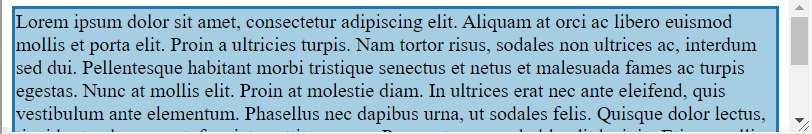

现在我们已经讨论了盒子模型的属性在不同的元素类型中是如何变化的，让我们来看看影响盒子模型定位的几个额外的属性。

- `Margin collapsing`：影响相邻边距，仅应用两个边距中较大的一个。
- `Negative margins`:负值的边距用于定位内容。
- `Overflow`:当容器框内的内容大于其父级或设置的偏移量超过父级盒子，它会溢出。`overflow`控制如何处理。
- `max-width, max-height, min-width, min-height`:可以使用 max-width、max-height、min-width 和 min-height 属性进一步限制宽度和高度。
- `Pseudo-elements`:允许在从 CSS 选择的元素中生成额外的元素。它们通常用于为布局生成附加内容或提供特定的视觉外观。
- `Stacking contexts and rendering order`:决定了z轴方向的渲染。

### Margin collapsing
边距塌陷：
1. 大吃小，相等的保留一个。
2. 只有竖直方向的margin会collapse，水平方向的margin从来不会。
3. 只有block-level的元素可以collapse，floats，absolutely和inline-block 元素永远不会collapse。inline-level 元素没有margin(竖直方向上)，所以也不会collapse。
4. 只有参与相同的BFC的盒子才会collapse(Note that block formatting contexts are not established by block boxes with overflow: visible (the default value))。
5. 只有相邻的margin才会发生collapse。

把盒子的margin当作盒子自己的。有以下情况会发生相邻：
- 父和子的margin
- 相邻盒子的margin
- 爷与父与子
- 没有内容的元素的margin

被以下分离的margin不会collapse：
- content(e.g.text)
- padding or border（例如，如果父级有填充或边框，则其边距不能与其子项的边距折叠，否则它们会折叠）
- 清除（例如清除浮动的结果可能会将边距分开，以至于它们不会折叠。）

```
.m {
  margin: 10px;
  background-color: #fb9a99;
}
.parent {
  margin: 10px;
  background-color: #a6cee3;
}
body {
  background-color: #b2df8a;
}
<div class="parent">
  <div class="m">Hello world</div>
  <div class="m">Hello world</div>
  <div class="m">Hello world</div>
</div>
```

```
.m {
  overflow: auto;
  margin: 10px;
  background-color: #fb9a99;
}
.parent {
  overflow: auto;
  margin: 10px;
  background-color: #a6cee3;
}
body {
  overflow: auto;
  background-color: #b2df8a;
}
<div class="parent">
  <div class="m">Hello world</div>
  <div class="m">Hello world</div>
  <div class="m">Hello world</div>
</div>
```

```
.m {
  margin: 10px;
  background-color: #fb9a99;
  border: 3px solid #e31a1c;
}
.parent {
  margin: 10px;
  background-color: #a6cee3;
  border: 3px solid #1f78b4;
}
body {
  background-color: #b2df8a;
  border: 3px solid #33a02c;
}
<div class="parent">
  <div class="m">Hello world</div>
  <div class="m">Hello world</div>
  <div class="m">Hello world</div>
</div>
```

### 负的margin
最好不要用，会发生重叠(overlap)

```
.negative {
  margin-top: -2em
  ;
  margin-left: 30px;
}
<div class="blue">In the case of negative margins, the maximum of the absolute values of the negative adjoining margins is deducted from the maximum of the positive adjoining margins.</div>
<div class="negative">If there are no positive margins, the maximum of the absolute values of the adjoining margins is deducted from zero.</div>
```

### overflow
默认值visible，然和超过visible的值，不适用于 display: inline 元素，然后不是visible的值都将创建一个新的BFC。
### max-width, max-height, min-width and min-height
| max- / min-width | Description|
| --- | --- |
| < length > | 指定固定的最小或最大使用宽度。|
|< percentage > | 指定一个百分比来确定使用的值。该百分比是相对于生成的方框的包含块的宽度计算的。如果包含区块的宽度为负数，则使用值为零。如果包含区块的宽度取决于这个元素的宽度，那么产生的布局在CSS2.1中是未定义的。|
| none | （仅适用于 'max-width'）框的宽度没有限制。|
|**max- / min-height** |**Description**|
|< length > |  指定固定的最小或最大使用宽度。|
|< percentage > | 指定一个百分比来确定使用的值。这个百分比是相对于生成的盒子的包含块的高度计算的。如果没有明确指定包含块的高度（即取决于内容高度），并且该元素没有绝对定位，百分比值将被视为 "0"（对于 "最小高度"）或 "无"（对于 "最大高度"）。|
| none | （仅适用于 'max-height'）框的高度没有限制。|

值得注意的是：
```
html, body {
  height: 100%;
}
.height {
  height: 100%;
}
<div class="height blue">
Lorem ipsum dolor sit amet, consectetur adipiscing elit. Aliquam at orci ac libero euismod mollis et porta elit. Proin a ultricies turpis. Nam tortor risus, sodales non ultrices ac, interdum sed dui. Pellentesque habitant morbi tristique senectus et netus et malesuada fames ac turpis egestas. Nunc at mollis elit. Proin at molestie diam. In ultrices erat nec ante eleifend, quis vestibulum ante elementum. Phasellus nec dapibus urna, ut sodales felis. Quisque dolor lectus, tincidunt vel augue ut, feugiat porttitor purus.

Praesent commodo blandit lacinia. Etiam mollis rutrum enim, non congue tortor semper in. Donec commodo metus id turpis dapibus, ut ultricies ante porta. Sed cursus dignissim eros cursus ullamcorper. Curabitur eleifend, turpis commodo tempus convallis, diam orci consequat velit, eu auctor mi felis eu elit. Sed lectus ipsum, hendrerit id dui eu, imperdiet dictum eros. Nullam tincidunt dignissim felis sit amet blandit.
</div>
```




```
html, body {
  height: 100%;
}
.min-height {
  min-height: 100%;
}
<div class="min-height blue">
Lorem ipsum dolor sit amet, consectetur adipiscing elit. Aliquam at orci ac libero euismod mollis et porta elit. Proin a ultricies turpis. Nam tortor risus, sodales non ultrices ac, interdum sed dui. Pellentesque habitant morbi tristique senectus et netus et malesuada fames ac turpis egestas. Nunc at mollis elit. Proin at molestie diam. In ultrices erat nec ante eleifend, quis vestibulum ante elementum. Phasellus nec dapibus urna, ut sodales felis. Quisque dolor lectus, tincidunt vel augue ut, feugiat porttitor purus.

Praesent commodo blandit lacinia. Etiam mollis rutrum enim, non congue tortor semper in. Donec commodo metus id turpis dapibus, ut ultricies ante porta. Sed cursus dignissim eros cursus ullamcorper. Curabitur eleifend, turpis commodo tempus convallis, diam orci consequat velit, eu auctor mi felis eu elit. Sed lectus ipsum, hendrerit id dui eu, imperdiet dictum eros. Nullam tincidunt dignissim felis sit amet blandit.
</div>
```


第一种情况设置的是height：100%，这种情况只是将盒子高度设置成父元素的高度在这个例子中是body的高度，文本太长，发生了溢出。
第二种情况设置的是min-height：100%，这种情况如果发生了溢出，会触发height：auto,block-level元素就是content-based，所以盒子的高度始终装得下文本，不管body的大小。但是如果文本太少的话，不会触发auto，只是将高度设为父元素的高度。
### Pseudo-elements
伪元素生成的内容放置在元素**内部**，在元素内容的开头或结尾：
```
.example:before {
  content: 'Hello ';
}
.example:after {
  content: '!!!';
}
<p class="example blue">world</p>
```

### Stacking contexts and z-index

具有负z-index的元素绘制在normal flow和floats下方，具有正x-index的元素绘制在normal flow和floats上方。 如果两个元素具有相同的 z-index，则它们会根据它们在 HTML 标记中的顺序从后到前堆叠。
请注意，只有定位(relative或者absolute)元素可以具有 z-index，例如为normal flow blocks or floats设置 z-index 不会影响它们的渲染顺序。

