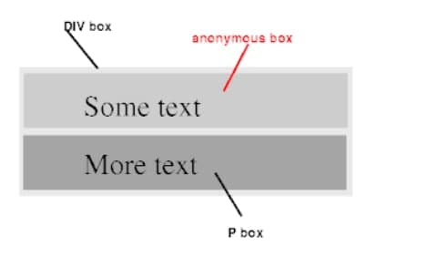
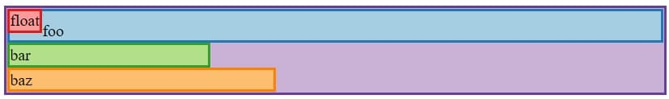
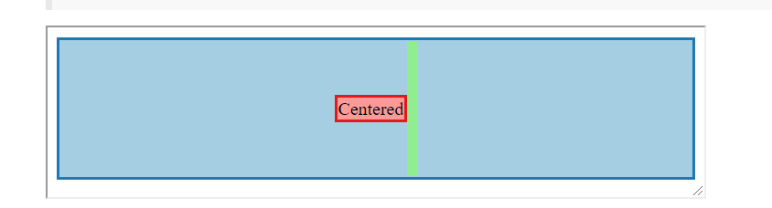
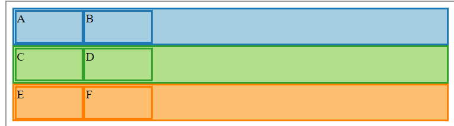
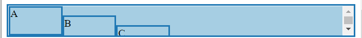
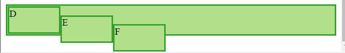

*在学习CSS的过程中，我认为最让人棘手的就是CSS的布局，经常达不到符合自己预期的效果。大部分的教程都停留在浅显的表面，而直接读CSS规范又不容易理解，因此我认为一个好的教程应该包含对规范的解读，再有一些生动的例子更好不过了。而作为学习者，我们通过对教程的吸收，建立起自己的mental model并多加练习，通常都会很好的掌握。幸运的是，我找到了这样的教程（感谢互联网）有能力的小伙伴请直接读[英文原文](http://book.mixu.net/css/1-positioning.html)(可能需要科学上网)，那么这篇文章是我对这篇文章的一个总结和一点点自己的思考。*

CSS布局的核心其实就是将一个个HTML的元素看做成一个个可以定位在X,Y,Z轴上的矩形盒子，而在X,Y轴上的定位取决于应用到这些盒子上的定位方案(positioning scheme)。从概念来说，CSS布局最重要的也是最基本的就是看他的定位方案，一旦定位方案确定，就可以进一步的被具体的布局模式(layout modes)修改，例如```display:table```或者```display:inline-table```，即使是CSS3中的布局模式例如flexbox和grid，他也是基于主要的定位方案。例如```display: flex```或者 ```display: inline-flex```。

## Positioning schemes

CSS2.1中定义了三种定位方案

- normal flow(文档流)：由三种格式化上下文组成(formatting contexts),Block Formatting Contexts(BFC),Inline Formatting Contexts(IFC),Relative Formatting Contexts(此处不懂没关系,后面会讲)
- floats (浮动)：它们以自己的方式与文档流交互，并构成大多数现代CSS网格框架的基础
- absolute positioning(绝对定位)：涉及相对于文档流的absolute 和 fixed 元素

所有的元素默认都属于文档流除非他们被特定的从文档流中移出(通常通过display和position属性)[[CSS2.1规范9.3](https://www.w3.org/TR/CSS2/visuren.html#dis-pos-flo)]


| 属性 | 默认值 | 目的 |
| --- | --- | --- |
| display | block or inline | 决定要使用的布局算法 |
| float | none | 允许其他元素在元素周围浮动 |
| position | static | 控制元素的定位 |

### normal flow positioning schemes

有两个方面起作用
1.  矩形盒的大小和对齐方式，主要被```display```,```width```,```height```，```margin```属性控制。
2. 特定父元素内子元素如何相对于其他元素定位的。

特定父元素内子元素如何相对于其他元素定位由格式化上下文决定的，而格式化上下文是由父元素和它的直接子元素建立的，在文档流中可以是块级格式化上下文(BFC)或者行级格式化上下文(IFC)。

CSS2.1规范关于对格式化上下文的描述
> Boxes in the normal flow belong to a formatting context, which may be block or inline, but not both simultaneously. Block-level boxes participate in a block formatting context. Inline-level boxes participate in an inline formatting context.

我的理解是：在文档流中每一个盒子都参与一个格式化上下文，要么是BFC要么是IFC,块级元素参与BFC，行级元素参加IFC。

父元素建立起格式化上下文取决于它的子元素是inline-level元素还是block-level元素。
block-level元素：```<address> <article> <aside> <blockquote> <canvas> <dd> <div> <dl> <dt> <fieldset> <figcaption> <figure> <footer> <form> <h1>-<h6> <header> <hr> <li> <main> <nav> <noscript <ol> <p> <pre> <section> <table> <tfoot> <ul> <video>```
display值为block，list-item，table的元素

规范的定义：
> Block-level elements are those elements of the source document that are formatted visually as blocks (e.g., paragraphs). The following values of the 'display' property make an element block-level: 'block', 'list-item', and 'table'.
>
>Block-level boxes are boxes that participate in a block formatting context. Each block-level element generates a principal block-level box that contains descendant boxes and generated content and is also the box involved in any positioning scheme. Some block-level elements may generate additional boxes in addition to the principal box [for example,]: 'list-item' elements. These additional boxes are placed with respect to the principal box.

inline-level元素：```<a> <abbr> <acronym> <b> <bdo> <big> <br> <button> <cite> <code> <dfn> <em> <i>  <input> <kbd> <label> <map> <object> <output> <q> <samp> <script> <select> <small> <span> <strong> <sub> <sup> <textarea> <time> <tt> <var>```
display值为inline，inline-block，inline-table的元素

规范中的定义：
>Inline-level elements are those elements of the source document that do not form new blocks of content; the content is distributed in lines (e.g., emphasized pieces of text within a paragraph, inline images, etc.). The following values of the 'display' property make an element inline-level: 'inline', 'inline-table', and 'inline-block'. Inline-level elements generate inline-level boxes, which are boxes that participate in an inline formatting context.
>
>An inline box is one that is both inline-level and whose contents participate in its containing inline formatting context. A non-replaced element with a 'display' value of 'inline' generates an inline box. Inline-level boxes that are not inline boxes (such as replaced inline-level elements, inline-block elements, and inline-table elements) are called atomic inline-level boxes because they participate in their inline formatting context as a single opaque box.

除了table boxes和可替换元素,几乎所有的block-level盒子也是块容器盒子(block container box),块容器盒子要么只包含Block-level盒子，要么只包含Inline-level盒子。这个比较好理解，因为一个盒子只能参与一种格式化上下文。如果父元素建立起了一个新的格式化上下文行级格式化上下文那么就只能包含Inline-level的盒子。
因为内联级别的元素不能包含块级级别的元素，所以对于建立起格式化上下文来说，父元素只能是块容器盒子。

可以粗略的认为块级格式化上下文对应竖直方向的堆叠，行级格式化上下文对应水平方向的堆叠。

**问题来了：如果一个父元素内即有块级元素又有行级元素(e.g. div和文本)会发生什么？**
答案是块级元素优先，存在一种叫做Anonymous box generation(匿名盒子生成)机制将行级元素升级为块级元素。

### Anonymous box generation
当父元素内即包含块级元素又包含行级元素就会生成匿名盒子。
```html
<div>
    Some text
    <p>More text
</p></div>
```
因为块级元素优先，这种情况会建立BFC，所以强制形成只有块级元素，当块容器元素包含未被内联盒子包含的文本时，会生成匿名的内联盒子。在同一父元素下的块级盒子旁边的内联盒子会破碎，里面的内容会被匿名的块级盒子包含。



### Anonymous inline boxes

当块容器盒子(block container)包含未被内联元素包含的文本时，将生成匿名内联盒子。
```html
<p>Some <em>emphasized</em> text</p>
```
这种情况将生成两个匿名内联盒子，一个包含Some一个包含text。

匿名盒子生成的作用是，在文档流中当一个父元素同时包含内联级元素和块级元素的时候，决定使用哪一个格式化上下文。

### Normal flow positioning
在文档流中，特定父元素的子元素的布局基于格式化上下文，块级格式化上下文对应竖直方向的堆叠，行级格式化上下文对应水平方向的堆叠。

### Normal flow: block formatting
CSS2.1规范
>In a block formatting context, boxes are laid out one after the other, vertically, beginning at the top of a containing block. The vertical distance between two sibling boxes is determined by the 'margin' properties. Vertical margins between adjacent block-level boxes in a block formatting context collapse.
>
>In a block formatting context, each box's left outer edge touches the left edge of the containing block (for right-to-left formatting, right edges touch). This is true even in the presence of floats (although a box's line boxes may shrink due to the floats), unless the box establishes a new block formatting context (in which case the box itself may become narrower due to the floats).

块级格式化上下文就是在块容器盒子的顶部开始一个个的在竖直方向上堆叠。它们之间的间距由margin(上下)决定。同一个格式化上下文(同一块容器下)的margin会发生collape(即相同大小的margin只保留一个，大吃小)，每个盒子的左外边缘接触块容器盒子的左外边缘(如果是从右向左，则相反)，即使包含浮动元素也是一样。
```html
.float {
  float: left;
}
.foo {
  padding-top: 10px;
}
.bar {
  width: 30%;
}
.baz {
  width: 40%;
}
<div class="container violet">
  <div class="float red">float</div>
  <div class="foo blue">foo</div>
  <div class="bar green">bar</div>
  <div class="baz orange">baz</div>
</div>
```


上图可以看到浮动元素并没有影响到其他元素的布局即使一个box中文字向右偏移了，这是因为浮动元素是第一行line box缩小了。
### Normal flow: inline formatting

>In an inline formatting context, boxes are laid out horizontally, one after the other, beginning at the top of a containing block. Horizontal margins, borders, and padding are respected between these boxes.
>
>The boxes may be aligned vertically in different ways: their bottoms or tops may be aligned, or the baselines of text within them may be aligned. The rectangular area that contains the boxes that form a line is called a line box. 
>
>The width of a line box is determined by a containing block and the presence of floats. The height of a line box is determined by the rules given in the section on line height calculations.

简单来说，行级格式化上下文就是盒子从块容器盒子的顶部开始，在水平上一个个的摆放。每一行会生成line box，它的宽是块容器盒子的宽减去浮动元素的宽度，它的高是能包含所有盒子的高。当行级盒子的宽大于line box的宽时，它会尽可能的分割成多个line box，当元素是不可分割时，例如不可替换元素如img这种，将会溢出line box。

### text-align
| 属性 | 默认值 | 目的 |
| --- | --- | ---|
| text-align | left(右至左方向则相反) | 描述块容器盒子中的内联内容在水平方向上对齐方式|

对于这个属性我的理解是当line box有多余的空间时，它决定了inline box 在 line box 水平方向的对齐方式。

###  vertical-align
这个属性定义了inline box在line box中竖直方向上的对齐方式。只能应用到inline box或者table cell上，即```<td></td>,<th></th>```。

inline box高度的计算，只为两个东西有关，他的字体大小(font-size)和行高(line-height)。当line-height属性的值为具体的数时(e.g. 1 or 1.2)，它的高是字体大小乘于行高。
line box的高是line-height的大小。

vertical-align可以有两个值，他的第一个值是相对于父元素的基线来说的，第二个值是相对于line box来说的，只能为top或者bottom。

这是特别说一下vertical-align：middle。这个middle其实大多时候并不能达到我们期望的效果，我们说说这个属性到底干了什么，它其实是把盒子的中点与父元素基线再加上半个x的高对齐，这都是它做的所有工作。

```html
.container {
  text-align: center;
  overflow: auto;
  height: 120px;
}

.container:after,
.block {
  display: inline-block;
  vertical-align: middle;
}

.container:after {
  content: '';
  height: 100%;
  margin-left: -0.25em; /* To offset spacing. May vary by font */
  width: 10px; /* to show the inserted pseudo element */
  background-color: lightgreen; /* to show the inserted pseudo element */
}

.block {
  max-width: 99%; /* Prevents issues with long content causes the content block to be pushed to the top */
}
<div class="container blue">
  <div class="block red">Centered</div>
</div>
```


这是之所以能竖直对齐是因为我们用了一个伪元素将line box的高度撑起来了，此时父元素的基线的位置也改变了。如果不给他的line box撑开的话line box 的高度就是盒子的高度，这时候设置为middle，其实它的位置还是会在顶部，不会改变。

### Normal flow: relative positioning

相对定位其实也可以认为是文档流，因为它并没有从文档流中删除，我的理解是，其他元素并不会受到它的移动而受影响，就跟感知不到他的移动一样。

### Float positioning scheme
>A float is a box that is shifted to the left or right on the current line. The most interesting characteristic of a float (or "floated" or "floating" box) is that content may flow along its side (or be prohibited from doing so by the 'clear' property). Content flows down the right side of a left-floated box and down the left side of a right-floated box.

浮动定位的元素从文档流中删除了，因此它并不会影响竖直方向布局，但他影响line box的大小，故会影响line box中的其他元素。浮动的方向要么向左，要么向右，位置对齐父元素的左外边缘或右外边缘，但是同时有多个浮动元素的时候，会水平堆叠，堆叠的顺序按照元素在文本流中的顺序。因为浮动元素从文档流中删除了，故父元素的高度不对包含浮动元素，这种情况可以通过clearfix技术解决(之后会讲)。浮动也可以通过clear属性清除。

那么如果使浮动元素不影响line box中其他的元素的，有两种方法，建立新的格式化上下文(overflow的值不为visible)或者清除浮动(通过clear属性)。

### clearfix技术
因为父元素的高度并不会包含float元素，如果能让他包含浮动元素呢，所以这就是clearfix技术的目的。

有三种方法可以实现
1. 在父元素之后显式的增加一个元素，设置属性clear为both。(为了样式而增加一个新元素，显然是不好的)
2. 在父元素之后加一个伪元素，设置属性为clear：both。
3. 使父元素建立一个新的格式化上下文，设置overflow的值不为visible。

用的最多的就是后两种

使用伪元素实现
```html
.clearfix:after {
  content: "";
  display: table;
  clear: both;
}
.left {
  float: left;
  width: 15%;
  height: 40px;
}
<div class="clearfix blue">
  <div class="left blue">A</div>
  <div class="left blue">B</div>
</div>
<div class="clearfix green">
  <div class="left green">C</div>
  <div class="left green">D</div>
</div>
<div class="clearfix orange">
  <div class="left orange">E</div>
  <div class="left orange">F</div>
</div>
```


建立新的格式化上下文实现

```html
.clearfix {
  overflow: auto;
}
.left {
  float: left;
  width: 15%;
  height: 40px;
}
<div class="clearfix blue">
  <div class="left blue">A</div>
  <div class="left blue">B</div>
</div>
<div class="clearfix green">
  <div class="left green">C</div>
  <div class="left green">D</div>
</div>
<div class="clearfix orange">
  <div class="left orange">E</div>
  <div class="left orange">F</div>
</div>
```


推荐使用伪元素这种解决方案，因为设置overflow不为visible时可能会导致滚动条出现。出现滚动条的原是因为你设置的overflow属性也生效啦！
例如下面的例子

```html
.clearfix-overflow {
  overflow: auto;
}
.clearfix-pseudo:after {
  content: "";
  display: table;
  clear: both;
}
.left {
  float: left;
  width: 15%;
  height: 40px;
}
.offset-1 {
  position: relative;
  top: 15px;
}
.offset-2 {
  position: relative;
  top: 30px;
}
<div class="clearfix-overflow blue">
  <div class="left blue">A</div>
  <div class="left offset-1 blue">B</div>
  <div class="left offset-2 blue">C</div>
</div>
<br>
<div class="clearfix-pseudo green">
  <div class="left green">D</div>
  <div class="left offset-1 green">E</div>
  <div class="left offset-2 green">F</div>
</div>
```



### Absolute / fixed positioning scheme
这个比较好理解，完全从文档流中删除了，通过top，bottom，left，right属性进行绝对定位。只不过fixed定位是相对于viewport，absolute的定位相对于包含块，并且他们的margin不会跟任何元素合并。


