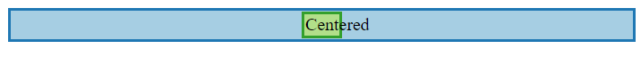
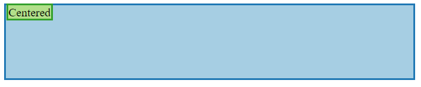
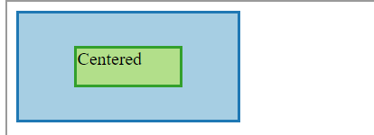
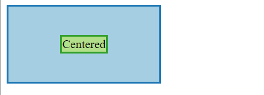

**何时会触发BFC：**

- 根元素（< html >）
- 浮动元素（元素的 float 不是 none）
- 绝对定位元素（元素的 position 为 absolute 或 fixed）
- 行内块元素（元素的 display 为 inline-block）
- 表格单元格（元素的 display 为 table-cell，HTML表格单元格默认为该值）
- 表格标题（元素的 display 为 table-caption，HTML表格标题默认为该值）
- 匿名表格单元格元素（元素的 display 为 table、table-row、 table-row-group、table-header-group、table-footer-group（分别是HTML table、row、tbody、thead、tfoot 的默认属性）或 inline-table）
overflow 计算值(Computed)不为 visible 的块元素
display 值为 flow-root 的元素
contain 值为 layout、content 或 paint 的元素
- 弹性元素（display 为 flex 或 inline-flex 元素的直接子元素）
- 网格元素（display 为 grid 或 inline-grid 元素的直接子元素）
- 多列容器（元素的 column-count 或 column-width (en-US) 不为 auto，包括 column-count 为 1）
- column-span 为 all 的元素始终会创建一个新的BFC，即使该元素没有包裹在一个多列容器中（标准变更，Chrome bug）。

## 水平和垂直居中技术
1. 水平居中normal flow中的块级元素
```
.block-center {
  display: block;
  width: 30px;
  margin-left: auto;
  margin-right: auto;
}
<div class="blue">
  <div class="block-center green">Centered</div>
</div>
```

缺点：必要明确块的宽度才能居中，有时候我们无法把握正确的宽度以至于会发生overflow的情况。

2. 水平居中line boxes中的行级元素
```
.text-align-center {
  text-align: center;
}
<div class="text-align-center blue">
  <span class="green">Centered</span>
</div>
```


缺点：如果line box的高够高，长文本可能会分到几个line box 中，居中的行为是在分到多行以后才应用的。

3. 垂直居中行级元素
```
.valign-center {
  vertical-align: middle;
  height: 100px;
}
<div class="valign-center blue">
  <span class="green">Centered</span>
</div>
```


**为什么不起效果？**

因为这个属性的作用是：讲盒子的中点对准line box 基线+半个X的高度！而上图中line box的高度仅为第一行的高度！

**怎么能让他起效果？**

两种方式
- 设置line-height的高度为父盒子的高度，这个就相当于把line box 的高度设置为了父盒子的高度。注意：必须设置明确的具体值，line-height：100%不会生效，因为line height是相对于父元素的字体高度，而不是父容器的高度。
- 通过一个inline-block伪元素把line box高度撑起来，让他跟父盒子的高度相等。（推荐这个方法）

## 水平和垂直居中
1. position: absolute constraint based centering
```
* { box-sizing: border-box; }
.center-container {
  position: relative;
  height: 100px;
  width: 200px;
}
.dialog {
  height: 40%;
  width: 50%;
}
.absolute-center {
  margin: auto;
  position: absolute;
  top: 0; left: 0; bottom: 0; right: 0;
}
<div class="center-container blue">
  <div class="dialog absolute-center green">Centered</div>
</div>
```

缺点：必须明确设定元素的宽，高和偏移量的具体值。可以使用max-width/min-width/max-height/min-height和百分比绕过这个问题。（IE8+）
2. absolute+缩放
```
* { box-sizing: border-box; }
.center-container {
  position: relative;
  height: 100px;
  width: 200px;
}
.absolute-center-negative {
  position: absolute;
  top: 50%; left: 50%;
  width: 100px;
  transform: translateX(-50%);
  transform: translateY(-50%);
  height: 50px;
}
<div class="center-container blue">
  <div class="absolute-center-negative green">Centered</div>
</div>
```

缺点：必须明确设置元素的宽和高！

3. flexbox based centering
```
.flexbox-center {
  display: flex;
  align-items: center;
  justify-content: center;
  height: 100px;
  width: 200px;
}
<div class="flexbox-center blue">
  <div class="green">Centered</div>
</div>
```

注意：如果有多个item要居中，要设置flex-wrap：nowrap。

### 文档中的层叠上下文由满足以下任意一个条件的元素形成：
- 文档根元素（<html>）；
- position 值为 absolute（绝对定位）或  relative（相对定位）且 z-index 值不为 auto 的元素；
- position 值为 fixed（固定定位）或 sticky（粘滞定位）的元素（沾滞定位适配所有移动设备上的浏览器，但老的桌面浏览器不支持）；
- flex (flexbox (en-US)) 容器的子元素，且 z-index 值不为 auto；
- grid (grid) 容器的子元素，且 z-index 值不为 auto；
- opacity 属性值小于 1 的元素（参见 the specification for opacity）；
mix-blend-mode 属性值不为 normal 的元素；
- 以下任意属性值不为 none 的元素：
  - transform
  - filter
  - perspective
  - clip-path
  - mask / mask-image / mask-border
- isolation 属性值为 isolate 的元素；
- -webkit-overflow-scrolling 属性值为 touch 的元素；
- will-change 值设定了任一属性而该属性在 non-initial 值时会创建层叠上下文的元素（参考这篇文章）；
- contain 属性值为 layout、paint 或包含它们其中之一的合成值（比如 contain: strict、contain: content）的元素。
