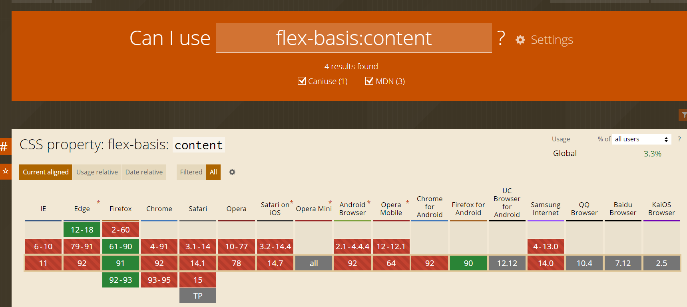
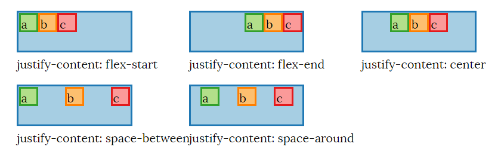

## Why Flexbox?

出现目的是解决管理负空间的问题，它对 flexbox 父项中的子项应该如何（重新）调整大小、包装和对齐提供了很多控制。

Flexbox内置的基本假设是，作为作者，你要确保Flexbox的内容能适当地调整
- flexbox 父级的可用宽度和高度的变化
- flexbox 容器中子项数量的变化

Flexbox中的 "flex "是指当可用的宽度或高度大于或小于子框所需的 "理想 "大小时，能够指定子项的尺寸。

## 属性

### flex container 属性
  `display：flex` 和 `display:inline-flex`
  `flex-flow`(属性缩写)
  - ``flex-direction`:flex子项堆叠的方向。
  - `flex-wrap`：指定 flex 元素单行显示还是多行显示 。
  - `justify-content`:控制flex元素在main axis上的定位。
  - `align-items`:控制flex元素相对于flex lines在cross axis上的定位。可以认为是cross axis上的`justify-content`。
  - `align-content`:控制flex lines 如何相对于父元素在cross axis上定位。

### flex item 属性
  - `order`：items的相对顺序
  - `flex`(属性缩写)
    - `flex-grow`:当main axis上有剩余的空间时，分配给item的空间比例。
    - `flex-shrink`:当main axis上没有足够空间时分配给item,收缩的比例。-
    - `flex-basis`: item的内容维度(content dimensions)如何影响 flex-grow 和 flex-shrink 计算。
- `align-self`: 对于特定item，覆盖其`align-items`。

### main axis and cross axis
flex-direction的方向就是main axis 垂直于他的是 cross axis。也可以理解为盒子堆叠的方向就是主轴的方向。reverse之后，主轴箭头方向指向反方向。


### flex lines
个人理解：

### flex items sizing
三个步骤：
- 先items分到flex lines上：计算flex items假设性大小(跟flex-basis相关，后面讲)，根据这个大小先分到flex lines上。
- 调整每个flex lines上的flex items大小：根据flex-grow和flex-shrink，调整这个flex items的最终大小。
- 对齐flex lines和items：根据应用到flex lines(align-content和align-items)上的属性调整然后是flex items。

### flex-basis
这个属性至关重要，他是flex items决定和调整大小的基础。

flex-basis根据四种不同的 flex sizing 操作模式（我想出的术语，而不是规范术语）更容易理解：（比例指的是flex-grow和flex-shrink计算）例如前者设为1后者设为2这中就叫做比例的模式。

1. 纯比例模式：设置flex-basis: 0相当于说子元素的默认宽度（或高度，取决于 flex-direction）是0px. 换句话说：
  - flex items内容的实际宽度对最终计算元素的大小没有任何影响。(也就是上面说的第一步)
  - flex items永远不会换行，因为关于何时换行的决定是根据子项的 flex basis大小完成的，并且在 flexbox 算法中明确设置的确定值优先。
2. flex-basis为固定值+比例模式：设置flex-basis: Npx，其中 N 是某个值会导致大小计算考虑这些元素具有N像素的 flex basis大小。
  - 只要这些flex的基值的总和大于flex container的可用主轴空间大小，就会发生换行。
  - 之后根据flex-grow和flex-shrink来计算最终的空间时，是以这个为基础算的。
3. flex-basis设为auto+比例的模式：
  这种情况真正的flex-basis的值回落到items的宽或者高的大小， 如果这些没有被设置，则为通常用于计算元素的宽度或高度的算法。
    - 当换行的行为发生时，flex items要么就是有明确的高或宽的值，或者没有的话就是根据content来算的。
    - 之后根据flex-grow和flex-shrink来计算最终的空间时，是以这个为基础算的。
4. flex-basis为content+比例模式：
basis的值为元素width：auto或者height：auto的值。这个属性比较新，浏览器支持极差，不建议使用。


**上面这些模式只是用于计算flex items 放置在flex lines上的大小用于判断是否换行，跟元素实际大小没有关系！！！**

例子：
  - flex-basis: 0 with width: 45px on each flex item results in the items having at least a 0px width, or their content size if it is greater.
  - flex-basis: 10px with width: 45px on each flex item results in the items having at least a 10px width, or their content size if it is greater.
  - flex-basis: 35px with width: 45px on each flex item results in the items having at least a 35px width, or their content size if it is greater.
  - flex-basis: 35px with width: 45px and max-width: 10px on each flex item results in the items having a 10px width.
  - flex-basis: auto with width: 45px on each flex item results in the items having a 45px width, and the items wrap because the sum of flex basis sizes exceeds the flex container's width.
  - flex-basis: content with width: 45px on each flex item should result in the flex items being sized exactly to their content, but this value is not supported as of the time I'm writing this.
  ```
  <div class="flex-parent blue">
  <div class="green">aaa</div><div class="orange">bbbb</div><div class="red">ccc</div>
</div>
.flex-parent {
  display: flex;
  flex-direction: row;
  flex-wrap: wrap;
  flex-grow: 0;
  justify-content: flex-start;
  width: 130px;
  height: 100px;
}
  ```


flex-basis只是提供一个最低值，如果你content的宽度比这个大，实际元素的宽度就是content宽度，如果flex-basis的值大于content的宽度，实际元素就是flex-basis的值，跟width大小无关，width的大小只是当flex-basis比width小的时候，content内容的大小最大不能超过width的大小，否则发生溢出。

### flex-grow 和 flex-shrink
不管width多少和实际元素的宽度多少，都是按照flex-basis的值来算的！！父元素宽度或者高度 - 子元素flex-basis的和 = 可分配空间，然后乘以比例加给或减给每个元素就是分配后元素的宽度或高度！

### main axis alignment：justify-content
注意margin：auto优先于justify-content

### Cross axis alignment for flex lines: align-content

`align-content`,`align-items`,`align-self`：属性确定在cross axis上的对齐。

但是`align-content`不会影响单行的flex container的对齐方式，可以这样理解有两个高度一个使cross axis container的高度，一个使每个flex lines的高度，这个属性决定了他们之间距离。

`align-items`并`align-self`具有相同的效果：它们控制每个flex lines内各个item的对齐方式。

## order
order值是相对的，大的在后面，小的在前面。

## 使用flexbox居中
```
<div class="parent blue">
  <div class="child green">Centered</div>
</div>

.parent {
  display: flex;
  flex-direction: row;
  justify-content:center;
  align-items:center;
  height:100%
}
```


## margin:auto 与 flexbox 一起使用

在main axis上设置margin：auto会覆盖justify-content属性。
在cross axis上设置margin：auto会覆盖align-items属性。