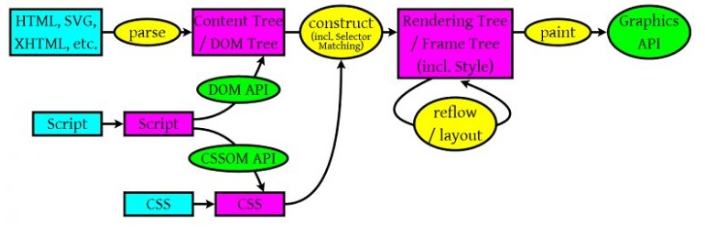

# 浏览器渲染原理

本文以Webkit为例，对现代浏览器的渲染过程进行一个深入的剖析。

## 浏览器渲染过程（大体分为四个过程）

---

### 1. Parsing

- HTML/SVG/XHTML等文件,解析器会把文件解析成DOM树形结构。
- CSS文件，解析CSS成CSSOM树，它的结构跟DOM树类似。
- Javascript脚本，等到js脚本文件加载后，通过DOM API和CSSOM API来操作DOM Tree和CSS Rule Tree。

### 2. Render/Frame tree

- 结合DOM树和CSSOM树构建Rendering Tree，其实并不是一个树而是四个树：RenderObjects，ReenderStyles，RenderLayers和Line boxes。
- 并不是一对一映射HTML结构：Rendering Tree渲染树和DOM树并不同，Rendering Tree是包含显示的节点和这些节点的样式信息，像不可见的元素标签，script，title和应用了display：none来隐藏的节点就不包含在Rendering Tree中。
- CSS的Rule Tree主要是为了完成匹配把CSS Rule附加给Rendering Tree上的每个节点（也就是每个frame）。

### 3. Layout/reflow

- 是一个递归的过程，遍历render tree得到节点的位置和大小等信息并布局子节点。
- 增量布局，对于改变的节点，渲染树的items会标记自身为脏的，浏览器会智能的批量处理，遍历所有的树并找到脏的树，且这个过程是异步的。
- 改变字体和浏览器的大小会重新布局整个文档，也就是reflow。
- 使用JS特定的属性也会触发回流，e.g.  node.offsetHeight。

### 4. Paint:调用操作系统Native GUI的API绘制

- 从每一层(layer)生成一个位图(bitmap)。
- 位图作为纹理上传到GPU
- 将纹理合称为最终的图像渲染到屏幕

## 重要步骤

---

## 构建DOM

*浏览器如何将HTML解析为DOM树？*

- 浏览器从磁盘或网络读取HTML的原始字节，并根据文件的指定编码将它们转换为字符串。
- 将字符串转换成Token，例如：<html>、<body>等。Token中会标识出当前Token是“开始标签”或是“结束标签”亦或是“文本”等信息。

节点与节点之间的关系如何维护？

事实上，这就是Token要标识“起始标签”和“结束标签”等标识的作用。例如“title”Token的起始标签和结束标签之间的节点肯定是属于“head”的子节点。

上图给出了节点之间的关系，例如：“Hello”Token位于“title”开始标签与“title”结束标签之间，表明“Hello”Token是“title”Token的子节点。同理“title”Token是“head”Token的子节点。

构建DOM的过程中，不是等所有Token都转换完成后再去生成节点对象，而是一边生成Token一边消耗Token来生成节点对象。换句话说，每个Token被生成后，会立刻消耗这个Token创建出节点对象。注意：带有结束标签标识的Token不会创建节点对象。

举例：

## 构建CSSOM

在这一过程中，浏览器会确定下每一个节点的样式到底是什么，并且这一过程其实是很消耗资源的。因为样式你可以自行设置给某个节点，也可以通过继承获得。在这一过程中，浏览器得递归 CSSOM 树，然后确定具体的元素到底是什么样式。

**注意：CSS匹配HTML元素是一个相当复杂和有性能问题的事情。所以，DOM树要小，CSS尽量用id和class，千万不要过渡层叠下去**。

*浏览器渲染过程中遇到JS文件怎么处理？*

构建DOM时，HTML解析器若遇到了JavaScript，那么它会暂停构建DOM，将控制权移交给JavaScript引擎，等JavaScript引擎运行完毕，浏览器再从中断的地方恢复DOM构建。

建议将 script 标签放在 body 标签底部的原因:HTML不被打断的构建DOM，以至于其更快的去渲染。

**JS文件不只是阻塞DOM的构建，它会导致CSSOM也阻塞DOM的构建。**

- CSSOM会阻塞渲染，只有当CSSOM构建完毕后才会进入下一个阶段构建渲染树。
- 通常情况下DOM和CSSOM是并行构建的，但是当浏览器遇到一个不带defer或async属性的script标签时，DOM构建将暂停，如果此时又恰巧浏览器尚未完成CSSOM的下载和构建，由于JavaScript可以修改CSSOM，所以需要等CSSOM构建完毕后再执行JS，最后才重新DOM构建。

## 补充

---

### 1.async和defer的作用是什么？有什么区别?

其中蓝色线代表JavaScript加载；红色线代表JavaScript执行；绿色线代表 HTML 解析。

### **1）情况1``**

没有 defer 或 async，浏览器会立即加载并执行指定的脚本，也就是说不等待后续载入的文档元素，读到就加载并执行。

### **2）情况2`` (异步下载)**

async 属性表示异步执行引入的 JavaScript，与 defer 的区别在于，如果已经加载好，就会开始执行——无论此刻是 HTML 解析阶段还是 DOMContentLoaded 触发之后。需要注意的是，这种方式加载的 JavaScript 依然会阻塞 load 事件。换句话说，async-script 可能在 DOMContentLoaded 触发之前或之后执行，但一定在 load 触发之前执行。

### **3）情况3 ``(延迟执行)**

defer 属性表示延迟执行引入的 JavaScript，即这段 JavaScript 加载时 HTML 并未停止解析，这两个过程是并行的。整个 document 解析完毕且 defer-script 也加载完成之后（这两件事情的顺序无关），会执行所有由 defer-script 加载的 JavaScript 代码，然后触发 DOMContentLoaded 事件。

defer 与相比普通 script，有两点区别：**载入 JavaScript 文件时不阻塞 HTML 的解析，执行阶段被放到 HTML 标签解析完成之后。在加载多个JS脚本的时候，async是无顺序的加载，而defer是有顺序的加载。**

### 2. 回流必定会发生重绘，重绘不一定会引发回流

### **1）常见引起回流属性和方法**

任何会改变元素几何信息(元素的位置和尺寸大小)的操作，都会触发回流，

- 添加或者删除可见的DOM元素；
- 元素尺寸改变——边距、填充、边框、宽度和高度
- 内容变化，比如用户在input框中输入文字
- 浏览器窗口尺寸改变——resize事件发生时
- 计算 offsetWidth 和 offsetHeight 属性
- 设置 style 属性的值

### **2）常见引起重绘属性和方法**

### **3）如何减少回流、重绘**

- 使用 transform 替代 top
- 使用 visibility 替换 display: none ，因为前者只会引起重绘，后者会引发回流（改变了布局）
- 不要把节点的属性值放在一个循环里当成循环里的变量。

`for(let i = 0; i < 1000; i++) {
    // 获取 offsetTop 会导致回流，因为需要去获取正确的值
    console.log(document.querySelector('.test').style.offsetTop)
}`

- 不要使用 table 布局，可能很小的一个小改动会造成整个 table 的重新布局
- 动画实现的速度的选择，动画速度越快，回流次数越多，也可以选择使用 requestAnimationFrame
- CSS 选择符从右往左匹配查找，避免节点层级过多
- 将频繁重绘或者回流的节点设置为图层，图层能够阻止该节点的渲染行为影响别的节点。比如对于 video 标签来说，浏览器会自动将该节点变为图层。

### 性能优化策略

---

- JS优化： `<script>` 标签加上 defer属性 和 async属性 用于在不阻塞页面文档解析的前提下，控制脚本的下载和执行。
    - defer属性： 用于开启新的线程下载脚本文件，并使脚本在文档解析完成后执行。
    - async属性： HTML5新增属性，用于异步下载脚本文件，下载完毕立即解释执行代码。
- CSS优化： `<link>` 标签的 rel属性 中的属性值设置为 preload 能够让你在你的HTML页面中可以指明哪些资源是在页面加载完成后即刻需要的,最优的配置加载顺序，提高渲染性能

### 引用：

---

[深入浅出浏览器渲染原理]([https://github.com/ljianshu/Blog/issues/51](https://github.com/ljianshu/Blog/issues/51))

[Ryan Seddon: So how does the browser actually render a website | JSConf EU 2015]([https://www.youtube.com/watch?v=SmE4OwHztCc](https://www.youtube.com/watch?v=SmE4OwHztCc))