# 个人的 coding 365 计划

我给自己定了一个小目标，每天都要学习一些数据结构和算法相关的内容，在这里记录一些自己学到的东西和一些`leetcode`题解，主要目的是提高自己的编程能力同时培养兴趣。

## DAY 1：2 进制和 10 的转换

```js
/*
 二进制
 1 -> 1
 2 -> 10
 3 -> 11
 4 -> 100
 5 -> 101
 6 -> 110
 7 -> 111
 8 -> 1000
*/

// 十进制转二进制: 回忆下我们怎样将二进制转换为十进制的，反向操作即可，取余
function decToBin(n) {
  if (n === 0) {
    return 0
  }
  const ans = []
  while (n) {
    // n > 0
    ans.unshift(n & 1) // n % 2
    n >>= 1 // 左乘右除
  }
  return parseInt(ans.join(""))
}

// 二进制转十进制
function binToDec(n) {
  ans = 0
  for (const i of n.toString()) {
    ans = ans << (1 + i)
  }
  return ans
}

// 判断是否是2的幂
/*
2 -> 10
4 -> 100
8 -> 1000
16 -> 10000


n - 1 : 01111

取 and 操作即可判断

n > 0 && (n & (n - 1) == 0)

延申
leetcode 342：判断是否是4的幂
判断是否是4的幂
n > 0 && (n & (n - 1) == 0) && n % 3 == 1
*/
```

## DAY 2: 二分查找

二分查找是一种在有序数组中查找某一特定元素的搜索算法。

搜索过程从数组的中间元素开始，如果中间元素正好是要查找的元素，则搜索过程结束。

如果某一特定元素大于或者小于中间元素，则在数组大于或小于中间元素的那一半中查找，而且跟开始一样从中间元素开始比较。

如果在某一步骤数组为空，则代表找不到。这种搜索算法**每一次比较都使搜索范围缩小一半**。

来看下面例题：leetcode 704


```ts
function search(nums: number[], target: number): number {
  if (target > nums[nums.length - 1]) {
    return -1
  }
  let low: number = 0
  let high: number = nums.length - 1
  while (low <= high) {
    let mid = (low + high) >> 1
    if (nums[mid] === target) {
      return mid
    } else if (nums[mid] > target) {
      high = mid - 1
    } else {
      low = mid + 1
    }
  }
  return -1
}
```

下面这题:


它要我们输出数组中第一个大于等于查找值的位置，我们依旧使用二分查找法。

如果中间值大于等于查找值，则这个中间值**可能**是最终答案，我们让`high`等于`mid`缩小范围并开始下一轮循环。
如果中间值小于查找值，则目标值一定在中间值的右边，我们让`low`等于`mid + 1`缩小范围并开始下一轮循环。

```ts
/**
 * 代码中的类名、方法名、参数名已经指定，请勿修改，直接返回方法规定的值即可
 * 二分查找
 * @param n int整型 数组长度
 * @param v int整型 查找值
 * @param a int整型一维数组 有序数组
 * @return int整型
 */
export function upper_bound_(n: number, v: number, a: number[]): number {
  // write code here
  if (v > a[n - 1]) {
    return n + 1
  }
  let low = 0
  let high = n - 1
  while (low < high) {
    let mid = (low + high) >> 1
    if (a[mid] >= v) {
      high = mid
    } else {
      low = mid + 1
    }
  }
  return high + 1
}
```

下面来看这一道题：leetcode 33


什么叫转动？来看下面的例子：

```plain
0 2 4 7 9
9 0 2 4 7
7 9 0 2 4
4 7 9 0 2
2 4 7 9 0
```

可以看出，通过所谓转动，原来有序的数组变成了一个无序的数组，但是也有很显著的特点 -- 它是由两个**有序数组**组成的！

我们只需要找到待查元素**在哪个有序区间**，然后再查找不就可以了吗？

那么问题就成了**如何找旋转临界点**。我们可以用二分查找的方式寻找临界点！

我们可以维护一个 **low** 和 一个 **high** 下标，获取中间值，如果中间值小于 `num[0]`，说明轴点可能是个临界点，让`high = mid`,继续搜索即可！最终，`high`的值就是轴点的值。

反之，如果中间值大于 `num[0]`,说明临界值一定在轴点的右边，让`low = mid + 1`,缩小范围继续搜索。

```ts
function search(nums: number[], target: number): number {
  // if array were sorted
  if (nums[nums.length - 1] >= nums[0]) return binarySearch(0, nums.length - 1)
  // find the boundary point
  let low: number = 0
  let high: number = nums.length - 1
  while (low < high) {
    let mid = (low + high) >> 1
    if (nums[mid] < nums[0]) {
      high = mid
    } else {
      low = mid + 1
    }
  }
  const pivot = high

  // if target >= nums[0],we find target on left sorted array,otherwise we find target on right sorted array.
  return target >= nums[0]
    ? binarySearch(0, pivot)
    : binarySearch(pivot, nums.length - 1)
  // 这里不用pivot-1的原因是:如果nums为[1]的话，二分函数中的high为-1，无法返回正确的结果

  // binary search algorithm
  function binarySearch(low: number, high: number) {
    while (low <= high) {
      let mid = (low + high) >> 1
      if (nums[mid] === target) {
        return mid
      } else if (nums[mid] > target) {
        high = mid - 1
      } else {
        low = mid + 1
      }
    }
    return -1
  }
}
```

## DAY 3: 实现计算斐波那契数的三种方式

```ts
// 这种方式很显然存在重复运算
function fib(n: number): number {
  if (n === 0) {
    return 0
  } else if (n === 1) {
    return 1
  } else {
    return fib(n - 1) + fib(n - 2)
  }
}
// 我们可以把求过的值缓存起来，这样就解决了重复计算的问题
function fib(n: number, cache: object = {}): number {
  if (n in cache) {
    return cache[n]
  }
  if (n === 0) {
    return 0
  } else if (n === 1) {
    return 1
  } else {
    const ans: number = fib(n - 1, cache) + fib(n - 2, cache)
    cache[n] = ans
    return ans
  }
}
// 方法三：迭代
function fib(n: number): number {
  let a = 0
  let b = 1
  for (let i = 0; i < n; i++) {
    ;[a, b] = [b, a + b]
  }
  return a
}
```

## DAY 4:使用 stack 来反转一个列表

```ts
// stack 数据结构的特点：first in last out
function reverseList(nums: number[]): number[] {
  const ans = []
  while (nums.length > 0) {
    const x: number = nums.pop()
    ans.push(x)
  }
  return ans
}
```

## DAY 5:介绍 queue 数据结构

```ts
// queue相对于stack则为first in first out
function sqr(nums: []) {
  const ans: number[] = []
  while (nums.length > 0) {
    const x: number = nums.shift()
    ans.push(x * x)
  }
  return ans
}
```

## DAY 6: 判定字符是否唯一

```ts
// 方法1：直接利用Set
function isUnique(astr: string): boolean {
    return astr.length === new Set(astr).size
};

// 方法2：遍历
function isUnique2(astr:string):boolean {
    const set:Set<string> = new Set()
    for（const i of astr）{
        if set.has(i) return false
        set.add(i)
    }
    return true
}
```

## DAY 7：判断回文字符串的几种方式

请看下题


```ts
// 方法一
/**
 * @param {string} s
 * @return {boolean}
 */
var isPalindrome = function (s) {
  s = s.replace(/[^a-zA-Z0-9]/g, "").toLocaleLowerCase()
  return s.split("").reverse().join("") === s
}

// 方法二
function isPalindrome(s: string): boolean {
  // first we need to get the TRUE string
  s = s.replace(/[^a-zA-Z0-9]/g, "").toLocaleLowerCase()
  // second we see if it's ralindrome string
  for (let i = 0; i < s.length / 2; i++) {
    if (s[i] !== s[s.length - 1 - i]) return false
  }
  return true
}

// 方法三：利用stack
/**
 * @param {string} s
 * @return {boolean}
 */
var isPalindrome = function (s) {
  s = s.replace(/[^a-zA-Z0-9]/g, "").toLocaleLowerCase()
  let stack = s.split("")
  for (let i = 0; i < s.length / 2; i++) {
    const x = stack.pop()
    if (x !== s[i]) return false
  }
  return true
}
// 方法四：方法二的稍微复杂版本
var isPalindrome = function (s) {
  s = s.replace(/[^a-zA-Z0-9]/g, "").toLocaleLowerCase()
  let left = 0
  let right = s.length - 1
  while (left < right) {
    if (s[left] !== s[right]) return false
    left += 1
    right -= 1
  }
  return true
}
```

## DAY8: Two Sum 问题

请看下面这题：leetcode 1
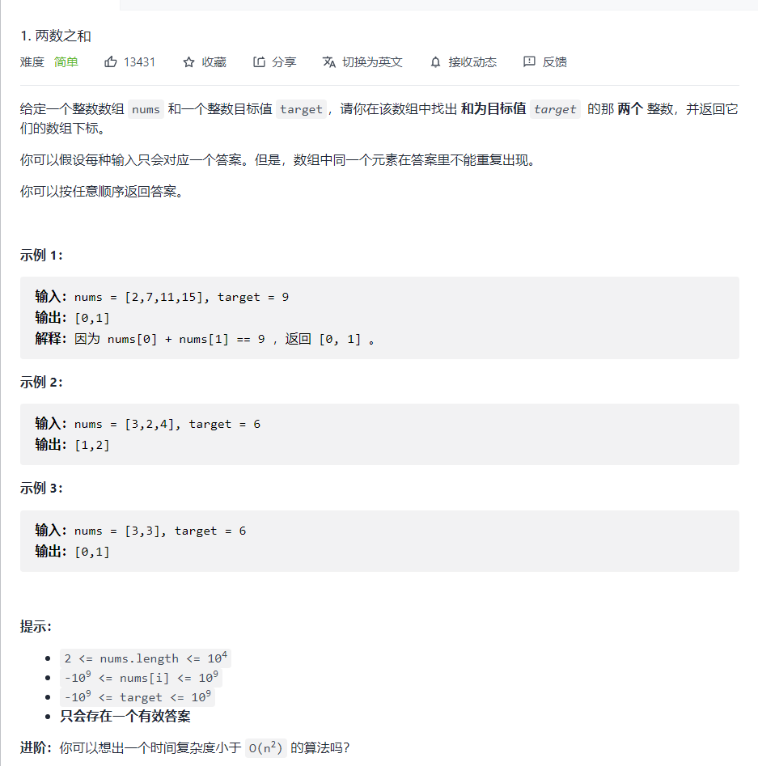

```ts
// 方法一：我们很容易想到暴力枚举  时间复杂度约等于O(n^2/2)
function twoSum(nums: number[], target: number): number[] {
  // 暴力枚举
  for (let i = 1; i < nums.length; i++) {
    for (let j = 0; j < i; j++) {
      if (nums[i] + nums[j] === target) {
        return [i, j]
      }
    }
  }
}
// 方法二：我们可以优化一下 可以维护一个notebook 然后去检查notebook里面是否有与此值相加等于目标值的值存在 时间复杂度O(n)
function twoSum(nums: number[], target: number): number[] {
  const notebook: Map<number, number> = new Map()
  for (let i = 0; i < nums.length; i++) {
    const value = target - nums[i]
    if (notebook.has(value)) {
      return [notebook.get(value), i]
    }
    notebook.set(nums[i], i)
  }
}
// 方法三：我们可以维护left，right两个下标在数组的两端，如果left + right > target，我们将right左移一位，反之将left右移一位，但是这种方法的前提条件是数组已经是排好序的了 所以在此题中不能使用(test case 中存在乱序的数组，且题目中需要我们返回元素下标)
function twoSum(nums: number[], target: number): number[] {
  // first of all,we need  the array to be sorted
  nums.sort((a, b) => a - b)
  let left: number = 0
  let right: number = nums.length - 1
  while (left < right) {
    if (nums[left] + nums[right] === target) {
      return [left, right]
    } else if (nums[left] + nums[right] > target) {
      right -= 1
    } else {
      left += 1
    }
  }
}
```

## DAY9: 逆阶乘

给定一个数，求它的阶乘数，不存在返回-1。

```ts
// 暴力枚举
function InverseFactorials(n) {
  if (n === 1) {
    return 1
  } else if (n < 1) {
    return -1
  }
  let i = 2
  let s = 1
  while (s < n) {
    s *= i
    i++
  }
  if (s === n) {
    return i - 1
  } else {
    return -1
  }
}

// 方法2
function InverseFactorials2(n) {
  if (n === 1) {
    return 1
  } else if (n < 1) {
    return -1
  }
  let i = 2
  while (n > 1) {
    if (n % i !== 0) {
      return -1
    }
    n /= i
    i++
  }
  return i - 1
}
```

## DAY10: sum of digits

请看 leetcode 1837：
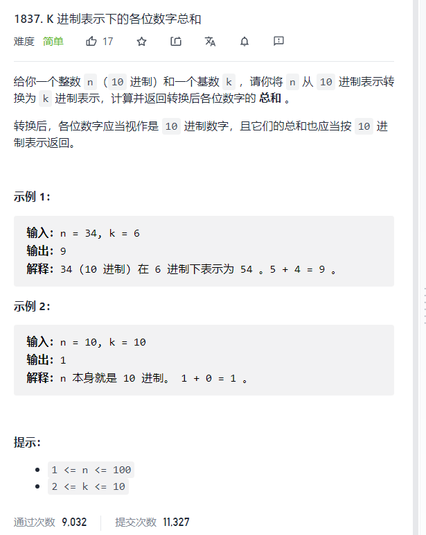

```ts
// 1.
function sumBase(n: number, k: number): number {
  n = parseInt(Number(n).toString(k))
  let ans: number = 0
  while (n > 0) {
    ans += n % 10
    n = Math.floor(n / 10)
  }
  return ans
}
//2. 字符串方法
function sumBase(n: number, k: number): number {
  let s: string = Number(n).toString(k)
  let ans: number = 0
  for (const i of s) {
    ans += parseInt(i)
  }
  return ans
}
//3. 递归
/**
 * @param {number} n
 * @param {number} k
 * @return {number}
 */
var sumBase = function (n, k) {
  if (Number.isInteger(k)) {
    n = parseInt(Number(n).toString(k))
  }
  // base case
  if (n === 0) {
    return 0
  }
  return (n % 10) + sumBase(Math.floor(n / 10))
}
```

## DAY11: 判断两个字符串是否为异位词(Anagrams)

什么叫异位词？"ate"和“eat”，"net" 和 "ten"。"baa" 和 "ba" 则不为异位词。解决这类问题我们可以维护两个`map`去统计每个字母的数量，然后再去比较两个`map`是否相等。
请看 leetcode 438:
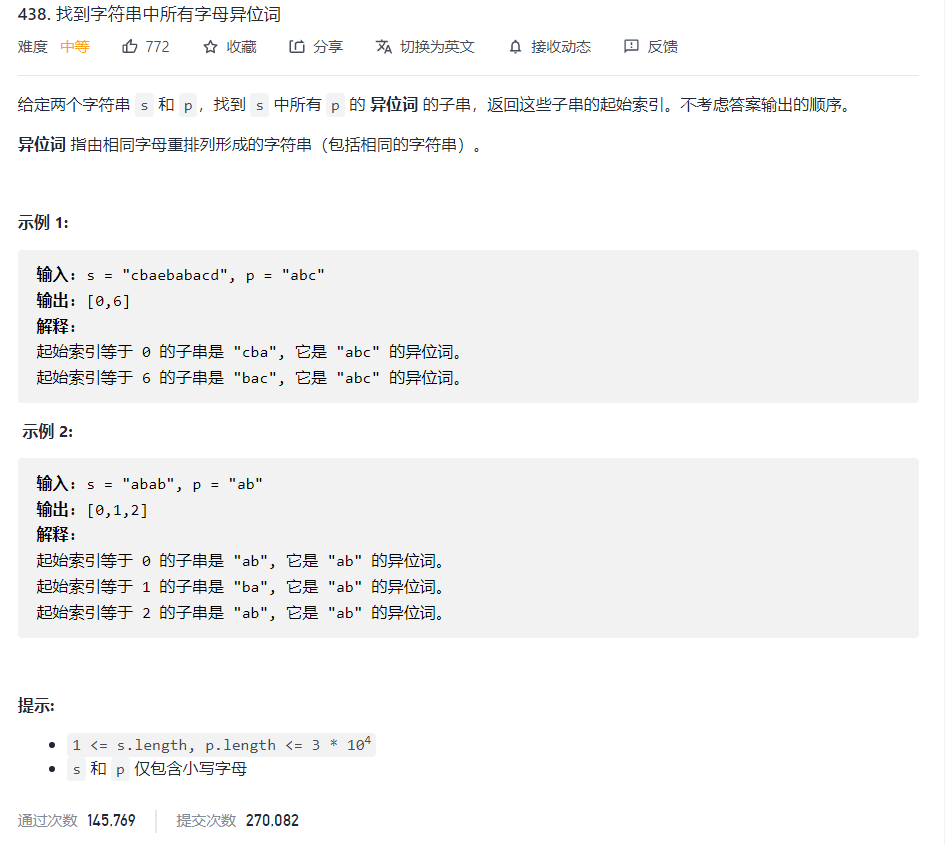

```ts
// 我们首先想到最暴力的方法：遍历 然后 去判断是否位异位词
function findAnagrams(s: string, p: string): number[] {
    let ans:Array<number> = []
    let map:Map<string,number> = new Map()
    for(const i of p){
        if(map.get(i) !== undefined){
            map.set(i,map.get(i) + 1)
        }else {
           map.set(i,1)
        }
    }
    for(let i = 0;i <= s.length - p.length; i++){
        let map2 = new Map()
        let substring = s.slice(i,i + p.length)
        for(const j of substring){
            if(map2.get(j) !== undefined){
                map2.set(j,map2.get(j) + 1)
            }else {
                map2.set(j,1)
            }
        }
        if(compareMaps(map,map2)){
            ans.push(i)
        }
    }
    return ans
};

function compareMaps(map1:Map<string,number>,map2:Map<string,number>):Boolean{
    if(map1.size !== map2.size){
        return false
    }
    for(const [key,val] of map1){
        const testVal = map2.get(key)
        if(val !== testVal || (testVal === undefined && !map2.get(key)){
            return false
        }
    }
    return true
}
```


可以看到实在是太慢了。

我们进一步优化

### 优化

这道题符合使用滑动窗口的条件：即

1. 处理连续的 subarray 或者 substring
2. window 是否满足条件与 window 长度相关的问题

```ts
function findAnagrams(s: string, p: string): number[] {
  let ans: Array<number> = []
  let targetMap: Map<string, number> = new Map()
  let windowMap: Map<string, number> = new Map() // 窗口counter
  for (const i of p) {
    targetMap.set(i, (targetMap.get(i) || 0) + 1)
  }
  let startIndex = 0 //窗口右边界

  for (let endIndex = 0; endIndex < s.length; endIndex++) {
    // 窗口左边界
    let char = s[endIndex]
    windowMap.set(char, (windowMap.get(s[endIndex]) || 0) + 1)
    while (windowMap.get(s[endIndex]) > (targetMap.get(s[endIndex]) || 0)) {
      // 当窗口内有元素的数量跟目标元素的数量不同时
      windowMap.set(s[startIndex], windowMap.get(s[startIndex++]) - 1) // 左边界右移
    }
    if (endIndex - startIndex + 1 === p.length) {
      // 窗口长度与目标元素长度相等，同时我们连续比较右边界与目标元素的数量，确保了当长度相等时窗口内元素与目标元素一致
      ans.push(startIndex)
    }
  }
  return ans
}
```

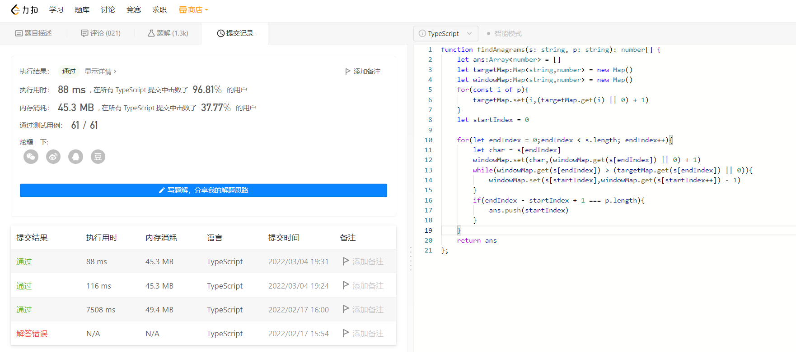

## DAY12:求最大公约数和最小公倍数

```ts
function gcd(a: number, b: number) {
  while (b > 0) {
    ;[a, b] = [b, a % b]
  }
  return a
}

function lcm(a: number, b: number) {
  return (a * b) / gcd(a, b)
}
```

## DAY13: 利用`BFS(Breadth First Search)`解决`Jump Game`问题

例如:[2,0,3,1,3,4] 以 1 为起点，0 为目标，如果能跳跃到目标位置。可以左右跳，当前元素代表你在该位置可以跳跃的最大长度。

```ts
function BFS(nums: number, start: number, target: number): boolean {
  let queue: number[] = [start]
  let seen: Set<number> = new Set()
  while (queue.length > 0) {
    const element = queue.shift()
    seen.add(element)
    if (nums[element] === target) {
      return true
    }
    for (const i of [-1, 1]) {
      const next = element + nums[element]
      if (next >= 0 && next <= nums.length - 1 && !seen[next]) {
        queue.push(next)
      }
    }
  }
  return false
}
```

请看下面这题：leetcode 55
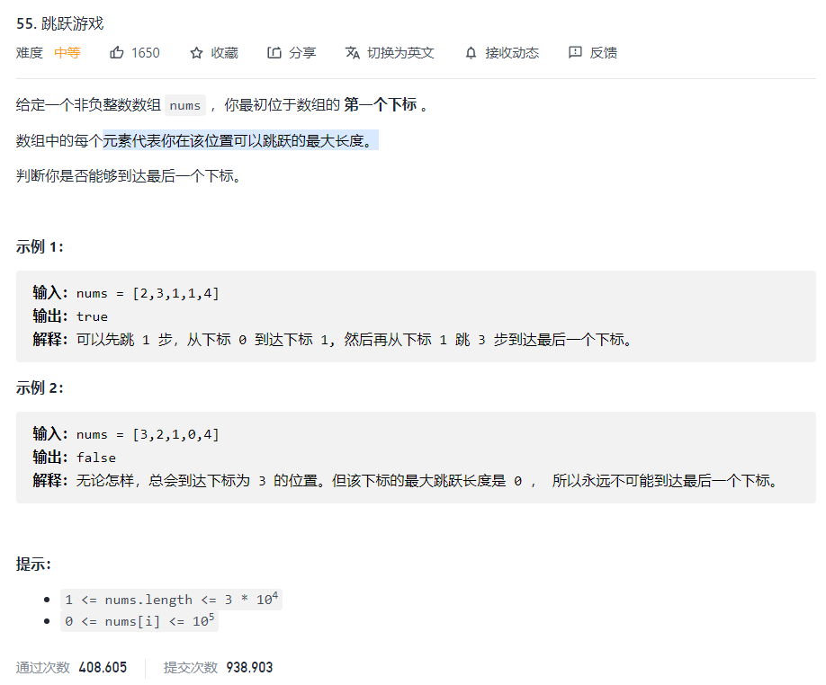

这题我们可以维护一个最大能到达的 index 值，遍历数组并与当前下标进行比较然后更新最大 index 值。

核心思想：如果能到达一个值，则这个值左侧的值也都能到达。

```ts
function canJump(nums: number[]): boolean {
  let k: number = 0
  for (let i = 0; i < nums.length; i++) {
    if (k < i) return false
    k = Math.max(k, i + nums[i])
  }
  return true
}
```

## DAY14: 利用`DFS(Depth First Search)`解决`Jump Game`

DFS 解法:

```ts
function DFS(
  n: number[],
  s: number,
  target: number,
  seen: Set<number> | undefined
): boolean {
  if (seen === undefined) {
    seen = new Set()
  }
  if (n[s] === target) {
    return true
  }
  for (const i of [-1, 1]) {
    const next = s + i * n[s]
    if (next >= 0 && next < n.length - 1 && !seen.has(next)) {
      seen.add(next)
      if (DFS(n, next, target, seen)) {
        return true
      }
      seen.delete(next)
    }
  }
  return false
}
```

## DAY15: 数学归纳法

Sum of integers：f(n) = n(n+1)/2

1. prove the base case
   when n = 1,f(1) = 1(1+1)/2 = 1
2. Induction step
   n = k = f(k) = k(k+1)/2
   f(k + 1) => f(k) + (k + 1) === f(k+1) = (k+1)(k+1+1)/2

wiki 的解释

```plain
The first, the base case (or basis), proves the statement for n = 0 without assuming any knowledge of other cases. The second case, the induction step, proves that if the statement holds for any given case n = k, then it must also hold for the next case n = k + 1. These two steps establish that the statement holds for every natural number n. The base case does not necessarily begin with n = 0, but often with n = 1, and possibly with any fixed natural number n = N, establishing the truth of the statement for all natural numbers n ≥ N.
```

## DAY16: Big O: Time complexity

O(1) < O(log n) < O( n ^ 1/2) < O(n) < O(nlogn) < O(n ^ 2) < O(n ^ 3) < O( 2 ^ n) < O( n! )

## DAY17: 合并两个有序的列表

```ts
// 不改变原数组
function merge(a: number[], b: number[]): number[] {
  let i = 0,
    j = 0,
    c = []
  while (i < a.length && j < b.length) {
    if (a[i] <= b[j]) {
      c.push(a[i])
      i += 1
    } else {
      c.push(b[j])
      j += 1
    }
  }
  if (i < a.length) {
    c = c.concat(a)
  }
  while (j < b.length) {
    c = c.concat(b)
  }
  return c
}
// 改变原数组
function merge2(a: number[], b: number[]): number[] {
  let c = []
  while (a.length && b.length) {
    if (a[0] < b[0]) {
      c.push(a.shift())
    } else {
      c.push(b.shift())
    }
  }
  return c.concat(a, b)
}
```

## DAY18: 快排

leetcode:912
快排是一种运用分治(divide and conquer )思想的排序算法,平均时间复杂度**O(nlogn)**,最大时间复杂度**O(n^2)**。

```ts
function quickSort(arr: number[]) {
  if (arr.length < 2) {
    return arr
  }
  let left = [],
    right = []
  let pivot = arr[arr.length - 1]
  while (arr.length > 1) {
    if (arr[0] < pivot) {
      left.push(arr.shift())
    } else {
      right.push(arr.shift())
    }
  }

  return [...quickSort(left), pivot, ...quickSort(right)]
}
```

## DAY19: 判断有效括号匹配

leetcode 20: 我们利用栈来解决

```ts
function isValid(s: string): boolean {
  const stack: string[] = []
  for (const i of s) {
    if (i === "(") {
      stack.push(")")
    } else if (i === "[") {
      stack.push("]")
    } else if (i === "{") {
      stack.push("}")
    } else {
      if (i !== stack.pop()) return false
    }
  }

  return !stack.length
}
```

## DAY20: 合并排序

合并排序也是一种运用分治思想的算法，无限将数组二分，当数组只有一个元素的时候，则数组为有序状态，我们再使用合并算法合并两个有序数组即可。时间复杂度`O(nlogn)`

```ts
function mergeSort(nums: number[]) {
  if (nums.length < 2) {
    return nums
  }
  let middle = Math.floor(nums.length / 2)
  let left = nums.slice(0, middle)
  let right = nums.slice(middle)
  let sortedLeft = mergeSort(left)
  let sortedRight = mergeSort(right)
  return merge(sortedLeft, sortedLeft)
}

function merge(left: number[], right: number[]): number[] {
  let i = 0,
    j = 0
  let ans = []
  while (i < left.length && j < right.length) {
    if (left[i] < right[j]) {
      ans.push(left[i])
      i += 1
    } else {
      ans.push(right[j])
      j += 1
    }
  }
  if (i < left.length) {
    ans = ans.concat(left.slice(i)) // note: concat return a new array
  }
  if (j < right.length) {
    ans = ans.concat(right.slice(j))
  }

  return ans
}
```

我们使用原地归并两个数组的方式来节省空间

```ts
function sortArray(nums: number[]): number[] {
  let aux = new Array<number>(nums.length).fill(undefined)
  sort(nums, 0, nums.length - 1)
  return nums
  function merge(nums: number[], low: number, middle: number, high: number) {
    let i = low
    let j = middle + 1
    for (let k = low; k <= high; k++) {
      aux[k] = nums[k]
    }
    for (let k = low; k <= high; k++) {
      if (i > middle) {
        nums[k] = aux[j++]
      } else if (j > high) {
        nums[k] = aux[i++]
      } else if (aux[j] < aux[i]) {
        nums[k] = aux[j++]
      } else {
        nums[k] = aux[i++]
      }
    }
  }
  function sort(nums: number[], low: number, high: number) {
    if (high <= low) {
      return
    }
    let middle = (high + low) >> 1
    sort(nums, low, middle)
    sort(nums, middle + 1, high)
    merge(nums, low, middle, high)
  }
}
```

## DAY21：使括号有效的最少添加

请看 leetcode 921：
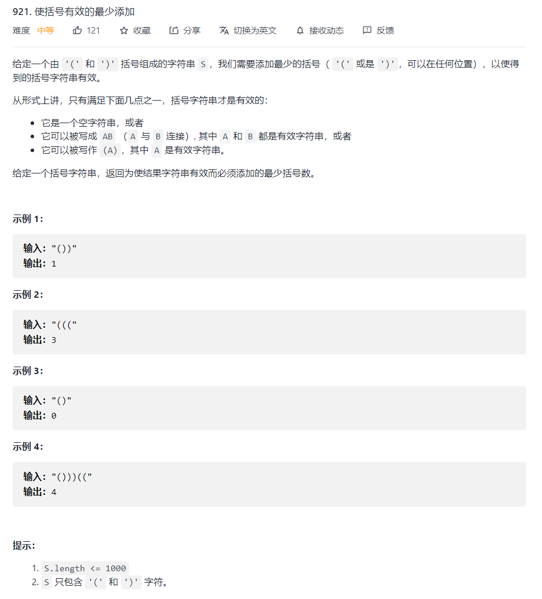

```ts
function minAddToMakeValid(s: string): number {
  let ans: number = 0
  let bal: number = 0
  for (const i of s) {
    if (i === "(") {
      bal += 1
    } else if (i === ")") {
      bal -= 1
      if (bal < 0) {
        bal = 0 // 当bal<0,我们需要将bal重置，因为只有”（“在前面的时候才会有balance
        ans += 1
      }
    }
  }
  return ans + bal
}
```

## DAY22：二叉树的验证

请看 leetcode: 98
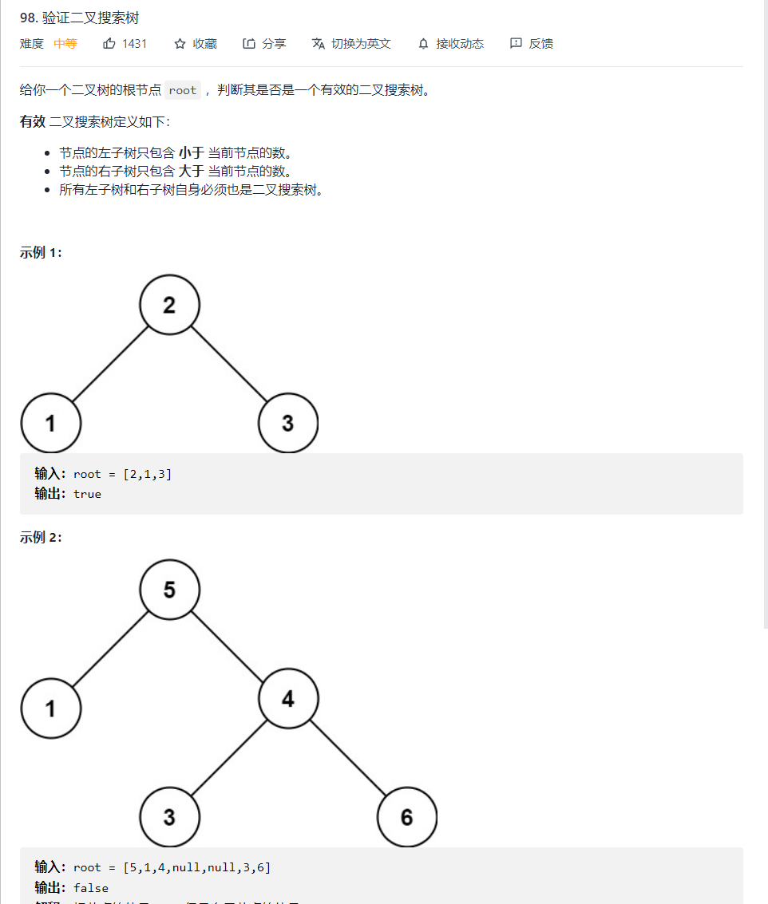
这里我们利用递归，维护两个边界，当数值超出了边界,返回 false 即可。

```ts
function isValidBST(
  root: TreeNode | null,
  max: number = Infinity,
  min: number = -Infinity
): boolean {
  if (root === null) {
    return true
  }
  if (root.val > min && root.val < max) {
    if (
      isValidBST(root.left, root.val, min) &&
      isValidBST(root.right, max, root.val)
    ) {
      return true
    }
  }
  return false
}
```

## DAY23：二叉树的遍历

- NLR: preorder
- LNR: inorder
- LRN: postorder
- RNL
- BFS

LNR(中序遍历): 请看 leetcode 94
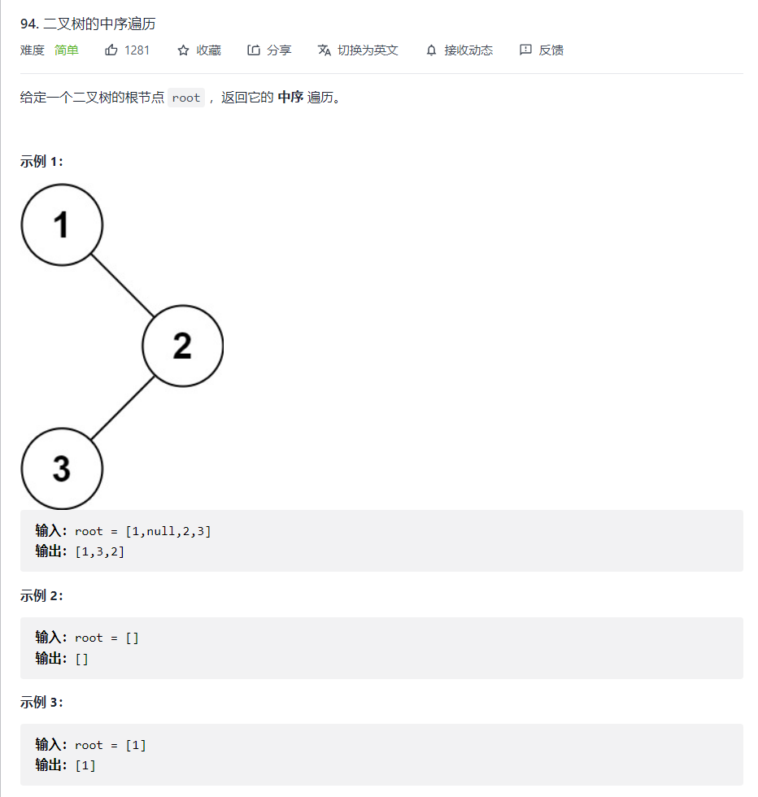

```ts
/**
 * Definition for a binary tree node.
 * class TreeNode {
 *     val: number
 *     left: TreeNode | null
 *     right: TreeNode | null
 *     constructor(val?: number, left?: TreeNode | null, right?: TreeNode | null) {
 *         this.val = (val===undefined ? 0 : val)
 *         this.left = (left===undefined ? null : left)
 *         this.right = (right===undefined ? null : right)
 *     }
 * }
 */
function inorderTraversal(root: TreeNode | null, ans: number[] = []): number[] {
  if (root === null) {
    return []
  }
  inorderTraversal(root.left, ans)
  ans.push(root.val)
  inorderTraversal(root.right, ans)
  return ans
}
```

LRN(后续遍历)：请看 leetcode 145
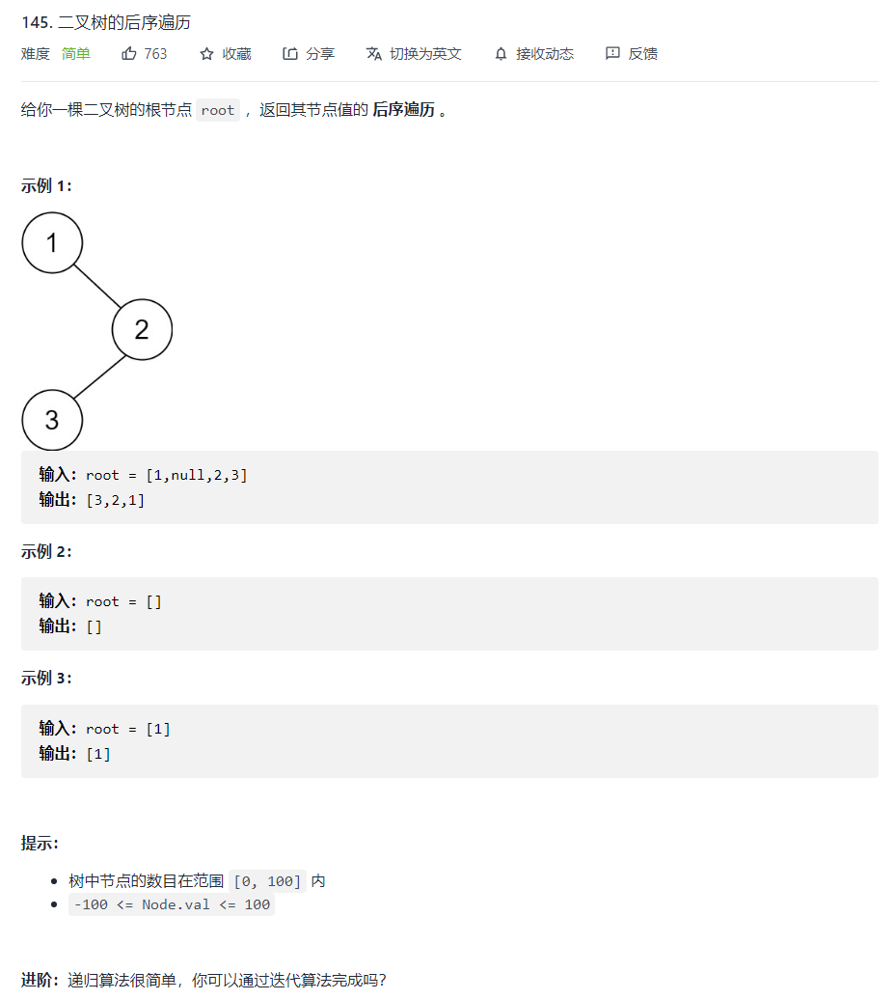

```ts
function postorderTraversal(
  root: TreeNode | null,
  ans: number[] = []
): number[] {
  if (root === null) {
    return []
  }
  postorderTraversal(root.left, ans)
  postorderTraversal(root.right, ans)
  ans.push(root.val)
  return ans
}
```

NLR(前续遍历):

```ts
function preorderTraversal(
  root: TreeNode | null,
  ans: number[] = []
): number[] {
  if (root === null) {
    return []
  }
  ans.push(root.val)
  preorderTraversal(root.left, ans)
  preorderTraversal(root.right, ans)
  return ans
}
```

## DAY24:回溯算法解决 n 皇后问题

DFS + 剪枝 -> 回溯
leetcode 51: n 皇后问题

```js
/**
 * @param {number} n
 * @return {string[][]}
 */
var solveNQueens = function (n) {
  let current = []
  let results = DFS(current, n)
  const ans = []
  for (let i = 0; i < results.length / n; i++) {
    ans.push(results.slice(i * n, i * n + n))
  }
  return ans
}

function DFS(current, n) {
  let ans = []
  if (current.length === n) {
    let forAns = new Array(n).fill(".".repeat(n))
    for (let i = 0; i < current.length; i++) {
      forAns[i] =
        forAns[i].substring(0, current[i]) +
        "Q" +
        forAns[i].substring(current[i] + 1)
    }
    return forAns
  }
  for (let i = 0; i < n; i++) {
    if (canPlace(current, i)) {
      ans = ans.concat(DFS(current.concat(i), n))
    }
  }
  return ans
}
function canPlace(current, x) {
  for (let i = 0; i < current.length; i++) {
    if (current[i] === x || current.length - i === Math.abs(x - current[i])) {
      return false
    }
  }
  return true
}
```

再来一题回溯

leetcode:46 全排列

```ts
function permute(nums: number[]): number[][] {
  let res: number[][] = []
  let path: number[] = []
  backtrack(path, nums, res)
  return res
}

function backtrack(
  path: number[],
  nums: number[],
  res: number[][]
): number[][] {
  // 结束条件
  if (path.length === nums.length) {
    res.push(path)
    return
  }
  // 选择列表
  for (let i = 0; i < nums.length; i++) {
    // 做选择
    if (!path.includes(nums[i])) {
      // 参数即路径
      backtrack(path.concat(nums[i]), nums, res)
    }
  }

  return res
}
```

## DAY25: sum of first odd and first even number

```ts
function sumOfFirstOdd(n) {
  let ans = 0
  for (let i = 1; i < 2 * n; i = i + 2) {
    ans += i
  }
  return ans
}

function sumOfFirstEven(n) {
  let ans = 0
  for (let i = 2; i < 2 * n + 1; i = i + 2) {
    ans += i
  }
  return ans
}
```

## DAY26:完全二叉树的节点个数

leetcode 222:


```ts
// BFS
function countNodes(root: TreeNode | null): number {
  if (root == null) {
    return 0
  }
  let queue: TreeNode[] = [root]
  let ans: number = 0
  while (queue.length) {
    let node = queue.shift()
    ans += 1
    if (node.left != null) {
      queue.push(node.left)
    }
    if (node.right != null) {
      queue.push(node.right)
    }
  }
  return ans
}

// DFS
function countNodes(root: TreeNode | null): number {
  if (root == null) {
    return 0
  }
  return 1 + countNodes(root.left) + countNodes(root.right)
}
```

## DAY27:区间列表的交集

leetcode 986：
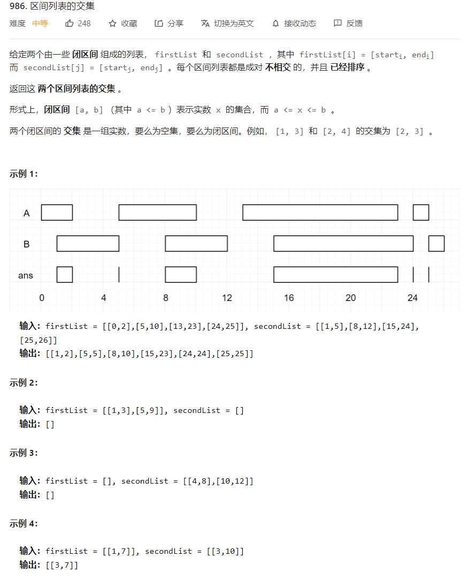

```ts
// 通过观察可知，左区间中小的减去右区间中大的即为交集
function intervalIntersection(
  firstList: number[][],
  secondList: number[][]
): number[][] {
  if (firstList.length === 0 || secondList.length === 0) {
    return []
  }
  let ans: number[][] = []
  let i: number = 0
  let j: number = 0
  while (i < firstList.length && j < secondList.length) {
    let left = Math.max(firstList[i][0], secondList[j][0])
    let right = Math.min(firstList[i][1], secondList[j][1])
    if (left <= right) {
      ans.push([left, right])
    }
    // 哪个右区间元素较小，就向前移动一位 这里很巧妙
    if (firstList[i][1] < secondList[j][1]) {
      i++
    } else {
      j++
    }
  }
  return ans
}
```

## DAY28：十进制十六进制互转

leetcode: 405

```ts
function toHex(num: number): string {
  if (num < 0) {
    num = 2 ** 32 - Math.abs(num)
  } else if (num === 0) {
    return "0"
  }
  let ans = []
  let numberMap = {
    0: "0",
    1: "1",
    2: "2",
    3: "3",
    4: "4",
    5: "5",
    6: "6",
    7: "7",
    8: "8",
    9: "9",
    10: "a",
    11: "b",
    12: "c",
    13: "d",
    14: "e",
    15: "f",
  }
  while (num > 0) {
    ans.unshift(numberMap[num % 16])
    num = Math.floor(num / 16)
  }
  return ans.join("")
}

// hex to decimal
function hex2Decimal(num: string) {
  let ans = 0
  let numberMap = {
    0: 0,
    1: 1,
    2: 2,
    3: 3,
    4: 4,
    5: 5,
    6: 6,
    7: 7,
    8: 8,
    9: 9,
    a: 10,
    b: 11,
    c: 12,
    d: 13,
    e: 14,
    f: 15,
  }
  for (const i of num) {
    ans = ans * 16 + numberMap[i.toLowerCase()]
  }
  return ans
}
```

## DAY29: 利用前缀和算内部某区间的和

```ts
function prefixComputeIntervalSums(
  nums: number[],
  start: number,
  end: number
): number {
  let s: number = 0
  let prefix: number[] = [0]
  for (const i of nums) {
    s += i
    prefix.push(s)
  }
  return prefix(end + 1) - prefix(start)
}
```

我们看 leetcode 930:

这题我们可以利用前缀和来解，记录每个前缀和的个数，那么每个位置对应的目标数就是此位置前缀和 - goal 对应的前缀和个数

```ts
function numSubarraysWithSum(nums: number[], goal: number): number {
  let s = 0
  let ans = 0
  const prefix = {}
  for (const i of nums) {
    prefix[s] = (prefix[s] || 0) + 1
    s += i
    ans += prefix[s - goal] || 0
  }
  return ans
}
```

## DAY30: 滑动窗口

leetcode 209：
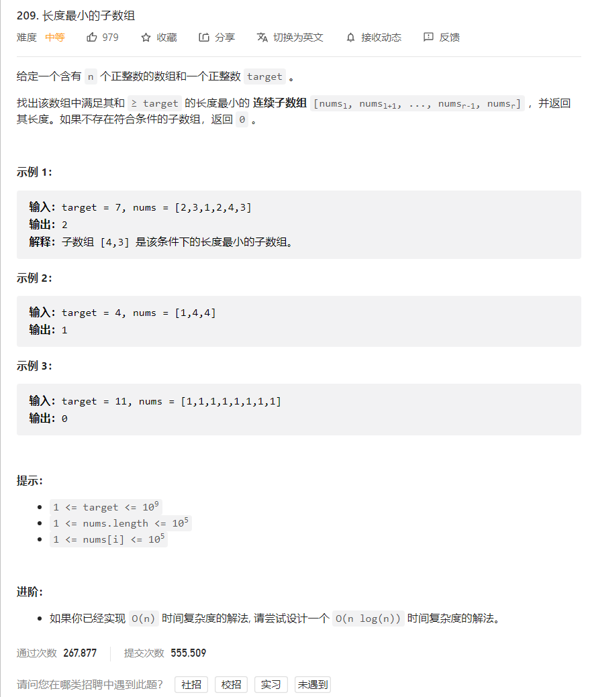

```ts
function minSubArrayLen(target: number, nums: number[]): number {
  // sliding window
  let ans = nums.length + 1
  let startIndex = 0 // 窗口起始坐标
  let endIndex = 0 // 窗口结束坐标
  let windowSum = 0 //窗口内元素之和
  let subLength = 0
  while (end_idx < nums.length) {
    windowSum += nums[endIndex]
    while (windowSum >= target) {
      subLength = endIndex - startIndex + 1 //窗口内长度
      ans = subLength < ans ? subLength : ans
      windowSum -= nums[startIndex++]
    }
    endIndex++
  }
  return ans === nums.length + 1 ? 0 : ans
}
```

## DAY31：单链表的中间节点

leetcode 876：返回单链表的中间节点
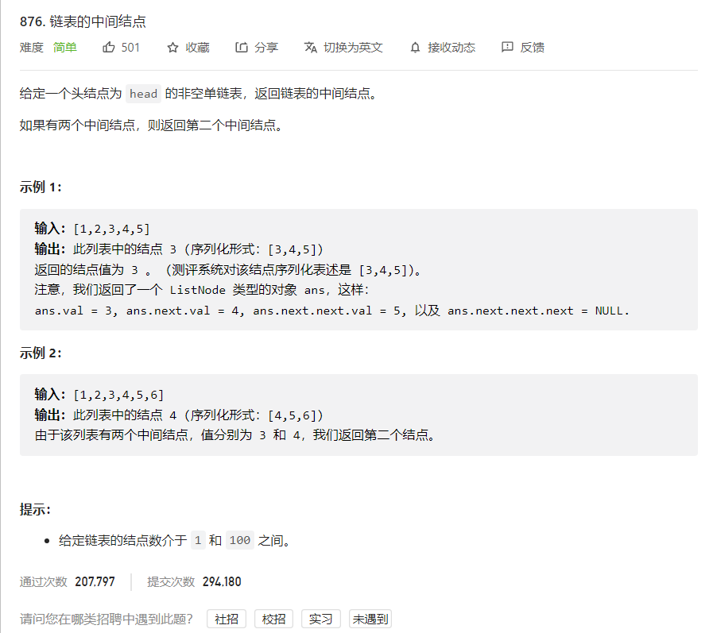

我们可以定义双指针`slow`，`fast`，让`fast`右移的速度是`slow`的两倍即可

```ts
function middleNode(head: ListNode | null): ListNode | null {
  let slow = head,
    fast = head
  while (fast !== null && fast.next !== null) {
    fast = fast.next.next
    slow = slow.next
  }
  return slow
}
```

## DAY32: 螺旋矩阵

解螺旋矩阵的要点是：确定边界！
维护四个边界，上下左右，每跑完一条边就更新边界
leetcode：54
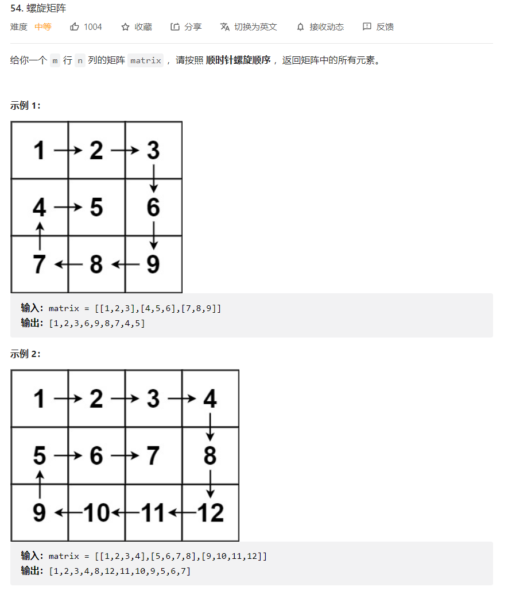

```ts
function spiralOrder(matrix: number[][]): number[] {
  let ans: number[] = []
  // 确定边界
  let beginRow: number = 0
  let endRow: number = matrix.length - 1
  let beginColumn: number = 0
  let endColumn: number = matrix[0].length - 1
  while (beginRow <= endRow && beginColumn <= endColumn) {
    for (let i = beginColumn; i <= endColumn; i++) {
      ans.push(matrix[beginRow][i])
    }
    beginRow++
    for (let i = beginRow; i <= endRow; i++) {
      ans.push(matrix[i][endColumn])
    }
    endColumn--
    // 由于上面两个for循环之后更新了边界值，所以我们要确定一下边界是否还是有效的
    if (beginRow <= endRow) {
      for (let i = endColumn; i >= beginColumn; i--) {
        ans.push(matrix[endRow][i])
      }
    }
    endRow--
    if (beginColumn <= endColumn) {
      for (let i = endRow; i >= beginRow; i--) {
        ans.push(matrix[i][beginColumn])
      }
    }
    beginColumn++
  }
  return ans
}
```

同理
leetcode: 59
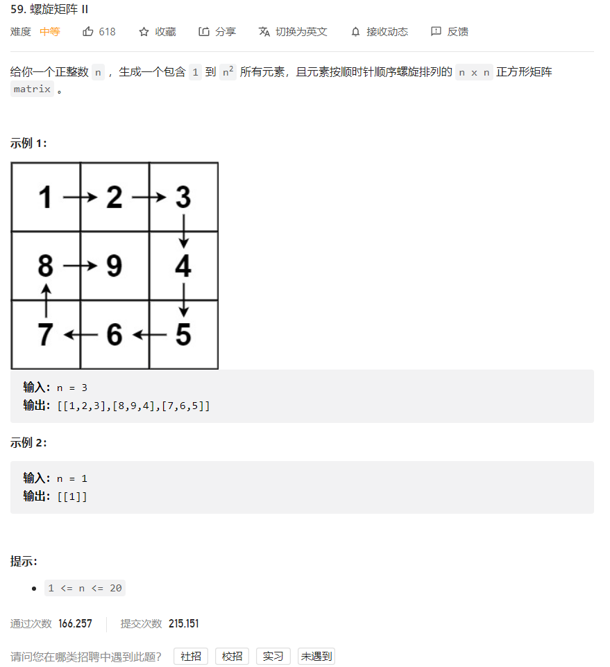

```ts
function generateMatrix(n: number): number[][] {
  const matrix: number[][] = new Array(n).fill(null).map(() => [])
  let beginRow: number = 0
  let endRow: number = n - 1
  let beginColumn: number = 0
  let endColumn: number = n - 1
  let counter: number = 1
  while (beginRow <= endRow && beginColumn <= endColumn) {
    for (let i = beginColumn; i <= endColumn; i++) {
      matrix[beginRow][i] = counter++
    }
    beginRow++
    for (let i = beginRow; i <= endRow; i++) {
      matrix[i][endColumn] = counter++
    }
    endColumn--
    if (beginRow <= endRow) {
      for (let i = endColumn; i >= beginColumn; i--) {
        matrix[endRow][i] = counter++
      }
    }
    endRow--
    if (beginColumn <= endColumn) {
      for (let i = endRow; i >= beginRow; i--) {
        matrix[i][beginColumn] = counter++
      }
    }
    beginColumn++
  }
  return matrix
}
```

## DAY33：判断一个字符串能否构成回文字符串

很容易想到，我们只需要验证字符串中字符数为奇数的字符不大于 1 即可

```ts
function canPermutePalindrome(s: string): boolean {
  let charMap = new Map<string, number>()
  let oddNumber: number = 0
  for (const i of s) {
    charMap.set(i, (charMap.get(i) || 0) + 1)
  }

  for (const v of charMap.values()) {
    if ((v & 1) === 1) {
      oddNumber++
      if (oddNumber > 1) return false
    }
  }
  return true
}
```

## DAY34: 反转单链表 和 移除单链表节点

```ts
// 迭代法 三指针
function reverseList(head: ListNode | null): ListNode | null {
  if (head === null || head.next === null) {
    return head
  }
  let pre = null
  let current = head
  let next = null
  while (current) {
    next = current.next
    current.next = pre
    pre = current
    current = next
  }
  return pre
}
// 递归
function reverseList(head: ListNode | null): ListNode | null {
  if (head === null || head.next === null) {
    return head
  }
  let n = reverseList(head.next)
  head.next.next = head
  head.next = null

  return n
}

// 移除
function removeElements(head: ListNode | null, val: number): ListNode | null {
  let fakeHead = new ListNode(0, head)
  let current = fakeHead.next
  let pre = fakeHead
  while (current) {
    if (current.val === val) {
      pre.next = current.next
    } else {
      pre = current
    }
    current = current.next
  }
  return fakeHead.next
}
```

## DAY35：链表相交

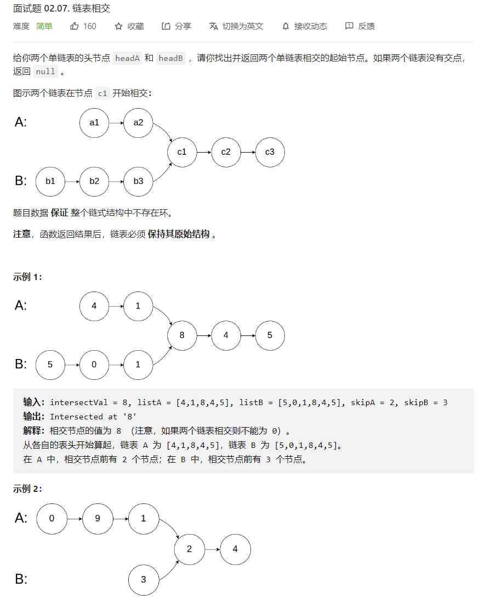

```js
/**
 * Definition for singly-linked list.
 * function ListNode(val) {
 *     this.val = val;
 *     this.next = null;
 * }
 */

/**
 * @param {ListNode} headA
 * @param {ListNode} headB
 * @return {ListNode}
 */
var getIntersectionNode = function (headA, headB) {
  let hA = headA,
    lenA = 0,
    hhA = headA
  let hB = headB,
    lenB = 0,
    hhB = headB
  // 求A的长度
  while (hA !== null) {
    lenA++
    hA = hA.next
  }
  // 求B的长度
  while (hB !== null) {
    lenB++
    hB = hB.next
  }
  let length = Math.abs(lenA - lenB)
  //根据长度差移动长度大的头节点
  if (lenA > lenB) {
    while (length) {
      hhA = hhA.next
      length--
    }
  } else if (lenA < lenB) {
    while (length) {
      hhB = hhB.next
      length--
    }
  }
  // 开始逐一比较
  while (hhA !== null && hhB !== null) {
    if (hhA === hhB) {
      return hhA
    }
    hhA = hhA.next
    hhB = hhB.next
  }
  return null
}

// 优化版： 如果两个链表相交 必定在相交点相遇
function getIntersectionNode(
  headA: ListNode | null,
  headB: ListNode | null
): ListNode | null {
  let a = headA,
    b = headB
  let counter = 0
  while (a !== b) {
    a = a.next
    if (!a) {
      // a 走到 末端, 从B开始走
      a = headB
      counter++
    }
    b = b.next
    if (!b) {
      // b 走到 末端，从A开始走
      b = headA
      counter++
    }
    if (counter > 2) {
      return null
    }
  }
  return a
}
```

## DAY36：两两交换链表中的节点

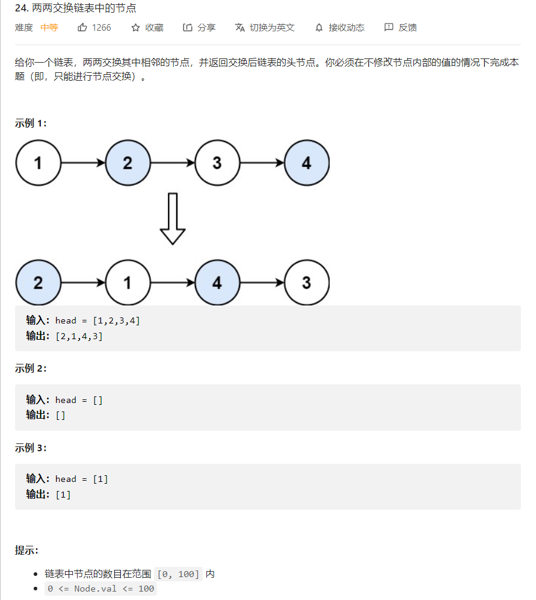

```ts
function swapPairs(head: ListNode | null): ListNode | null {
  if (head === null || head.next === null) {
    return head
  }
  let fakeHead: ListNode = new ListNode(0, head)
  let pre: ListNode = fakeHead
  let current: ListNode | null = fakeHead.next
  while (current !== null && current.next !== null) {
    // 交换
    let next = current.next
    let temp = next.next
    pre.next = next
    next.next = current
    current.next = temp

    // 移动指针
    pre = current
    current = current.next
  }
  return fakeHead.next
}
```

## DAY37:删除链表倒数第 K 个节点

```ts
// 双指针
let counter: number = 0
function removeNthFromEnd(head: ListNode | null, n: number): ListNode | null {
  // 递归
  if (!head) {
    return null
  }
  let node = removeNthFromEnd(head.next, n)
  head.next = node
  counter++
  if (counter === n) {
    return head.next
  }
  return head

  // 快慢指针
  let slow: ListNode = head
  let fast: ListNode = head
  while (fast.next) {
    fast = fast.next
    n--
    if (n < 0) {
      slow = slow.next
    }
  }
  // 当n大于0 说明删除的是第一个
  if (n > 0) {
    return slow.next
  }
  // 此时slow是要删除的前一个节点
  slow.next = slow.next.next
  return head
}
```

## DAY38：pow(x,n)

```ts
// 递归 如果是偶数 就将指数减半
function myPow(x: number, n: number): number {
  // 首先处理边界情况
  if (x === 1 || x === 0) {
    return x
  }
  if (n === 0) {
    return 1
  }
  if (n < 0) {
    x = 1 / x
    n = -n
  }
  // 如果是奇数
  if (n & 1) {
    return x * myPow(x, n - 1)
  }
  // 如果是偶数
  let y = myPow(x, n / 2)
  return y ** 2
}
```

## DAY39: 排序链表

```ts
// 合并排序
function sortList(head: ListNode | null): ListNode | null {
  if (!head || !head.next) {
    return head
  }

  let middle: ListNode = head
  let pointer: ListNode | null = head
  let prev: ListNode | null = null
  while (pointer && pointer.next) {
    pointer = pointer.next.next
    prev = middle
    middle = middle.next
  }
  prev.next = null
  let sortedLeft = sortList(head)
  let sortedRight = sortList(middle)
  return merge(sortedLeft, sortedRight)
}

function merge(left: ListNode, right: ListNode): ListNode {
  // 巧妙
  let dummy: ListNode = new ListNode(0)
  let p: ListNode = dummy
  while (left && right) {
    if (left.val < right.val) {
      p.next = left
      left = left.next
    } else {
      p.next = right
      right = right.next
    }
    p = p.next
  }
  if (left) {
    p.next = left
  }
  if (right) {
    p.next = right
  }
  return dummy.next
}
```

## DAY40: 三数之和

```ts
function threeSum(nums: number[]): number[][] {
  if (nums.length < 3) {
    // 特判
    return []
  }
  let ans: number[][] = []
  let sum: number = 0
  nums.sort((a, b) => a - b)
  let n = nums.length
  for (let i = 0; i < n; i++) {
    if (nums[i] > 0) {
      // 已经排好序，如果大于0，说明没有满足条件的另外两个数
      return ans
    }
    if (i > 0 && nums[i] === nums[i - 1]) {
      // 相邻重复的，去重
      continue
    }
    let j = i + 1
    let k = n - 1
    while (j < k) {
      sum = nums[i] + nums[j] + nums[k]
      if (sum === 0) {
        ans.push([nums[i], nums[j], nums[k]])
        while (j < k && nums[k] === nums[k - 1]) {
          // 此处保证下个指针的位置与此指针的数不同，去重
          k -= 1
        }
        while (j < k && nums[j] === nums[j + 1]) {
          j += 1
        }
        k -= 1
        j += 1
      } else if (sum > 0) {
        k -= 1
      } else {
        j += 1
      }
    }
  }
  return ans
}
```

## DAY41: 四数之和

leetcode 18:
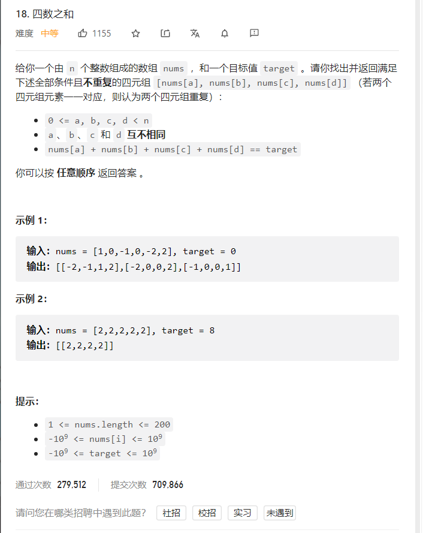

```ts
function fourSum(nums: number[], target: number): number[][] {
  // 特判
  if (nums.length < 4) {
    return []
  }
  let ans: number[][] = []
  // 排序数组
  nums.sort((a, b) => a - b)
  let n: number = nums.length
  for (let i = 0; i < n - 1; i++) {
    // 保证不与前一个数相等 前一个数我们已经处理过了 且数组是排过序的 这样就保证了我们处理的都是不相等的数
    if (i > 0 && nums[i - 1] === nums[i]) {
      continue
    }
    for (let j = n; j > i; j--) {
      let left: number = i + 1
      let right: number = j - 1
      // 保证不与后一个数相等，后一个数我们已经处理过了
      if (j < n && nums[i] + nums[j] === nums[i] + nums[j + 1]) {
        continue
      }
      while (left < right) {
        if (nums[left] + nums[right] + nums[i] + nums[j] === target) {
          ans.push([nums[left], nums[right], nums[i], nums[j]])
          // 保证不与前一个数相等，前一个数我们已经处理过了
          while (left < j && nums[left] === nums[left + 1]) {
            left++
          }
          // 保证不与后一个数相等，后一个数我们已经处理过了
          while (right > i && nums[right] === nums[right - 1]) {
            right--
          }
          left++
          right--
        } else if (nums[left] + nums[right] + nums[i] + nums[j] > target) {
          right--
        } else {
          left++
        }
      }
    }
  }
  return ans
}
```

## DAY42: Symmetric & equal & copy & invert binary tree

```ts
// revert
function revert(root: TreeNode | null): TreeNode | null {
  if (root === null) {
    return null
  }
  let revertedLeft = revert(root.left)
  let revertedRight = revert(root.right)
  root.right = revertedLeft
  root.left = revertedRight
  return root
}
// copy
function copy(root: TreeNode | null): TreeNode | null {
  if (root === null) {
    return null
  }
  let copyedLeft = copy(root.left)
  let copyedRight = copy(root.right)
  let newNode = new TreeNode(root.val)
  newNode.right = copyedRight
  newNode.left = copyedLeft
  return newNode
}
// equal
function equal(a: TreeNode | null, b: TreeNode): boolean {
  if (a === null && b === null) {
    return true
  } else if (a === null || b === null) {
    return false
  }

  return a.val === b.val && equal(a.left, b.left) && equal(a.right, b.right)
}
// symmetric
function Symmetric(left: TreeNode | null, right: TreeNode | null): boolean {
  if (left === null && right === null) {
    return true
  } else if (left == null || right == null) {
    return false
  }
  return (
    left.val === right.val &&
    Symmetric(left.left, right.right) &&
    Symmetric(left.right, right.left)
  )
}
```

## DAY43: 有序链表构造平衡树

```ts
function sortedListToBST(head: ListNode | null): TreeNode | null {
  if (head === null) {
    return null
  } else if (head.next === null) {
    return new TreeNode(head.val)
  }
  let fast = head,
    slow = head
  let prev = null
  while (fast && fast.next) {
    fast = fast.next.next
    prev = slow
    slow = slow.next
  }
  prev.next = null
  let newNode = new TreeNode(slow.val)
  newNode.left = sortedListToBST(head)
  newNode.right = sortedListToBST(slow.next)

  return newNode
}
```

## DAY 44: 合并 K 个有序链表

```ts
// 此题和归并排序的思路一样，按照归并排序的思路写就行了，差异在于归并两个有序列表和归并两个
// 有序链表的不同，但是也不复杂，利用虚拟头节点一个个合并就行了。
function mergeKLists(lists: Array<ListNode | null>): ListNode | null {
  if (lists.length === 0) {
    return null
  } else if (lists.length === 1) {
    return lists[0]
  }
  let middle = lists.length >> 1
  let left: Array<ListNode | null> = lists.slice(0, middle)
  let right: Array<ListNode | null> = lists.slice(middle)
  let sortedList: ListNode | null = mergeKLists(left)
  let sortedRight: ListNode | null = mergeKLists(right)

  return merge(sortedList, sortedRight)
}

function merge(a: ListNode | null, b: ListNode | null): ListNode | null {
  let dummyHead: ListNode = new ListNode(null)
  let p: ListNode = dummyHead
  let left: ListNode | null = a,
    right: ListNode | null = b
  while (left && right) {
    if (left.val > right.val) {
      p.next = right
      right = right.next
    } else {
      p.next = left
      left = left.next
    }
    p = p.next
  }
  // 处理剩余的
  if (left) {
    p.next = left
  }

  if (right) {
    p.next = right
  }
  return dummyHead.next
}
```

## DAY45： 链表两数相加

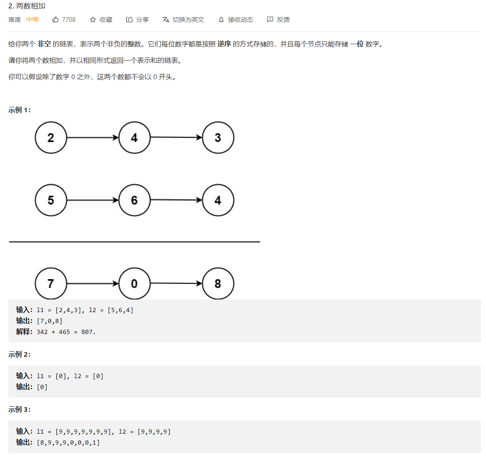

```ts
function addTwoNumbers(
  l1: ListNode | null,
  l2: ListNode | null
): ListNode | null {
  let dummy = new ListNode(0)
  let p = dummy
  let carry = 0
  while (l1 || l2 || carry) {
    let currentDigital = carry
    if (l1) {
      currentDigital += l1.val
      l1 = l1.next
    }
    if (l2) {
      currentDigital += l2.val
      l2 = l2.next
    }
    p.next = new ListNode(currentDigital % 10)
    carry = Math.floor(currentDigital / 10)
    p = p.next
  }
  return dummy.next
}
```

## DAY46: 修剪二叉树

给定一个范围(都是闭区间)，剪掉二叉树中不在此范围的元素节点。

```ts
function trimBST(
  root: TreeNode | null,
  low: number,
  high: number
): TreeNode | null {
  if (root === null) {
    return null
  } else if (root.val < low) {
    return trimBST(root.right, low, high)
  } else if (root.val > high) {
    return trimBST(root.left, low, high)
  }

  root.left = trimBST(root.left, low, high)
  root.right = trimBST(root.right, low, high)
  return root
}
```

## DAY47: 位 1 的个数

leetcode 191:

```ts
// 利用 n = n & (n - 1) 来消除低位
function hammingWeight(n: number): number {
  let ans: number = 0
  while (n) {
    ans++
    n &= n - 1
  }
  return ans
}

// 移位
// P.S  此方法js过不了 但C++可以过
function hammingWeight(n: number): number {
  let ans: number = 0
  while (n) {
    ans += n & 1
    n >>= 1
  }
  return ans
}
```
