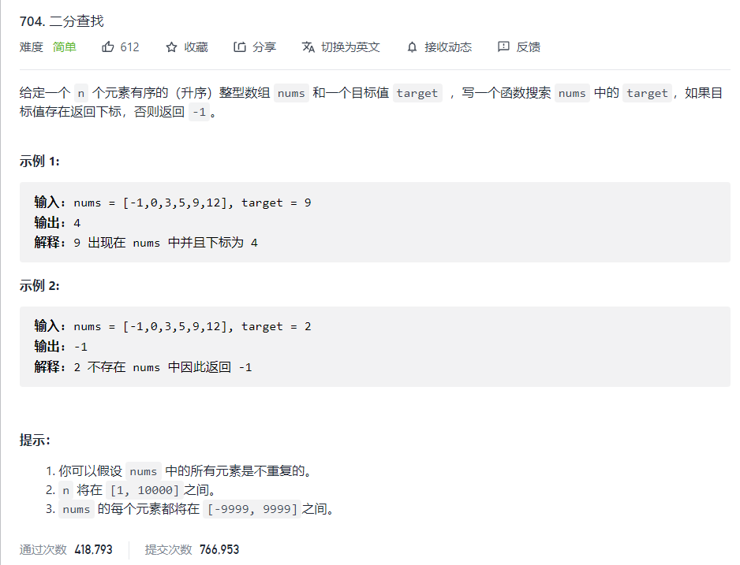
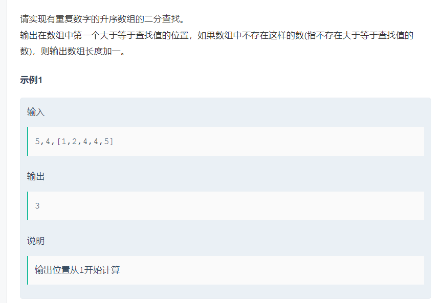
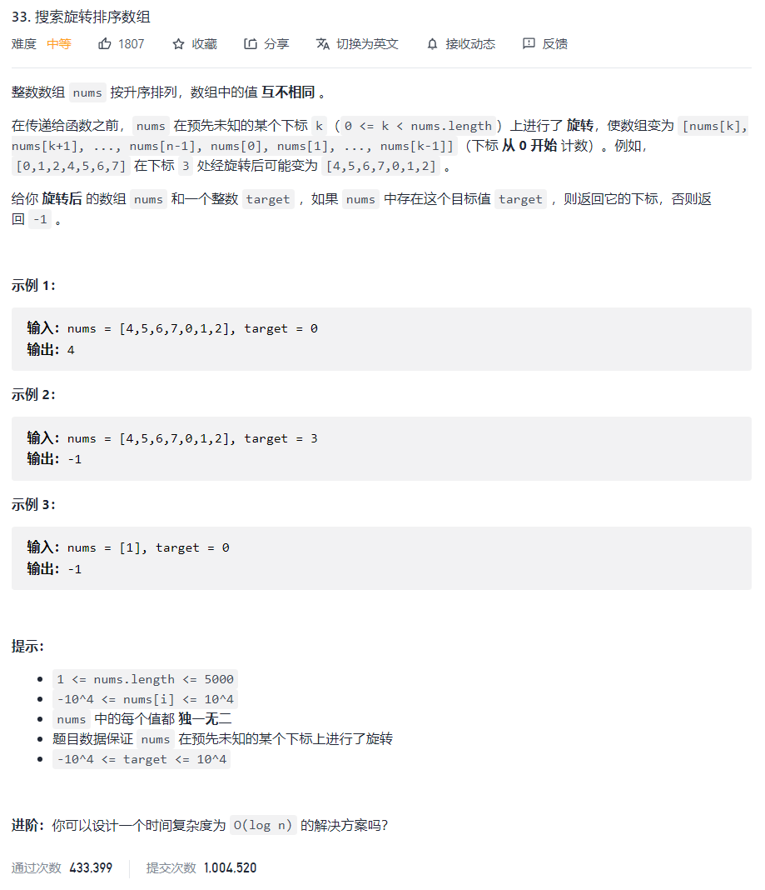

# 个人的 coding 365 计划

再接下来的 365 天里，每天完成一道编程题，主要目的是提高自己的编程能力同时培养兴趣。

## DAY 1：2 进制和 10 的转换

```js
/*
 二进制
 1 -> 1
 2 -> 10
 3 -> 11
 4 -> 100
 5 -> 101
 6 -> 110
 7 -> 111
 8 -> 1000
*/

// 十进制转二进制: 回忆下我们怎样将二进制转换为二进制的，反向操作即可，取余
function decToBin(n) {
  if (n === 0) {
    return 0
  }
  const ans = []
  while (n) {
    // n > 0
    ans.unshift(n & 1) // n % 2
    n >>= 1 // 左乘右除
  }
  return parseInt(ans.join(""))
}

// 二进制转十进制
function binToDec(n) {
  ans = 0
  for (const i of n.toString()) {
    ans = ans << (1 + i)
  }
  return ans
}

// 判断是否是2的幂
/*
2 -> 10
4 -> 100
8 -> 1000
16 -> 10000


n - 1 : 01111

取 and 操作即可判断

n > 0 && (n & (n - 1) == 0)

延申
leetcode 342：判断是否是4的幂
判断是否是4的幂
n > 0 && (n & (n - 1) == 0) && n % 3 == 1
*/
```

## DAY 2: 二分查找

二分查找是一种在有序数组中查找某一特定元素的搜索算法。

搜索过程从数组的中间元素开始，如果中间元素正好是要查找的元素，则搜索过程结束。

如果某一特定元素大于或者小于中间元素，则在数组大于或小于中间元素的那一半中查找，而且跟开始一样从中间元素开始比较。

如果在某一步骤数组为空，则代表找不到。这种搜索算法**每一次比较都使搜索范围缩小一半**。

来看下面例题：leetcode 704


```ts
function search(nums: number[], target: number): number {
  if (target > nums[nums.length - 1]) {
    return -1
  }
  let low: number = 0
  let high: number = nums.length - 1
  while (low <= high) {
    let mid = (low + high) >> 1
    if (nums[mid] === target) {
      return mid
    } else if (nums[mid] > target) {
      high = mid - 1
    } else {
      low = mid + 1
    }
  }
  return -1
}
```

下面这题:


它要我们输出数组中第一个大于等于查找值的位置，我们依旧使用二分查找法。

如果中间值大于等于查找值，则这个中间值**可能**是最终答案，我们让`high`等于`mid`缩小范围并开始下一轮循环。
如果中间值小于查找值，则目标值一定在中间值的右边，我们让`low`等于`mid + 1`缩小范围并开始下一轮循环。

```ts
/**
 * 代码中的类名、方法名、参数名已经指定，请勿修改，直接返回方法规定的值即可
 * 二分查找
 * @param n int整型 数组长度
 * @param v int整型 查找值
 * @param a int整型一维数组 有序数组
 * @return int整型
 */
export function upper_bound_(n: number, v: number, a: number[]): number {
  // write code here
  if (v > a[n - 1]) {
    return n + 1
  }
  let low = 0
  let high = n - 1
  while (low < high) {
    let mid = (low + high) >> 1
    if (a[mid] >= v) {
      high = mid
    } else {
      low = mid + 1
    }
  }
  return high + 1
}
```

下面来看这一道题：leetcode 33


什么叫转动？来看下面的例子：

```plain
0 2 4 7 9
9 0 2 4 7
7 9 0 2 4
4 7 9 0 2
2 4 7 9 0
```

可以看出，通过所谓转动，原来有序的数组变成了一个无序的数组，但是也有很显著的特点 -- 它是由两个**有序数组**组成的！

我们只需要找到待查元素**在哪个有序区间**，然后再查找不就可以了吗？

那么问题就成了**如何找旋转临界点**。我们可以用二分查找的方式寻找临界点！

我们可以维护一个 **low** 和 一个 **high** 下标，获取中间值，如果中间值小于 `num[0]`，说明轴点可能是个临界点，让`high = mid`,继续搜索即可！最终，`high`的值就是轴点的值。

反之，如果中间值大于 `num[0]`,说明临界值一定在轴点的右边，让`low = mid + 1`,缩小范围继续搜索。

```ts
function search(nums: number[], target: number): number {
  // if array were sorted
  if (nums[nums.length - 1] >= nums[0]) return binarySearch(0, nums.length - 1)
  // find the boundary point
  let low: number = 0
  let high: number = nums.length - 1
  while (low < high) {
    let mid = (low + high) >> 1
    if (nums[mid] < nums[0]) {
      high = mid
    } else {
      low = mid + 1
    }
  }
  const pivot = high

  // if target >= nums[0],we find target on left sorted array,otherwise we find target on right sorted array.
  return target >= nums[0]
    ? binarySearch(0, pivot)
    : binarySearch(pivot, nums.length - 1)
  // 这里不用pivot-1的原因是:如果nums为[1]的话，二分函数中的high为-1，无法返回正确的结果

  // binary search algorithm
  function binarySearch(low: number, high: number) {
    while (low <= high) {
      let mid = (low + high) >> 1
      if (nums[mid] === target) {
        return mid
      } else if (nums[mid] > target) {
        high = mid - 1
      } else {
        low = mid + 1
      }
    }
    return -1
  }
}
```

## DAY 3: 实现计算斐波那契数的三种方式

```ts
// 这种方式很显然存在重复运算
function fib(n: number): number {
  if (n === 0) {
    return 0
  } else if (n === 1) {
    return 1
  } else {
    return fib(n - 1) + fib(n - 2)
  }
}
// 我们可以把求过的值缓存起来，这样就解决了重复计算的问题
function fib(n: number, cache: object = {}): number {
  if (n in cache) {
    return cache[n]
  }
  if (n === 0) {
    return 0
  } else if (n === 1) {
    return 1
  } else {
    const ans: number = fib(n - 1, cache) + fib(n - 2, cache)
    cache[n] = ans
    return ans
  }
}
// 方法三：迭代
function fib(n: number): number {
  let a = 0
  let b = 1
  for (let i = 0; i < n; i++) {
    ;[a, b] = [b, a + b]
  }
  return a
}
```

## DAY 4:使用 stack 来反转一个列表

```ts
// stack 数据结构的特点：first in last out
function reverseList(nums: number[]): number[] {
  const ans = []
  while (nums.length > 0) {
    const x: number = nums.pop()
    ans.push(x)
  }
  return ans
}
```

## DAY 5:介绍 queue 数据结构

```ts
// queue相对于stack则为first in first out
function sqr(nums: []) {
  const ans: number[] = []
  while (nums.length > 0) {
    const x: number = nums.shift()
    ans.push(x * x)
  }
  return ans
}
```

## DAY 6: 判定字符是否唯一

```ts
// 方法1：直接利用Set
function isUnique(astr: string): boolean {
    return astr.length === new Set(astr).size
};

// 方法2：遍历
function isUnique2(astr:string):boolean {
    const set:Set<string> = new Set()
    for（const i of astr）{
        if set.has(i) return false
        set.add(i)
    }
    return true
}
```
